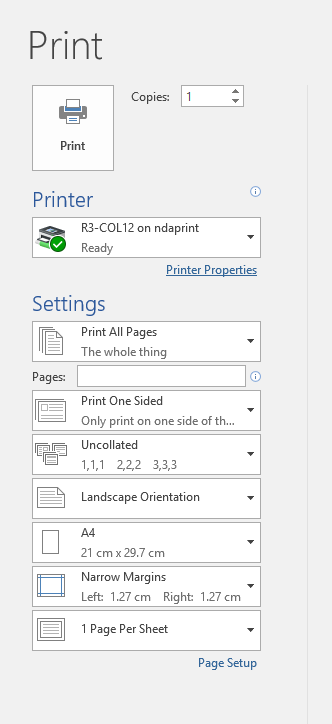
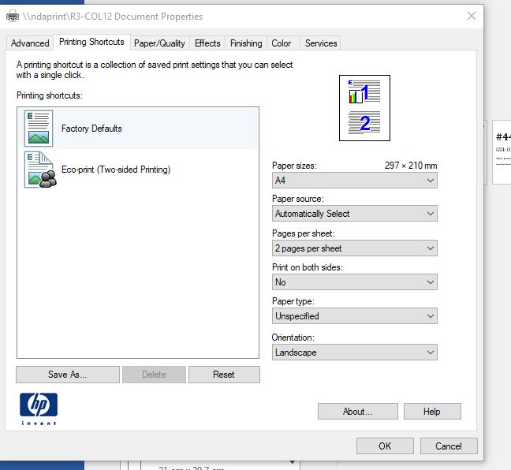

> [Wiki](Home) > [Processes](Processes) > [Backlog Preparation](Backlog-Preparation)

Backlog preparation is the meeting where we decide on most of the candidate tickets for a sprint and rank them by importance.

### Preparation

1. Announce at standup that people should move tickets to proposal
1. Before the backlog pruning meeting, people should add the label 'proposal' to the proposed tickets that they would like to see in the next sprint; all the tickets that must be in and a maximum of 2 extras per person. 
1. Print out the tickets so that they can be ordered in the meeting. To do this run:

    ```
    cd ibex_utils\repo-tool\scripts
    %PYTHON% proposal_printing.py
    ```
    1.  You will need a github token. Create this on the github user settings page. In Developer settings -> Personal access tokens and generate a token. 
    1. To print open the word document and use the word printing settings
       
    1. and set the print properties setting to:
       

### During the meeting

At the meeting, we will look at these tickets discuss what they are and then rank their importance. 

1. Look at each ticket and decide whether it makes sense, edit if needed
1. Decide on rank on importance and urgency and add to pile
1. Order tickets by priority starting with important and urgent

### After the Meeting

1. Collect tickets in order and write order into slack
1. Look at any IOC tickets and get someone to do an analysis of difficulty.


### To print out tickets from the script

