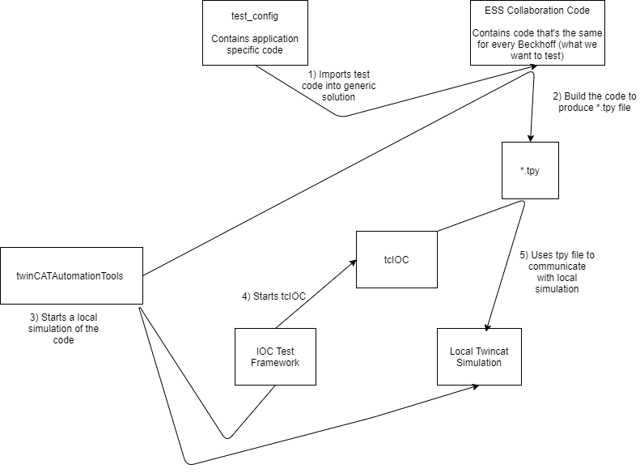

> [Wiki](Home) > [The Backend System](The-Backend-System) > [IOCs](IOCs) > [Motor IOCs](Motor-IOCs) > [Beckhoff](Beckhoff)

Beckhoff motor controllers are the most complex in use at ISIS and will be the standard going forward. A Beckhoff controller is basically a generic PLC that includes a number of useful functions out of the box for running motors. The generality of a beckhoff means that it will most likely be used in the future for measuring and controlling other hardware outside of motion. A more detailed presentation has been given about Beckhoffs in a [Code Chat](Code-Chats) entitled Layers, Onions and Ogres.

## Code on the controller
Unlike most other devices (except the Galil) the computing group has some oversight over the PLC code written on the controller. It has been agreed that this code will mostly be written by IDD, with oversight from computing to guide good programming practices, assist in debugging etc. The ISIS first version of this code is stored at https://github.com/ISISComputingGroup/BeckhoffPLCCode/, which has an accompanying wiki to discuss specifics of the codebase. However, going forward the code will be written in collaboration with the ESS and stored [here](https://bitbucket.org/europeanspallationsource/tc_generic_structure/src/master/).

### Building and simulating the code
Beckhoff code can be run as a simulated system on a developer machine by doing the following: 

 1. Download and install [TwinCAT 3 XAE](https://stfc365.sharepoint.com/sites/ISISMechatronics/Shared%20Documents/Forms/AllItems.aspx?viewid=a9a65e76%2D4335%2D479e%2Da1eb%2De12265e5cad6&id=%2Fsites%2FISISMechatronics%2FShared%20Documents%2FTwinCAT%20Development%2FTwinCAT%20Software) more information can be found about this [here](https://infosys.beckhoff.com/english.php?content=../content/1033/tcinfosys3/html/startpage.htm&id=). If you do not have permission ask IDD. The XAE is really just a Visual Studio plugin.
 1. Start the Twincat XAE. This can be done by clicking on the TwinCat icon in the system tray.
 1. Open the Twincat project that you are interested in. For example there is a simple test PLC [here](https://github.com/ISISComputingGroup/BeckhoffPLCCode/tree/master/dummy_PLC)
 1. Ensure that you have the following toolbars enabled in the XAE:
    - `TwinCAT PLC`
    - `TwinCAT XAE Base`
    - (optionally) `TwinCAT XAE Remote Manager`
1. Click the `Activate Configuration` button  - Note you may need to do [this](https://control.com/forums/threads/twincat-3-error-when-switched-to-run-mode.43467/) if it moans about ticks. You may also need to disable Hyper-V and disable Intel Virtualisation from within BIOS on your machine if this error persists.  
2. TwinCAT will ask you to enter a code to get a trial license. You will need to do this once a week.
3. If prompted if you wish to start the system in `Run Mode` click `Ok`. Otherwise start run mode using the button next to `Activate Configuration` 
4. You now have a simulated beckhoff PLC running on your PC. This behaves the same as real hardware and so all development can be done against it. You could now also run an IOC up talking to this local PLC.
5. To see what is happening inside this PLC in more detail, and to change values, you can use the login button 

### Continuous Integration

Beckhoff PLC code is being developed by people who do not have CI expertise and have their own repository structures yet we want integration into some form of CI to be as easy as possible. This lent itself to the following structure:
* A `BeckhoffTestRunner` repository that is owned by us and contains the jenkinsfile and other utilities required for CI
* Every branch on this repository (apart from master) then pulls a different PLC project down (note each project could be from a different repository or from separate branches on the same repository)
* The jenkinsfile can then do the one or both of the following:
   * Build the project (currently assumed to be called `solution.sln` at the top of pulled PLC project)
   * Run any [IOCTestFramework](https://github.com/ISISComputingGroup/EPICS-IOC_Test_Framework) tests (currently assumed to be in a `tests` folder at the top of the pulled PLC project) - these will likely be written by us

This means that the workflow for adding new PLC projects into CI is:
1. A PLC developer writes their code (making sure the solution is called `solution.sln`)
2. They give us a link to the repo and branch that contains the code
3. We create a new branch on `BeckhoffTestRunner` and modify it to point at their repo
4. At this point they have CI for building their code
5. We make a decision about whether the code requires any system tests and if so add some into their repository

To actually run tests we use the Beckhoff `automation interface` which can do any of the things you can do in the Twincat XAE automatically through DCOM. AC# (Beckhoff do not fully support a Python interface 😢) program (`twinCATAutomationTools`) has been written to leverage this interface in the following way to write integration tests for the Beckhoff:



1. Jenkins will pull a branch of [BeckhoffTestRunner](https://github.com/ISISComputingGroup/BeckhoffTestRunner).
2. `build.bat` is run to do the following:
   1. Build the `TwincatAutomationTools` solution, [twinCATAutomationTools](https://github.com/Simon-Cooper/twinCATAutomationTools)
   1. Use the `twinCATAutomationTools` to import the `test_config` into the generic Twincat Solution and build the PLC code using the `automation interface`. This build will also create a `*.tpy` file, which outlines how to connect to the PLC and can be used to configure the IOC itself.
3. The IOC test framework is started. This will use the `TwinCATAutomationTools` program to run a local simulated PLC. Then startup and test the Beckhoff twincat in the usual way.

This is currently being run on the ndw1926 node on Jenkins. A quirk of using this DCOM interface is that the Jenkins slave must be run as an interactive user and thus not as a service. To do this there is a bat file that should run on startup inside `C:\Users\ibexbuilder\AppData\Roaming\Microsoft\Windows\Start Menu\Programs\Startup`.

To run a PLC locally you need a license. A trial license can be activated on a developer's machine by manually running through the building and running steps above until you are prompted to supply a captcha phrase to generate a license.

## Testing

Firstly in `BeckhoffTestRunner` run: 
`git submodule update --init --recursive --remote`

To run tests locally you must build the `twinCATAutomationTools` tools then use them to set up a working simulated PLC. This can be done by running `build.bat` (best done not in an EPICS terminal). Once this is done you can run the following command in your `BeckhoffTestRunner` directory to begin testing:

```
python %EPICS_KIT_ROOT%\\support\\IocTestFramework\\master\\run_tests.py -tp ".\\tests"
```

Note that the IOC tests do not stop the PLC at the end of the run, however this isn't a problem as the PLC is restarted when the IOC tests start. If this fails to start the PLC it may be because you do not have a trial license. Debug the issue by manually running through the building and running steps above.

## Commissioning steps
These steps are for commissioning a Beckhoff on a beamline. 

### Networking
Beckhoffs are connected to NDX machines via private networks, in much the same way as the Galils. By convention Beckhoffs live in the `192.168.1.22X` range, starting at 1 for the first controller (`192.168.1.221`) 

### ADS routes
To actually communicate via the ADS transport layer you will need to set up a route on the instrument PC. To do so: 
1. Install the XAR tools if not already installed. A copy of these will be hosted on `<public share>\third_party_installers\special_drivers\beckhoff\`. All of the defaults are fine so this should be a case of just clicking through the wizard and installing the drivers that show up. 
2. Set up an ADS route on the NDX: 
  - `Right-click TwinCAT icon in system tray -> Router -> Edit Routes -> Add...` with these settings:
    - Advanced settings ticked, click the IP Address radio button, enter the IP address (mentioned above) 
    - Static Target routes and remote routes (default) 
    - Everything else can be left as defaults
3. To confirm that this has been set up remote into the controller itself on the aforementioned IP address and check that the route to the NDX has been added automatically. You should not need to manually add a route in the controller. 

### IOC setup
The IOC should be able to talk via ADS at this point but will need setting up in the respective configs. 
- A `.tpy` file will be used for `tCioc` to actually talk to the hardware via ADS - this should be placed in the instrument's twincat config area
- A `MTRCTRL` number will need to be given - this is the normal controller number
- `Beckhoff_plc_code` should be specified as a macro, this may be removed in future releases, more information on this is available below however it should be set to `1` for instruments running the latest code. 

#### Fields that aren't automatically populated
Although commissioning a Beckhoff is far simpler than a Galil from an IBEX perspective, there are some fields that need to be set manually for each axis.  These are: 
- Engineering units (`.EGU`) [ticket to populate](https://github.com/ISISComputingGroup/IBEX/issues/6855)
- Axis description (`.DESC`) [ticket to populate](https://github.com/ISISComputingGroup/IBEX/issues/6860)
- Velocity (`.VELO`) [ticket to populate](https://github.com/ISISComputingGroup/IBEX/issues/6861)
These can be set via a `caput` and will be autosaved thereafter.

#### Axes, motion setpoints
These are loaded in the usual way, you'll need to put your `axes.cmd` and `motionSetpoints.cmd` files alongside the `tpy` file (in the twincat config directory)

## IOC(s)

There are currently two IOCs that we have to communicate with Beckhoffs.

### [tcIoc](tcIOC)

The current Beckhoff applications that are being run through `tcIOC` and the CI pipeline discussed above are:
* [dummy_PLC](https://github.com/ISISComputingGroup/BeckhoffPLCCode/tree/dummy_PLC)- a PLC that does very little, basically used to test that fundamental tcIOC comms works
* [old_ISIS_code](https://github.com/ISISComputingGroup/BeckhoffPLCCode/tree/Ticket5052_refactor_test_runner) - this is the old ISIS prototype motion code that is currently on the CRISP jaws. Hopefully this code can be removed once the jaws are moved on.
* [ESS_base_code](https://bitbucket.org/europeanspallationsource/tc_generic_structure/) (now linked to by `main` of the `BeckhoffTestRunner` repository) - this is the collaboration code that we will be using go forward.

### MCAG (defunct)

This IOC was originally written by ESS. It uses an ASCII protocol over TCP/IP to do the communication and is very specifically designed for motion. There is a simulator which can be run using the following steps:

- `cd EPICS\support\MCAG_Base_Project\master\epics\simulator`
- `doit.bat`
- Start the IOC (host macros needs to be set to 127.0.0.1:5024)

~Currently this is only being run on IMAT. It should soon be replaced by the collaboration code.~ - **It has been replaced by the new code, so is now defunct.**


### Beckhoff config area

The config area contains a directory used for storing `.tpy` files for use with `tcIoc`. On an instrument it should look like this: `\instrument\settings\config\<instname>\configurations\twincat\`. The TWINCAT IOC will search in this directory using the given `TPY_FILE` macro. The generated DB file also gets created in this directory by `tcIoc`. 