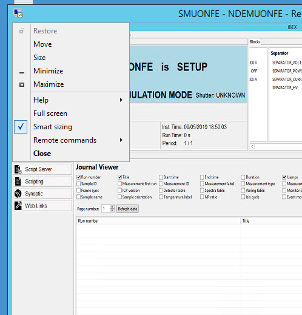

> [Wiki](Home) > [Trouble-shooting](trouble-shooting-pages) > [Computer-Troubleshooting](Computer-Troubleshooting)

Issue related to the computer that IBEX is running on


## Screen Resolution needs to be Set

The resolution is settable on a remote desktop, even to a resolution bigger than the current screen. To do this there is a menu item on the remote desktop window for “smart sizing” which does just this. 



It doesn't seem to persist on server 2012 unless you edit it into the `.rdp` file (and it also requires that you don’t select full screen or it takes a lower resolution).  I’ve edited the `.rdp` file appropriately on the NDHSMUONFE desktop so that this works at 1920x1200.  The key bits are at the top here – but you we can fiddle the resolution down a bit if a different aspect ratio works better.

```
screen mode id:i:1
use multimon:i:0
desktopwidth:i:1920
desktopheight:i:1200
smartsizing:i:1
...
```

## Cannot access the network shares

This may be solved by adding windows credentials on the machine. There is a document describing how to do this on ICP Discussions under "Security".

## Data fills up volume too rapidly on an Instrument
  (generating Nagios errors or disk full errors)

This is usually an issue when an instrument changes their mode of data taking and it is particularly common for instruments which have changed recently to using event mode data collection or altered the scheme they use (where the amount of data which can be produced may be much larger).
Good questions to ask are:

  1) Are any monitors being used in event mode (usually not a good idea, better to histogram)
  2) Have the jaws been opened up or is white beam falling on any detectors (check setup with scientist)
  3) Any unusually rapid data taking? (e.g. 15s runs with large-ish files)

## Data Disk available space

Varies widely per instrument and the space is tailored over time to match the needs of the instrument (with spare space as a buffer against exceptional usage).

Space for data to reside on the instrument so it can be analysed locally is provided by a cache which is purged on most instruments using a scheduled task with `robocopy` (`robocopy /? `for details).  Cache sizes vary widely per instrument.  Some instruments with low data rates have caches with more gentle purging strategies.  Caching on most high volume instruments will use a `robocopy` task with the MINAGE parameter set to 1 or 2 remove files that are 1 or 2 days old.  Fewer instruments purge on a monthly basis (e.g. MINAGE:30), muons and reflectometers generally have smaller data files.

Availability in the cache for 1 day minimum is required for local copying programs on all instruments to have data _available for copying_ from the instrument `data` share.  The External Export cache may be cleared of recent data files if space is limited, but NOT the instrument Data area (these will be removed only when archived).

The Clean and purging tasks run as privileged tasks in the scheduled tasks library on the guest VMs.  Where specially large and controlled caching is needed (on WISH currently) a more generic powershell script `purge.ps1` is run as a task on the host - the difference being that the cache trims to a fill level of over 90% on age and currently will not empty over time.  This allows maximum local data (about 2 cycles normally) to be available for local analysis.  In both cases, files are first moved to an area for deletion and then deleted by a separate task which runs later.

## System Disk Getting Full; Finding Space

Often the system disk gets full because of logging, or windows updates etc. You can free up space by doing the following:

- vnc to machine, check no-one is using it
- run tree size:
    - flag large files that you are worried about delete to Chris
    - uninstall apps which shouldn't be there
- Check size of `instrument/var/logs` move any large logs to back `<inst area>\Backups$\stage-deleted\ndxMARI`. Do this by creating a directory on c, moving files in then copying to this because it is write once. 
- [Truncate the database if it is too large](https://github.com/ISISComputingGroup/ibex_developers_manual/wiki/Database-Troubleshooting#reducing-database-disc-space)


