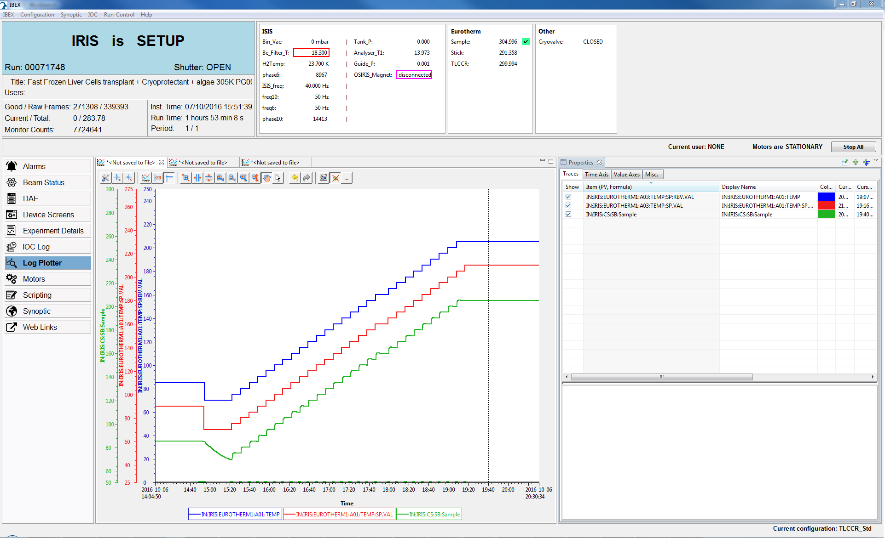

Something Has Gone Wrong with my Experimental Run

# Script Failed to Finish and Take All Measurements

This is from a problem see on IRIS.

1. Get the script and configuration.
   In this case the important bits are:
    ```
    def set_sample_temp(temp, high, low, tlccr_offset):
        g.cset(Sample=temp, highlimit=high, lowlimit=low, runcontrol=True)
        g.cset(TLCCR=temp+tlccr_offset, runcontrol=False)
        
    def next_sample(temp, uamps):
        g.change(title="Fast Frozen Liver Cells transplant + Cryoprotectant + algae "+str(temp)+"K PG002")
        g.begin()
        g.waitfor(uamps=uamps)
        g.end()

    for i in range(47):
        temp += 5
        set_sample_temp(temp, temp+2, temp-2,-5)
        next_sample(temp, 20)
    ```
1. Find the PVs and plot them in log plotter
    1. Open IBEX GUI. Switch to the instrument in question
    1. If the config is loaded right click on PV and display block history (otherwise do this and edit)
    1. Look for the time in question (zoom out horizontally button in bar and use the hand to drag to the place)
    1. Add other plots which might be interesting (right click add PV)
        1. Block as `IN:<instument>:CS:SB:<block name>
        1. Other PVs `IN:<instrument>:<IOC>:PV.VAL` (these must be marked in the DB file with `info(archive, "VAL")`)
    1. Good blocks to choose might be SP and SP:RBVs in this case ploting the SP and SP:RBV showed that the SP had not be set in the machine. So run control hadn't been able to progress and it had hung.

