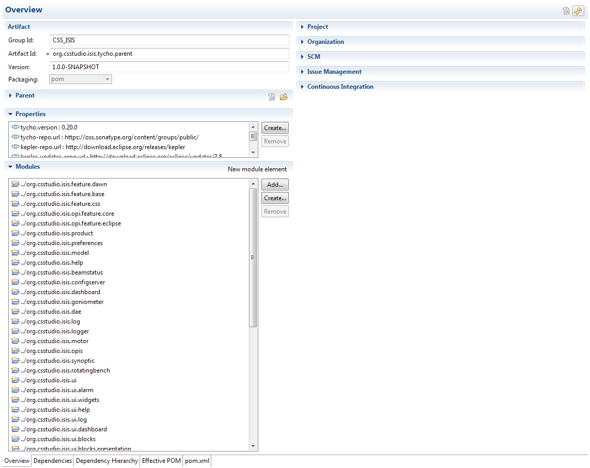

There are essentially two steps: adding a POM file to the plug-in/feature and editing the parent POM to include the new file.

## Adding a POM file

* In Eclipse, add a file called pom.xml to the top-level of the plug-in/feature

* Open the file in Eclipse and switch to the pom.xml tab

* Paste the following if it is a plug-in:

```xml
<project xmlns="http://maven.apache.org/POM/4.0.0" xmlns:xsi="http://www.w3.org/2001/XMLSchema-instance" xsi:schemaLocation="http://maven.apache.org/POM/4.0.0 http://maven.apache.org/xsd/maven-4.0.0.xsd">
  <modelVersion>4.0.0</modelVersion>
  <artifactId>YOUR_ITEM_NAME_HERE</artifactId>
  <packaging>eclipse-plugin</packaging>
  <parent>
    <groupId>CSS_ISIS</groupId>
    <version>1.0.0-SNAPSHOT</version>
    <artifactId>org.csstudio.isis.tycho.parent</artifactId>
    <relativePath>../org.csstudio.isis.tycho.parent</relativePath>
  </parent>
  <version>1.0.0-SNAPSHOT</version>
</project>
```
* Or paste the following if it is a feature:

```xml
<project xmlns="http://maven.apache.org/POM/4.0.0" xmlns:xsi="http://www.w3.org/2001/XMLSchema-instance" xsi:schemaLocation="http://maven.apache.org/POM/4.0.0 http://maven.apache.org/xsd/maven-4.0.0.xsd">
  <modelVersion>4.0.0</modelVersion>
  <artifactId>YOUR_ITEM_NAME_HERE</artifactId>
  <packaging>eclipse-feature</packaging>
  <parent>
    <groupId>CSS_ISIS</groupId>
    <version>1.0.0-SNAPSHOT</version>
    <artifactId>org.csstudio.isis.tycho.parent</artifactId>
    <relativePath>../org.csstudio.isis.tycho.parent</relativePath>
  </parent>
</project>
``` 
* In either case replace the YOUR_ITEM_NAME_HERE with the plug-in/feature name; example names:

    * org.csstudio.isis.myplugin
    * org.csstudio.isis.feature.myfeature
    
* Save the changes

## Adding a new POM file to the Parent POM

* Open the pom.xml file in org.csstudio.isis.tycho.parent in Eclipse. It should look like this:



* Click the 'Add' button under the Modules section

* In the new dialog select your plug-in/feature by checking the check-box
* Click 'OK'
* The next time a build is triggered the new plug-in/feature will be included in it