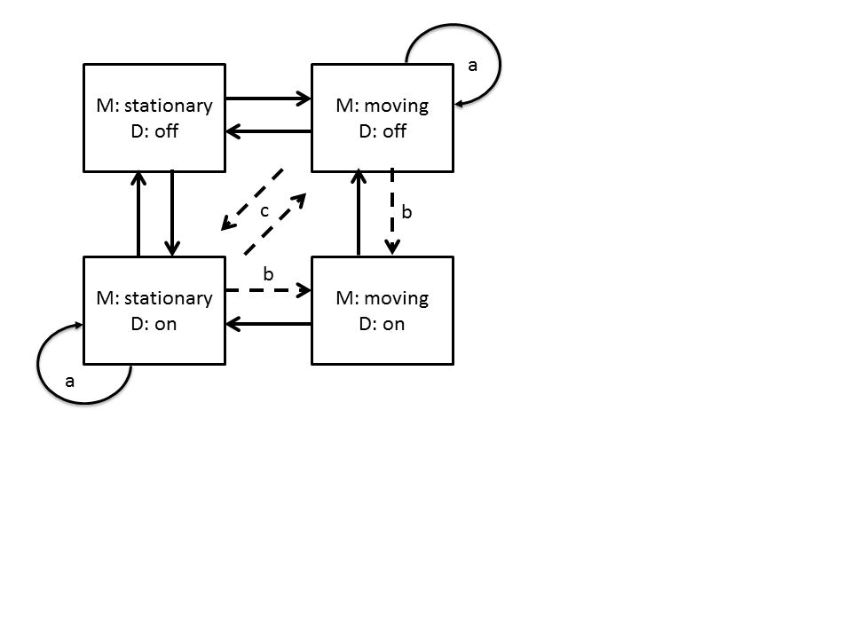

The inhibitor is a configurable IOC which will inhibit the setting of values depending on the state of the system. For example the motors on ZOOM should not be movable when a bank of detectors is powered and vice-versa.

The following states and transitions are possible for a two state inhibitor. This describes motor movement `M` and detector `D` on or off but the same diagram is applicable for two groups of PVs with two states:

Where
- Solid Lines: Initial set of transitions
- Dotted Lines: Transitions for the future

The easiest case to write (and where we will start) is for transitions *to* states where one or none of the groups is on (i.e. motors and detector both off, or motor on & detector off, or motor off & detector on, but not motors and detector both on [it can transition from this state]). If the system is requested to switch both groups on then the request is ignored. If the system is started with both movement and power then the system should issue errors but should not change the state of the system until the system enters a safe state(it is assumed the user know what they are doing).

There are other modes that may be useful in the future and the system should not rule these out explicitly but should not code for them either. These modes would be for instance:

   - c: E.g. If the system is moving and the user requests the detectors are switched on then the movement is stopped.
   - b: Might want to allow or disallow any or all transitions on the diagram. E.g. Detectors can only be switched on if the temperature of the detectors is less than x.

## Disabling a group

A request can be ignored by disabling the record. It is not clear how to do this and we will look at doing this as part of the work. Idea are 

1. setting and monitoring the disable field on the record to point at a new inhibitor controller record; this does mean the disable of the original IOC won't work but this is only used in testing.
1. replacing the record with a calc which will only forward the request based on the inhibitor say so
1. Monitoring and setting the value to 0 (or X).

## Implementation

This will be implemented as a separate IOC in SNL language. This should easy to maintain and configure. A separate IOC is used because then it can apply to more than one case without importing templates during the build. In SNL because it is ideally suited to the state machine and there are already example for splitting up strings for configuration. Python was considered but there is too much boiler plate without enough win, pure C/C++ and normal DB records were also considered but they will become too complicated.

