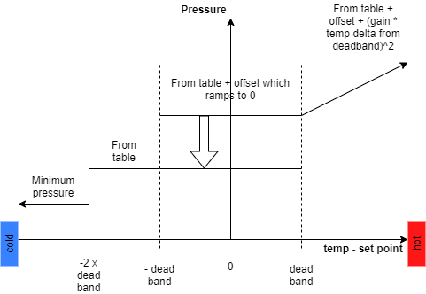

 > [Wiki](Home) > [The Backend System](The-Backend-System) > [Specific Device IOC](Specific-Device-IOC) > [Temperature Controllers](Temperature-Controllers) > [Mercury iTC](MercuryiTC)

The Mercury iTC is a configurable temperature controller from oxford instruments ( [Manual](http://lmu.web.psi.ch/docu/manuals/bulk_manuals/OxfordInstruments/Dolly_Mark_II/Mercury_iTC_manual_Issue_05.pdf) ).

It contains various slots into each slot a variety of devices can be placed. For the purposes of this document the motherboard is treated as a slot too, it contains a temperature sensor and a heater.

Types of daughter boards are:
 * temperature sensor
 * Heater
 * Auxiliary board (general purpose and stepper motors)
 * Pressure sensor
 * Cryogen
 * GPIB board (communications)

# Communications

The device should be talked to via serial (RS232 / ISOBUS in OI terms) at a baud rate of 57600. This is variable on the front panel, but **only while the device is in local mode** (when the box in the bottom left of the home screen **_doesn't_** have an orange background).

The configuration screens look like:


## Driver
Currently, the driver only measures and sets the following:

- Temperature
- He Level
- Pressure

and allows control of:

- Pressure based on temperature (used initially for the little blue cryostat)

There is a section on each below as well as how to set the communication settings.

### Temperature

#### Setup

To activate a card you must set the related IOC macro (note that this is different from in SECI where there was a separate VI to talk to each individual card e.g. Mercury_1_Temp_4 to talk to the 4th card as a temperature card). The following macros set the <I> for the possible IOC slot:

| Macro | IOC Name | 
| ----  | -------- | 
| MERCURY_01__TEMP_1 | %MYPVPREFIX%MERCURY_01:1 |
| MERCURY_01__TEMP_2 | %MYPVPREFIX%MERCURY_01:2 |
| MERCURY_01__TEMP_3 | %MYPVPREFIX%MERCURY_01:3 |
| MERCURY_01__TEMP_4 | %MYPVPREFIX%MERCURY_01:4 |
| MERCURY_01__LEVEL_1 | %MYPVPREFIX%MERCURY_01:LEVEL:1 |
| MERCURY_01__LEVEL_2 | %MYPVPREFIX%MERCURY_01:LEVEL:2 |
| MERCURY_01__PRESSURE_1 | %MYPVPREFIX%MERCURY_01:PRESSURE:1 |
| MERCURY_01__PRESSURE_2 | %MYPVPREFIX%MERCURY_01:PRESSURE:2 |
| etc                   |                          |

To find out what values these macros should take, connect the mercury IOC and check the "System" tab on the opi, which will list the cards which are currently present. 

Example: If the list of Temperature cards displayed on the system tab is ["MB1.T1", "DB1.T1", "DB2.T1"] you should set the following macros:
- `TEMP_1`: `MB1.T1`
- `TEMP_2`: `DB1.T1`
- `TEMP_3`: `DB2.T1`
- `TEMP_4`: (empty string)

#### Important PVs

* `TEMP` Current temperature
* `TEMP:SP` Setpoint for temperature controller
* `TEMP:SP:RV` Read back of the set temperature point
* `NAME` Name associated with the card

### He Level

The helium level can be monitored by setting the macro `LEVEL_N` to point at the correct vi in a similar fashion to the temperature.

### Pressure

A pressure card can be monitored by setting the macro `PRESSURE_N` to point at the correct vi in a similar fashion to the temperature.

### Software Pressure Control

The little blue cryostat has a software pressure control mode to save Helium. The pressure set point, and in turn the needle value opening range, is set based on the set point and current temperature. There is a PV to set this to be on for the Mercury, in addition this will turn on Temperature PID, heater and pressure flow rate automatic settings and turn off the temperature flow rate automatic setting. The pressure will be set base on four regimes based on the temperature - setpoint:

- Less than - 2x the temperature deadband: Pressure is set to `minimum pressure`. The idea is to let the cell warm up as quickly as possible.
- from -2x to -1x the deadband: Pressure is set to the value for the temperature from the table. The cell needs to warm up but more slowly.
- from -1x to 1x the deadband: Pressure is set to the value for the temperature from the table + a ramp is added from the offset to 0. Cell is the right temperature reduce the offset we used for extra cooling to be 0.
- above the deadband: Pressure is set to the value for the temperature from the table + offset + a value proportion to the square of the gain * distance above deadband the temperature is. Increase the pressure to cool the cell as quickly as possible reducing extra cool as we get near the deadband.

Temperature pressures are then coerced to be between a minimum and maximum pressure. 



To enable the full auto control the FULL_AUTO_PRESSURE1` macros must be set.

A full list of macros to set are:

Macro | Default | Purpose
----- | ------- | -------
SPC_PRESSURE_X | blank | The index of the pressure card to control for temperature card X
SPC_MIN_PRESSURE | 0 | Minimum pressure allowed
SPC_MAX_PRESSURE | - | Maximum pressure allowed
SPC_TEMP_DEADBAND | - | Deadband for the temperature and setpoint
SPC_OFFSET | - | Offset from which the ramp is reduced
SPC_OFFSET_DURATION | - | Time in minutes over which the offset is reduced
SPC_GAIN | - | Gain term for the extra pressure

The pressures for the various temperature setpoints are read from `...Settings\config\common\other_devices\little_blue_cryostat.txt`

### Example

In this example, the front panel (home screen) on the Mercury looks like:


NB The device should be in remote mode this is indicated by the *i* (bottom left) having an orange background.
This mercury has 3 temperature sensors, Sample_Rod, VTI_DB6 and PT2_DB7, the VTI has a heater attached to the second temperature.

The temperature controls are on the 1st and 2nd temperature and so on the first and second tab on the mercury device screen. NB the device screen also needs these macros set.

For info here is a detailed temp loop:


## OPI

The OPI has macros that relate to the macros set at the IOC level.

## Outdated Macros
There are some MercuryiTCs which are using outdated macros (in the format `VI_`...). See below for where these are located.
| **Instrument**  | **Configuration/Component** |
| ------------- | ------------- |
| LET  | LET_Mercury  |
| OSIRIS  | OSIRIS_Mercury | 
| MAPS | mercury_itc |
| GEM | Mercury_cryostat |
| SANDALS | GEM_mercury |
| IRIS | triton |
| ZOOM  | isisstat |
| LARMOR | ISISSTAT |

If you use one of these MercuryiTCs could you please:
* add and configure the new macros if they have not yet been added
* configure the new macros if they exist but have not yet been configured

The new macros and how to configure them can be found in [Setup](https://github.com/ISISComputingGroup/ibex_developers_manual/wiki/MercuryiTC#setup) section above: 


## Troubleshooting

### Mercury doesn't communicate 

1. One issue we have seen is that when the Mercury is transferred between instruments, or during some initial configuration, a user will change values like the Baud rate. It's good practice to check the devices settings (baud rate etc).
1. Ensure that it is set to remote mode. On the front panel the *i*, bottom left, should have an orange background.

### Pressure card won't read heater voltage correctly

This may be accompanied by an error in the ioc log:

```
2019/12/15 16:18:04.417 TE:NDW1799:MERCURY_01:PRESSURE:2:HEATER:VOLT devAsynFloat64 process read error lvDCOMDriver:readFloat64: status=0, function=13, name=HEATER:VOLT, value=0.000000, error=LabVIEW : parameter %p not found in the VI's connector pane. : IDispat
```

If this is the case, you need to get the latest version of `Mercury - Pressure.vi` from sourcesafe. Older versions had two parameters with the same name, which LvDCOM could not cope with correctly.

### Cannot input IOC macros of the form `MB0.T1`

You may need to rebuild ioc startups on the instrument - Release 7.1.0 initially shipped with a regex which was too restrictive and did not allow `.` as a character.

To do this:
- Ensure it is ok to shutdown ibex temporarily (i.e. check with scientist and ensure script/dae is not running)
- Run `stop_ibex_server.bat`
- Run `make iocstartups` from `C:\instrument\apps\epics` (it is ok if this complains about some missing directories)
- Run `start_ibex_server.bat`

### Mercury is not talking to any cards

Ensure that IOC macros have been set which correctly correspond to the cards in the mercury itself. You can check which cards are currently in the mercury by looking at the "system" tab in the opi. The macros should be strings of a form similar to "DB1.T1"

### Mercury is not reading a heater/needle valve correctly on a temperature/pressure card

In the details screen of the OPI, check that the `associated heater channel` (for heaters) or `associated aux channel` (for needle valves) is not None. If it is None, check with the scientist/cryogenics whether a heater/needle valve should be configured for this channel.
