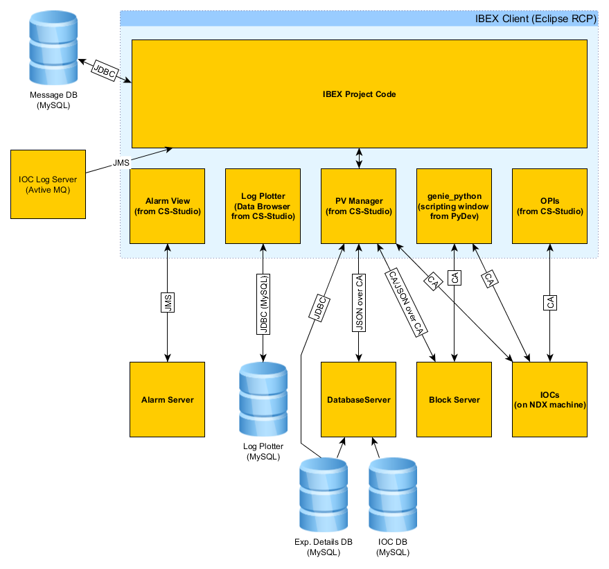

> [Wiki](Home) > [The Backend System](The-Backend-System) > [IOCs](IOCs) > Motor IOCs

The basis of the motor IOCs at ISIS is the [motor record](http://www.aps.anl.gov/bcda/synApps/motor/), which aims to provide a generic interface to all motors regardless of make or model. The motor record is a single PV that contains a number of fields for things like motor speed, position, encoder readback etc. Note that this is very different to the way other IOCs would normally be set up, where each of these values would be it's own PV. Naming conventions for motor PVs are also different in that all motors are of the form `%PVPREFIX%MOT:MTR0101` where the first number gives the controller and the second gives the axis. These controller/axis numbers are what dictates the axis position in the table of motors.

For most motor IOCs the motor record itself is pulled in from `support\motor\master\motorApp\Db\motor.db`. However, the Galil contains its own copy of the motor record in `support\galil\master\GalilSup\Db`.

## IOC Structure

## Physical Hardware

In general one motor controller will control a number of different axes (the actual motors themselves). Each axis will most likely give some feedback to the controller, the most common types of feedback are:
* Encoder: This is some form of external device that is measuring where the axis actually is. This is normally fed back to the controller in _steps_, the motor record will convert this to a distance using a supplied resolution.
* Limits: A binary signal that tells the controller that the motor has reached the edge of it's travel. There will be a high and a low limit for each direction of travel.
* Home: A binary signal that tells the controller when the axis is at a known _home_ position.

## Motors used at ISIS
The motors currently used at ISIS are:
* [Galil](Galil) - This is the most widely used motor type.
* [SMC](SMC)
* Linmot
* McLennan
* Beckhoff

## Other info

* [Motor Setpoints](Motor-SetPoints)
* [Creating soft motors to control real motors](Creating-soft-motors-to-control-real-motors) This is useful if you need some logic for transformations between axes.
* [Adding a motor IOC to global motor moving and stop all](Adding-motor-IOC-to-global-motor-moving-and-stop-all)