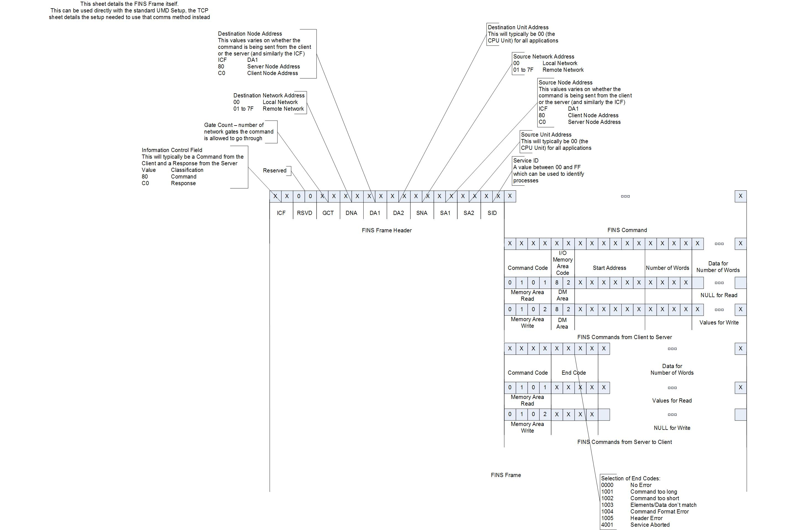

> [Wiki](Home) > [The Backend System](The-Backend-System) > [Specific Device IOC](Specific-Device-IOC) > [PLCs](PLCs) > [Omron FINS](Omron-FINS)

# Introduction

Most of the work done by the IOCs for the various FINS PLCs at ISIS consists of reading and writing to various places in the memory of that particular PLC. Some IOCs also perform some internal logic.

The Omron FINS is a PLC controlled via a driver first written at Diamond, see [here](https://github.com/ISISComputingGroup/EPICS-FINS). The IOC works by loading an instrument specific `FINS_01.cmd` in `configurations/fins`, which will load an instrument specific `db` from `ioc/master/FINS/db`. The dbs in here are usually created from a number of templates matching specific memory addresses to PVs. This is the case because PLCs used for different applications have different things stored in their memory, and to read/write various pieces of data the IOC needs to know the exact memory address for that data. Each individual PLC has its own memory map, which shows what memory address stores what thing, and each specific IOC is based on that.

Currently the following specific FINS PLC installations are supported in IBEX:

* IMAT FINS PLC
* LARMOR air PLC
* SANS2D vacuum PLC
* WISH vacuum PLC
* ZOOM vacuum PLC
* Helium Recovery PLC - stores information needed for the Helium Level Monitoring project

# The FINS protocol

The FINS protocol is an applications layer communications protocol designed for industrial applications and made by Omron. FINS stands for Factory Interface Network Service.

Throughout this guide, when I mention a manual, it can be found on the shares drive in Manuals/OMRON_FINS_PLCs .

FINS communications can be done over a serial connection or over a network. For serial connections, it uses the Host Link protocol on the Data Link layer of the OSI model. If used over a network, FINS can be used over a wide variety of Data Link layer protocols, including Controller Link and Ethernet. At ISIS, FINS PLC communication is done via Ethernet. FINS PLCs also supports another protocol instead of FINS, called C-mode, which is specialised for Host Link, but we do not use that. For more information, see Section 1 of the Comms Reference manual.

When using FINS over Ethernet, it can work with both TCP and UDP. FINS over TCP though is only supported on the CS1W-ETN21 and CJ1W-ETN21 models. The default UDP/TCP port number is 9600.

## FINS Frames

When using FINS over UDP, the FINS frame is the part of the UDP packet after the UDP protocol specific header. The first 10 bytes of the FINS command frame represent the FINS frame header, and the rest of the frame represent either a command or a response, which have different formats. For FINS over TCP, after the TCP header and before the FINS frame there is a special FINS/TCP header used by FINS to handle TCP connections.

### FINS header

The first 10 bytes of the FINS command frame represent the FINS frame header, and the rest of the frame represent the command.

The structure of the FINS frame header is as follows (each of the elements take up one byte):

- Information Control Field or ICF: Displays whether the frame is for a command or a response, and whether a response is required or not. For our purposes, this byte should 0x80 for a command and 0xC1 for a reply.
- Reserved or RSV byte: should always be 0x00.
- Gate Count or GCT: The number of network bridges the frame needs to pass through. For our purposes, it should always be 0x02.
- Destination Network Address or DNA: The address of the network to which the receiver belongs. This address is of the entire network, and not of just the machine, and is different from the IP address. It is 0x00 for Local Network, and 1 to 127 for remote networks.
- Destination Node Address or DA1: The node of the receiver, which is an address needed by the FINS protocol, and is different from the IP address. It has values from 0 to 256, with 0 for the local PLC unit and 256 for broadcasting.
- Destination Unit Address or DA2: The number of the unit of the destination node to which the command is addressed. It will typically be 0, for the CPU unit. A unit is one of the modules mounted on rails that make up the PLC.
- Source network address or SNA: The node of the sender. The possible values of SNA are the same as of DNA.




# Connection

### PLC init

The fins PLC communication is set up with the following:

```
finsUDPInit(<port Name>, <address>, <protocol>, <simulate>)
```
where:

- port name: ASYN port name (usually PLC)
- address: ip address of the PLC 
- protocol: which protocol to use
    - "TCP": use TCP communication
    - "TCPNOHEAD": use TCP comms, but without FINS-TCP header. This is required (and should only be used for) the devsim IOC tests
    - anything else: use UDP protocol
- simulate: whether to simulate calls
    - 0: Do not simulate (real device or devsim)
    - 1: Simulate (don't send commands), this is required for recsim as it lets device initialisation complete successfully with no device

# Configuration

In order to run this IOC and talk to the real PLC, you need to have the correct instrument specific `FINS_01.cmd` in `configurations/fins`. See below an example:

```
#Init and connect
finsUDPInit("PLC", "$(PLC_IP)", "UDP", 0, "$(PLC_NODE=)")

## Load our record instances
dbLoadRecords("${TOP}/db/he-recovery.db","P=$(MYPVPREFIX),Q=EXAMPLE:)
```

In the IBEX GUI, make sure to set the two macros for the FINS IOC, PLC_IP and PLC_NODE. PLC_IP refers to the IP address of the PLC, and the node is a FINS protocol application layer specific address that differentiates between nodes (such as PLCs or host computers). By default, it corresponds to the last byte of the IP address, but for some FINS PLCs this is not the case.

For running the IOC for testing, see below.


## Testing the FINS IOC in the Ioc Test Framework

In contrast to the normal operation of a FINS PLC, the instrument specific `FINS_01.cmd` file that should be used for the IOC Tests for a FINS PLC should be placed in an instrument specific folder in [`ioc\master\FINS\exampleSettings`](https://github.com/ISISComputingGroup/EPICS-ioc/tree/master/FINS/exampleSettings). This cmd file should have the appropriate finsUDPInit calls for devsim or recsim, as detailed below, and also the usual `dbLoadRecords` call to load the instrument specific db.

### Testing the FINS IOC in DevSim

If you want to test the IOC for a FINS PLC in devsim mode, you need to add to the FINS_01.cmd file used by that specific FINS IOC the line:
```
$(IFDEVSIM) finsUDPInit("PLC", "$(PLCIP):$(EMULATOR_PORT=)", "TCPNOHEAD", 0, "$(PLCNODE=)")
```  

At the same time, the file should either not have any other finsUDPInit call for talking with the real PLC, or have ```$(IFNOTDEVSIM) $(IFNOTRECSIM)``` before that call.

### Testing the FINS IOC in RecSim

If you want to test the IOC for a FINS PLC in recsim mode, you need to add to the FINS_01.cmd file used by that specific FINS IOC the line:
```
$(IFRECSIM) finsUDPInit("PLC", "$(PLCIP):$(EMULATOR_PORT=)", "TCPNOHEAD", 1, "$(PLCNODE=)")
```  

At the same time, the file should either not have any other finsUDPInit call for talking with the real PLC, or have ```$(IFNOTDEVSIM) $(IFNOTRECSIM)``` before that call.
