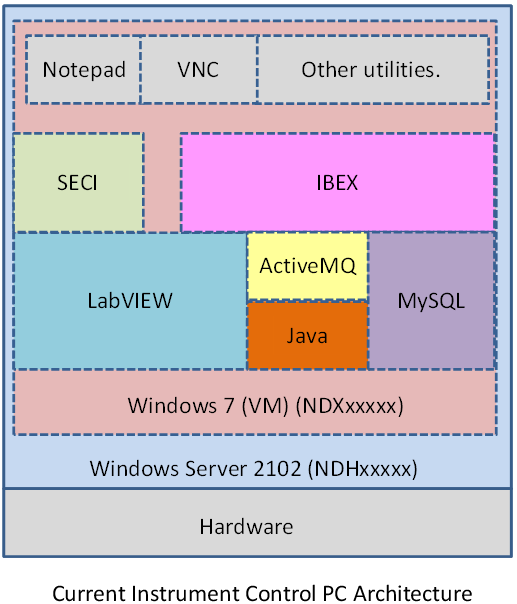

# Plan how to deploy automatically on 30 instruments

## Preface

This document is related to Ibex issue [#2152](https://github.com/ISISComputingGroup/IBEX/issues/2152) and the content is from the subsequent discussion on 24th May 2017

## Existing issue

We are faced with a number of issues in supporting a product that needs to be simultaneously deployed to 30 different instruments within a 2-week shutdown. Several tasks are typically conducted during shutdown:

- Backing up the existing system
- Applying OS patches
- Upgrading Ibex, which includes
    - The server
    - The client
    - genie_python
    - MySQL
    - Ibex settings

This typically takes on the order of several hours per instrument in the best case, but longer if significant changes need to be applied, particularly to settings. Doing this process manually for 30 instruments will require high levels of team resource to complete during a shutdown. A lengthy deployment process also precludes any possibility of rolling out urgent changes mid-cycle.

A further issue is that the current NDX[INST] systems are VMs that vary significantly in their system setup. This makes maintaining them more difficult and the chance of system-specific issues more likely.

## Use cases

The following use cases were identified for supporting Ibex deployment to instruments:

- Deploy Ibex to a new instrument
    - Instruments with SECI already running
    - Newly commissioned systems that don't have any existing control software
- Full release update to a current Ibex instrument
    - This must include post-installation updates such as configuration format updates
- Patching a hotfix to an existing instrument

## Goals

These are the general properties we expect the proposed solution to have:

- Fast: The solution must be sufficiently quick that it can be done on 30 instruments within a 2-week shutdown. Ideally it would be significantly quicker. I would expect a full release should be achievable in under around 30 minutes
- Minimal user input: Although deployment time may be constrained by data transfer speeds, the process should be able to proceed with minimal user input.
- Parallelisation: Multiple machines can be deployed simultaneously so that overall deployment time does not scale linearly with number of instruments.
- Consistent: The solution should produce a consistent deployment that can be relied upon to be functional with minimal manual tests

## Constraints

The long-term goal is to support only Ibex and fully retire SECI. We recognise that owing to ongoing instrument requirements, this is not feasible in the short term. Instruments converted from SECI to Ibex must be able to roll back to Seci and a retirement plan agreed with the scientists. However, we should attempt to expedite this process, particularly on those instruments that have been running Ibex for more than a cycle and are comfortable with the new system.

## Current deployment architecture

## Discussion notes

*Based on meeting from 24th May*

The ideal solution for deploying to 30 instruments would be to have a clean Windows 7 VM image that we update with the latest version of Ibex when we want to do a deployment. The existing VMs would then simply be re-imaged to the new version at each deploy, avoiding the need for installation of various pieces of software.

There are several concerns with this approach:

- Given we'll be 'deploying' the whole OS and accompanying software, how long will it take for each instrument?
- Can we deploy multiple instruments simultaneously? *Presumably if they're all on the same Windows Server, the limiting factor is the disk write speed so deploying multiple instruments will take a similar amount of time in serial versus parallel.*
- How do we retain the ability to keep running SECI?
- What if scientists have put information on the VM that they don't realise will be wiped at the next deployment?

With regard to the last question, the proposed solution is to keep the existing VM for SECI and have an identically named VM for Ibex. Only one would be run at a time to avoid conflicts.

One issue that must be addressed to achieve the above solution is to decouple machine-specific information from the VM. The plan would be to store all machine-specific information in Git (e.g. Ibex settings) or on separate managed data drives (e.g. C:\data) which would be symbolically linked to the VMs. This is already the case for much of the data but would need to be extended. Care would need to be taken in a number of cases:
    - LabView Modules: Currently most of the information in this directory is instrument agnostic, but the .ini files specifically are different for each instrument. We would need to point the VIs that we control via LvDCOM to use .ini files that are somewhere off the VM, probably in the instrument settings. The LabView modules distributed on the Ibex VM could also be stripped eventually to only include the VIs we need.
    - ISISICP: This program communicates with the DAE and retains information common to SECI and Ibex (e.g. run number). This would need to be placed in a shared space so that the information between the two systems does not go out of sync.

It was noted multiple times that the long-term goal is to stop using SECI. When this becomes practical, the old VM containing SECI can be safely deleted. Until then, the SECI VM should have windows automatic updates enabled so it is updated on startup during the infrequent times it is used. This should limit the amount of additional support work needed to maintain it. In addition, a timeline should be agreed with instrument scientists for each instrument to drop SECI. Otherwise we are likely to find it continuing to be used indefinitely.

A first step for implementing this method would be to set up a VM that will work on ZOOM. As this is a new instrument, this can be done without worrying about legacy SECI integration. It was suggested that this be the model for all instruments, and that the current system continue until instruments are ready to switch fully. There is a significant concern with this proposal that many instruments will be highly reluctant to lose their safety net and we'll be stuck with the current system for the foreseeable future.

## Outstanding questions

- In the solution where Ibex and SECI are on different VMs, how easy would it be for an **instrument scientist** to switch between them? I presume we don't want to give them admin access to VMs so they'd have to call the support team. That raises two issues:
    - Will that generate too many extra calls to support?
    - Will everyone who might have the support phone have the ability to do the switch
- How do we handle post-installation tasks in the proposed solution?
- How do we do hotfixes in the proposed solution?
- Will we use the multi-VM solution, or leave hybrid systems as is? In the case of the latter, how do we cope with the unsustainable deployment workload associated with hybrid systems? In the short-term, we will have created significant additional work which will take a long time to yield any return. We could at least automate more of the current deployment procedure.
- How long will deploying the VM take in the proposed solution? Is it manageable given the time constraints?
- Can shared systems and data be fully decoupled from the Ibex/SECI VMs so they can be placed in a shared directory?

## Plan of attack
The basic plan of attack is to create a prototype Ibex-only VM and deploy to ZOOM. This will give useful information about the speed and ease of deployment before proceeding further. A more detailed plan moving forwards will be generated once this document has been reviewed.

## Next steps

- [X] Invite Ibex team to review this document
- [ ] Collate feedback
- [ ] Populate plan of attack
- [ ] Verify plan of attack
- [ ] Create tickets