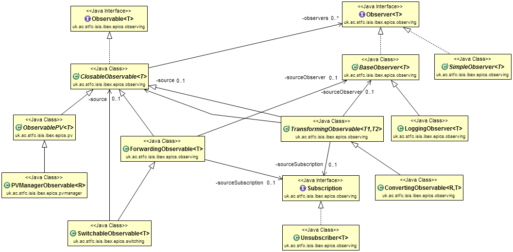
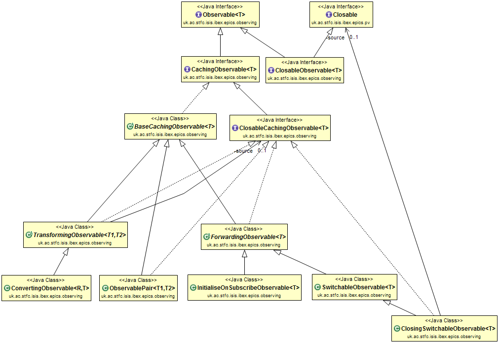
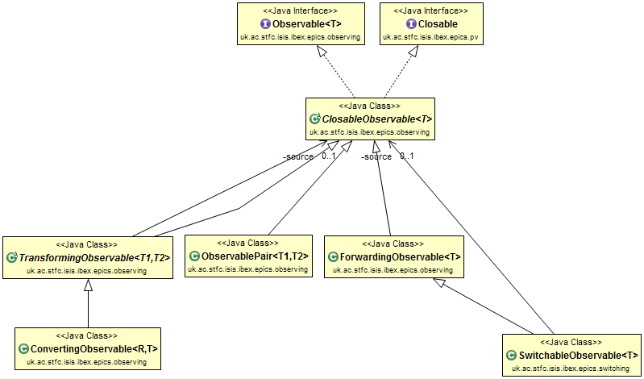
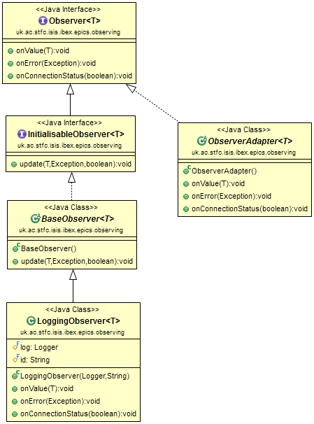
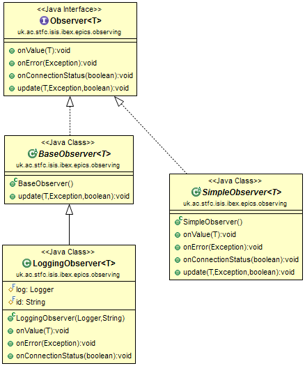
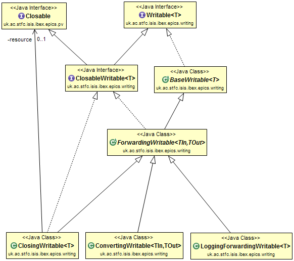
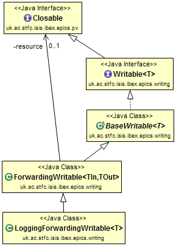

> [Wiki](Home) > [The GUI](The-GUI) > [Coding](GUI-Coding) > Refactoring for observables and writers

Class Diagrams for Observables, Observers, Writables and Writers
================================================================

This document contains the class diagrams for the various classes that relate to reading and writing to PVs.
It also shows how the design has been evolved and refactored over time.

Observables and Observers Overall Diagram
=========================================

NOTE: PairObservable is not depicted for clarity.

Original
--------

 
 
    
November 2015
-------------

 
 
    
January 2016
-------------

 
 

Observables
===========
Original
--------

November 2015
-------------

   
January 2016
-------------

Observers
=========
Original
--------

November 2015
-------------

After refactoring the two existing interfaces were combined into a single Observer interface, and ObservableAdapter was renamed.

Writables
=========
Original
--------

November 2015
-------------

   
April 2016
-------------

   
After refactoring, the ForwardingWritable is passed a converter, which can either convert value or do nothing.

Writers
=======
Original
--------

November 2015
-------------

