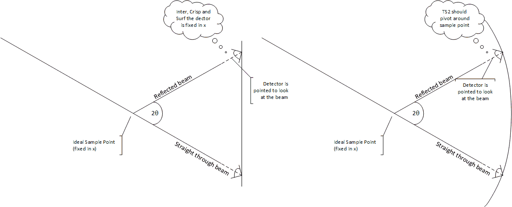
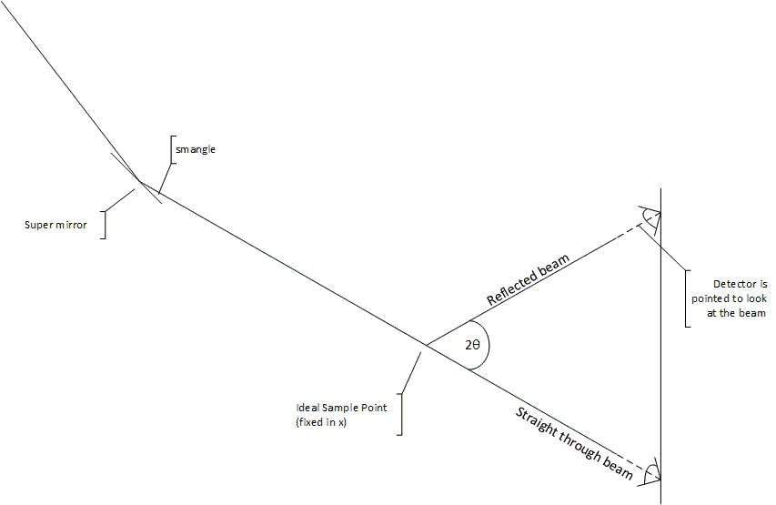

> [Wiki](Home) > [Project overview](Project-Overview) > Design documents >[Reflectometers](Reflectometers) > [Reflectometers Science](Reflectometers-Science)

[Diagram created in visio](reflectometers/Reflectometry1.vsdx).

## Experiment to perform

The reflectometry concept are described in part in the [mantid documentation](http://docs.mantidproject.org/v3.12.0/techniques/ISIS_Reflectometry.html)
the actual experiment is described in [reflectometry at Isis](https://github.com/ISISComputingGroup/IBEX/wiki/Reflectometry-at-Isis). The important things to know from this and other are:

1. The data needed to be retrieved is neutron count vs Q.
1. The [momentum transfer](https://en.wikipedia.org/wiki/Momentum_transfer) is characterised from `Q = 4π / λ sin θ` 
1. The wavelength is proportional to the time of flight. So to get a large range of q the scientists stitch together spectra from multiple angles.
1. There are other experiments that can be performed where off-specular alignments are used. Also where the sample is rocked.
1. When thinking about alignments, there is a path through the experiment set by the super mirror, sample point, analyser angle and detector position. Everything else can be aligned to this path but does not control that path. 

## Setup

Generally, the idea is to position the detector at **theta** around the **sample point** (= the coordinates of the beam at a fixed distance x from the detector). We make a distinction between two types of reflectometry instruments based on beamline equipment and the way their detector is positioned.

In the first case (for INTER, CRISP, SURF), the detector slides up and down on a height stage and can be angled to be perpendicular to the incident beam. This means the distance between sample and detector actually varies slightly, however the beam path on these instruments is relatively short so the resultant error is tolerable.

In the second case (for POLREF, OFFSPEC), the detector sits on a bench, that can be angled, driven up/down, and slide closer/further from the sample, which allows the detector to actually move along a radius around the sample.

Devices on the beamline are classed as active or passive: **active** devices affect the direction of the beam; **passive** devices do not.  A slit which blocks the beam is passive because it does not change the beam direction. Equipment will usually track the beam path; it might not during initial alignment or for some unusual experiments. This means that an offset needs to be added to the position and angle of each piece of equipment after a path change so that it remains centred and perpendicular/parallel to the beam. 

Beamline equipment can be in the beam or not depending on the mode; e.g. some experiments use a super mirror others don't. Once the beamline equipment has been moved to its tracking position the variables that are used to set the values need to be read back to account for engineering errors. For instance:

1. The angle theta is set
1. This sets the detector height
1. The detector will move to this position
1. The readback should then be read
1. The theta for the readback (not the setpoint) is then used to calculate the theta of the device

## Liquid Samples

For liquid samples the sample angle must remain fixed at the natural angle of the beam, i.e. level with the floor. Instead of tilting the sample you use the super mirror. The angle of super mirror should be related to the theta that is being measured. To calculate this using the above picture you want the incoming beam to make an angle with the sample (which is at and angle of theta) which is the same as the natural angle. E.g. `natural angle = 2 x super mirror angle + theta`.

### Equipment on the beam

#### Polariser/Super Mirror

An active component before the sample which changes the angle of the incoming beam

#### Slit

Slits are passive components that can sit anywhere along the beam line. The centre of a slit is measured from the beam's path.

#### Analyser

An active component placed after the sample which will split the beam. Some forms of analysers change the beam path horizontally, some vertically. In the vertical case they should be treated like mirrors with an angle.

#### Detector

A detector is a passive component that sits at the end of the beam line. There are at least two common types of detector: Point and 1D.

## Experimental Modes

### Modes

- Neutron Reflection (NR) mode: just a straight reflection from the ideal sample point. Used for solids and liquids with solids, i.e. things that can be rotated and are not affected by gravity
- Liquids NR: Since liquids cannot be angled, the super mirror is instead used to angle the incoming beam at the sample and make the specular condition correct for different theta.
- Polarised NR: Like NR, but with a polarising supermirror in the beam path set to a given angle, which changes the angle of the incoming beam at the sample point.
- Polarisation Analysis (PA) mode: Like NR but now after the sample point, the beam is split into two by an analyser and the detector moves to see either beam. 2* Theta is still the angle between the incoming and outgoing beam at the sample point.
- Disabled: All beamline components are unlinked from one another's geometry constraints and can be moved independently.

Note: When adding theta into a mode it is expected that you will add the items that define theta to the mode too. This way when you change theta the beamline parameter that sets the component to for theta will move automatically. If you do not do this your readback for theta will be different to you theta value. However we have not put an automatic check on this because it may be desired behaviour (We can add a check in the future).

### Off Specular vs Specular

In Specular mode the point detector is used whereas in off specular the 1D detector is used.

