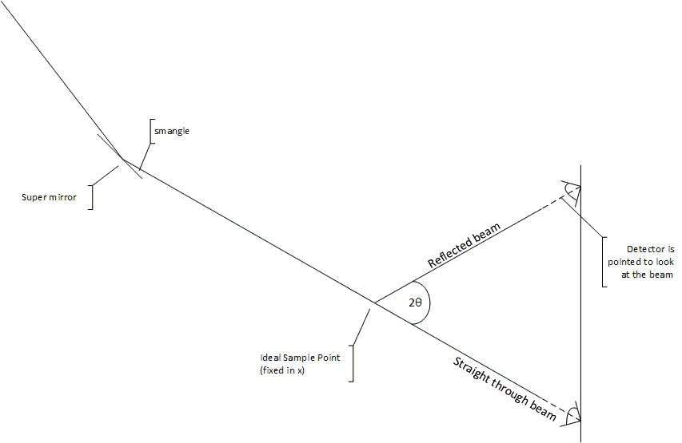

> [Wiki](Home) > [Project overview](Project-Overview) > Design documents

The aim of the reflectometer project is to allow users of the reflectometers to have a common and easy experience to set the position of items on the beam line. The setup is fairly complex because of there are multiple items that need to be coordinated to make a measurement. This page should give an overview of what is going on and the user cases that are needed.

[Diagram created in visio](reflectometers/Reflectometry1.vsdx).

## Experiment to perform

The reflectometry experiment is described in part in the [mantid documentation](http://docs.mantidproject.org/v3.12.0/techniques/ISIS_Reflectometry.html) and in [more detail for POLREF](https://github.com/ISISComputingGroup/IBEX/wiki/Reflectometry-at-Isis). The important things to know from this and other are:

1. The data needed to be retrieved is neutron count vs Q.
1. The [momentum transfer](https://en.wikipedia.org/wiki/Momentum_transfer) is characterised from Q = 4π / λ sin θ 
1. The wavelength is proportional to the time of flight. So to get a large range of q the scientists stitch together spectra from multiple angles.
1. There are other experiments that can be performed where off-specular alignments are used. Also where the sample is rocked.
1. When thinking about alignments, there is a path through the experiment set by the super mirror, sample point, analyser angle and detector position. Everything else can be aligned to this path but does not control that path. 

## Setup

Generally, the idea is to position the detector at **theta** around the **sample point** (= the coordinates of the beam at a fixed distance x from the detector). We make a distinction between two types of reflectometry instruments based on beamline equipment and the way their detector is positioned.

In the first case (for INTER, CRISP, SURF), the detector slides up and down on a height stage and can be angled to be perpendicular to the incident beam. This means the distance between sample and detector actually varies slightly, however the beam path on these instruments is relatively short so the resultant error is tolerable.

In the second case (for POLREF, OFFSPEC), the detector sits on a bench, that can be angled, driven up/down, and slide closer/further from the sample, which allows the detector to actually move along a radius around the sample.

Devices on the beamline are classed as active or passive: **active** devices affect the direction of the beam; **passive** devices do not.  A slit which blocks the beam is passive because it does change the beam direction. Equipment will usually track the beam path; it might not during initial alignment or for some unusual experiments. This means that an offset needs to be added to the position and angle of each piece of equipment after a path change so that it remains centred and perpendicular/parallel to the beam. 

Beamline equipment can be in the beam or not depending on the mode; e.g. some experiments use a super mirror others don't. Once the beamline equipment has been moved to its tracking position the variables that are used to set the values need to be read back to account for engineering errors. For instance:

1. The angle theta is set
1. This sets the detector height
1. The detector will move to this position
1. The readback should then be read
1. The theta for the readback (not the setpoint) is then used to calculate the theta of the device

### Equipment on the beam

#### Polariser/Super Mirror

An active component before the sample which changes the angle of the incoming beam

#### Slit

Slits are passive components that can sit anywhere along the beam line. The centre of a slit is measured from the beam's path.

#### Analyser

An active component placed after the sample which will split the beam. Some forms of analysers change the beam path horizontally, some vertically. In the vertical case they should be treated like mirrors with an angle.

#### Detector

A detector is a passive component that sits at the end of the beam line. There are at least two common types point and 1 D detectors.

## Experimental Modes

### Modes

- Neutron Reflection (NR) mode: just a straight reflection from the ideal sample point. Used for solids and liquids with solids, i.e. things that can be rotated and are not effected by gravity
- Liquids NR: Since liquids cannot be angled, the super mirror is instead used to angle the incoming beam at the sample and make the specular condition correct for different theta.
- Polarised NR: Like NR, but with a polarising supermirror in the beam path set to a given angle, which changes the angle of the incoming beam at the sample point.
- Polarisation Analysis (PA) mode: Like NR but now after the sample point, the beam is split into two by an analyser and the detector moves to see either beam. 2* Theta is still the angle between the incoming and outgoing beam at the sample point.
- Disabled: All beamline components are unlinked from one another's geometry constraints and can be moved independently.

### Off Specular vs Specular

In Specular mode the point detector is used whereas in off specular the 1D detector is used.

### Components in a mode

Table of our understanding for each mode what is in the beam and what is tracking the beam. States are:

- O: Out of the beam
- I: In the beam but not tracking it
- T: In the beam and tracking it

Mode      | S1 | Poleriser | S2 | sample stack | ideal sample point | S3 | analyser | S4 | Detector
---       | --- | -----    |  --- | ----       | ----               | --- | ---     | --- | ----
NR        | T  | O         | T  | I            | T                  | T  | O        | T  | T  
polerised | T  | T         | T  | I            | T                  | T  | O        | T  | T  

In sim language

Mode | S1 Height above beam |  Poleriser angle and height above 

## Calculating Height of an Item Above Straight Through Beam

The height of an item along the beam can be calculated based of the incoming angle. This diagram shows how this works.

## Questions

1. Is the ideal sample point x position fixes?
    - Yes. The beam coming in will hit any presample active components and the height of the sample point is the point at which the beam reaches this x coordinate.
1. I think each mode of operation sets up fixed rules and relations and this is what we need to capture.
1. We need to calculate both the positions based on composite parameters and composite parameters based on the positions of the components, is this right?
    - Yes, it would be strange not to have this readback
    1. What happens if the beam having hit the super mirror does not hit the sample axis?
        - apart from pathological cases, beam going straight up or backwards, there is always a point that the sample acis is hit
    1. What happens if the detector is not looking at the sample point?
        - Nothing, but a warning in this case would be useful.
1. Does the beam always go forwards?
    - Yes, on reflectometers the beam always goes forward. 
1. Are there any corrections to the idealised model, at that level?
    - No
1. What does an analyser do to the beam? Is it an active component? How does it affect the measurement of theta?
    - Yes it is an active component on some beam lines (depends on type). It doesn't effect the measurement of theta; although if you are calculating the readback the outgoing beam goes to the analyser not the detector.
1. How are slits measured (along the arc or along there length)?
    - In the end it doesn't really matter but they are measured along their length.
1. Room coordinates are these ok as we defined them?
    - Maybe, they should be the same as Mantid default.

