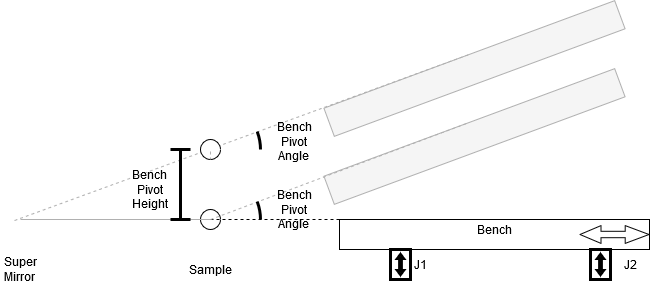

> [Wiki](Home) > [The Backend System](The-Backend-System) > [Specific Device IOC](Specific-Device-IOC) > [Miscellaneous motion control](Miscellaneous-Motion-Control) > [Reflectometry IOC](Reflectometry-IOC) > [Reflectometry Configuration](Reflectometry-Configuration)

# Overview

### [An in-depth training course for writing a Reflectometry Configuration can be found here](https://github.com/ISISComputingGroup/ibex_developers_manual/wiki/Reflectometry-Config-Training-%E2%80%90-Overview-&-Setup)

The reflectometry configuration describes the geometry of the beamline and is read by the reflectometry IOC on startup. The config file is written in python and lives in `<config area>/refl/config.py`.

This file needs to import relevant classes and methods used for constructing the configuration via the line `from ReflectometryServer import *`. It should implement a `get_beamline` method, which takes a single `macros` argument, and returns an object of type `Beamline`.

[Jump to Example Configuration](https://github.com/ISISComputingGroup/ibex_developers_manual/wiki/Reflectometry-Configuration#example-configuration)

# Reference Manual

This section contains an overview of the available building blocks in the form of classes and helper methods, which are used to construct the beamline model.

## [Beamline Constants](https://github.com/ISISComputingGroup/ibex_developers_manual/wiki/Reflectometry-Beamline-Object#beamline-constants)

These are fixed values which are exposed by the IOC as PVs of the form `<PREFIX>:REFL:CONST:<NAME>`, but cannot be changed at runtime. They follow a naming convention so that they can be read automatically by the shared reflectometry scripting library. The default set of constants the configuration has to define consists of:
- `S1_Z`: Z coordinate of Slit 1
- `S2_Z`: Z coordinate of Slit 2
- `S3_Z`: Z coordinate of Slit 3
- `S4_Z`: Z coordinate of Slit 4
- `SM_Z`: Z coordinate of the supermirror
- `SAMPLE_Z`: Z coordinate of the sample point
- `PD_Z`: Z coordinate of the point detector
- `S3_MAX`: Maximum vertical gap for S3
- `S4_MAX`: Maximum vertical gap for S4
- `THETA`: Maximum Theta angle
- `NATURAL_ANGLE`: Natural angle of the beam as it enters the blockhouse
- `HAS_HEIGHT2`: Whether the sample stack has a second height stage (`True`/`False` only)

Also for the OPI we need constants:

- `OPI`: Value is the directory names in which the OPI link panels are stored. E.g. on CRISP this is set to CRISP and the panels are in `<GUI OPIs>\resources\reflectometry\crisp`. This allows for different instruments and configs to have different front panels.

### Arguments

#### Required:
- `name`: The name of the constant (and it's PV)
- `value`: The value it should have
- `description`: A helpful text description

### Example:

```Python
BeamlineConstant("MAX_THETA", 1.8, "Maximum Theta value")
```


## [Components](https://github.com/ISISComputingGroup/ibex_developers_manual/wiki/Reflectometry-Geometry-Components)
Components are the central building blocks of the configuration. Each of them represents a node of interaction with the beam on the instrument (either passively tracking or actively affecting it). They are also the connective middle layer element between the user-facing beamline parameters and the composite drivers that talk to low level motors.

### Types of Component
- `Component`: Component that manages the linear displacement between the incoming beam and the component without affecting the beam (e.g. a slit)
- `TiltingComponent`: Component manages the angle and distance between the incoming beam and the component without affecting the beam. This allows the component to stay perpendicular to the beam as well as centred (e.g. point detector on SURF/CRISP)
- `ReflectingComponent`: Component manages the angle and distance between the incoming beam and the component, outgoing beam is reflected from this angle (assumes infinitely long reflector at angle and distance from the incoming beam) (e.g. supermirror); If the component is out of the beam it no longer reflects
- `BenchComponent`: Component for a reflectometry bench. The bench has an angle and height of the position which it pivots about, usually the sample, and a seesaw, which is a value added and subtracted from its two jacks. The seesaw axis must always be autosaved because it can not be worked out independently of the angle. The bench is also capable of moving along the beam so that the bench appears to move around an arc centred at the bench pivot (sample position). The usual configuration is that the super mirror tips and this raises the height of the bench pivot and also changes the angle of it; theta just changes the angle of the pivot; see diagram below. For an example of a bench in the configuration [see this page](reflectometry-bench-configuration)



- `ThetaComponent`: Component manages the angle between the incoming beam and the outgoing beam at the sample position.
    - The readback calculates the angle to the theoretical beam intercept of another component (ignoring any positional offset on that component). The component used is the first component on the list of the theta component (as defined in the configuration) that is in the beam. For example, a beamline may contain an analyser followed by a detector. If the analyser is in the beam, theta is the angle of the beam to the analyser, otherwise it is the angle to the detector.
    - The setpoint works in the same way as the ReflectingComponent except that it will update the beam path of components which define its angle even in disabled mode. 

### Arguments

#### Required:
- `name`: Name of the component
- `setup`:
    - Most components: The geometry setup for this component as an object of the form `PositionAndAngle(y, z, angle)`, where:
        - `y`: y position of straight through beam
        - `z`: z position of straight through beam
        - `angle`: angle at which the linear axis moves
    - Bench Component: The bench setup of the form `BenchSetup(y, z, angle, jack_front_z, jack_rear_z, initial_table_angle, pivot_to_beam, min_angle_for_slide, max_angle_for_slide)`, where:
        - `y`: y position of pivot of the bench of straight through beam
        - `z`: z position of pivot of the bench of straight through beam
        - `angle`: angle that bench pivot moves along
        - `jack_front_z`: distance to the front jack on the bench from the pivot
        - `jack_rear_z`: distance to the rear jack on the bench from the pivot
        - `initial_table_angle`: initial table angle (the natural angle of the beam)
        - `pivot_to_beam`: distance from the pivot of the bench to the beam
        - `min_angle_for_slide`: is the angle below which the slide will not move any further. This does not include the initial table angle, (e.g. on POLREF it is 0)
        - `max_angle_for_slide`: is the angle above which the slide will not move any further. This does not include the initial table angle, (e.g. on POLREF it is 4.8)

### Theta Angle to/of Special Method

Once the component is defined that the theta should measure its angle to then it must be set on the theta component with either:

- `add_angle_to(<component>)`: this add the component to a list of components. If it is the first enabled component in that list then theta will use the components *position* to determine the angle of theta.
- `add_angle_of(<component>)`: this add the component to a list of components. If it is the first enabled component in that list then theta will use the components *angle* to determine the angle of theta.

### Example

```Python
theta = add_component(ThetaComponent("theta_component", setup=PositionAndAngle(0.0, 50.0, 90.0))

detector = add_component(TiltingComponent("detector", setup=PositionAndAngle(0.0, 100.0, 90.0)))
theta.add_angle_to(detector)
```

This creates a theta component which points at the detector height.

[See example](reflectometry-bench-configuration) for an example of the bench component with parameters


## [Beamline Parameters](https://github.com/ISISComputingGroup/ibex_developers_manual/wiki/Reflectometry-Beamline-Parameters)

These are the top-level parameters exposed as PVs of the form `<PREFIX>:REFL:PARAM:<NAME>:<SUFFIX>`, which the users can set via the reflectometry front panel or scripting.

### Types of parameter

- `AxisParameter`: A parameter which controls the value of this components axis. If the axis is:
    - POSITION: The position relative to the beam along the linear movement axis (e.g. offset on slit 2 `S2OFFSET`). This is useful for scanning over this axis for alignment
    - ANGLE: The angle of this component relative to the angle of the incoming beam (e.g. angle of the point detector `PDANGLE`)
    - TRANS: The translation position
    - LONG_AXIS: The movement of the component parallel to the beam 
    - CHI: The chi rotation angle
    - PSI: The psi rotation angle
    - SEESAW: The seesaw of the component, used with the bench.
    - DISPLACEMENT_HEIGHT: The height of the component relative to gravity. Cannot be set by the user directly, rather this is exposing positions computed by the reflectometry server based on the current beam path
    - DISPLACEMENT_ANGLE: The angle of the component relative to gravity. Cannot be set by the user directly, rather this is exposing positions computed by the reflectometry server based on the current beam path
- `InBeamParameter`: A multi-state parameter which says whether this component is currently in the beam and tracking, or in parked state and not tracking
- `DirectParameter`: A non-tracking parameter (i.e. the value is independent of the current beam path). This currently does not require a `Component` but is instead directly passed a `PVWrapper` through which it talks to the motors.
    - `SlitGapParameter`: A specific type of `DirectParameter` describing slit gaps (functionally the same)
- `EnumParameter`: A parameter which can take multiple values; the value is set as read back on move. 
- `VirtualParameter`: A parameter that is not actually tied to a motor and does not have any component associated with it. Values passed to this parameter is used as an engineer correction at run time.
### Arguments

#### Required:
- `name`: name of the parameter
- `component` (only for `AxisParameter` and `InBeamParameter`): The component this parameter is for
- `axis` (only for `AxisParameter`): The axis the parameter points to
- `options` (only for `EnumParameter`): A list of options that the parameter can take, e.g. `["opt1", "opt2"]`
#### Optional:
- `description`: A description of this parameter (Default: use parameter `name`)
- `autosave`: Whether the parameter should be [autosaved](https://github.com/ISISComputingGroup/ibex_developers_manual/wiki/Reflectometry-Beamline-Parameters#parameter-initialisation) to file (meaning that on IOC start up, the last known setpoint is re-applied, rather than inferred from a motor position). If multiple parameters depend on a single motor axis (e.g. `Theta` and `PDOffset` are inferred from point detector height), all but one of them should be autosaved in order to not lose information on the constituent parts of the axis value on restart. It should also be autosaved if a parameter can be parked out of the beam. (Default: `False`)
- `rbv_to_sp_tolerance`: The maximum difference between parameter readback and setpoint values at which it is still considered by the IOC to have arrived at its setpoint. (Default: `0.002`)
- `custom_function`: A python function that will be run when the parameter is moved to (either as part of a move all, as an individual parameter move or because it is in a mode where another parameter is set). This can be used to set other things in the system that depend on certain parameters, for example INTER uses it to set the wiring table when the point detector is put into and taken out of the beam. The arguments passed are the new value of the setpoint and the original value of the setpoint. To make it future compatible it should also except `*args` and `**kwargs`. If the function returns a string it will be printed to the log.
- `characteristic_value` (only for axis parameters): This allow a characteristic value from a PV to be displayed next to this parameter. The value for this is the PV name without instrument extension, e.g. `MOT:MTR0101`. These are often used to display raw motor values next to positions relative to the beam.
- `sp_mirrors_rbv` (only for axis parameters): When set to True the setpoint will take its value from the readback value on any move (either because of a move beamline or because it is in the mode). For example the long axis on INTER moves sometimes but we don't want to move the motor back instead we want to correct the detector height.

### Example

```Python
# Parameter relative to the beam path
AxisParameter("SM_angle", ChangeAxis.ANGLE, supermirror_component)
```
Point a parameter at the super mirror components angle. Call the parameter `SM_ANGLE`, resulting in the PV `<INSTRUMENT PREFIX>REFL:PARAM:SM_ANGLE` and related PVs, e.g. `:SP` to set and move to the value.

```Python
# Parameter that is not associated with any component
VirtualParameter("HEIGHT", "mm")
```
Crates a parameter called `HEIGHT` and has "mm" as a unit of distance.

```Python
# Parameter that directly wraps a motor value
DirectParameter("sample_trans", MotorPVWrapper("MOT:MTR0305"))
```
Create a parameter called `SAMPLE_TRANS` that sets the motor 0305.

```Python
def change_dae_tables(point_detector_in_beam, last_point_detector_in_beam):
    """
    Change the dae tables. In beam use the point detector tables, out of the beam use multi detector.
    
    Args:
        point_detector_in_beam: True point detector is in the beam; False otherwise 
        last_point_detector_in_beam: Original value before the parameter set
    Return:
         message to let the user know tables were changed
    """
    from genie_python import genie as g

    g.set_instrument(None, import_instrument_init=False)
    tables = {True: {"wiring": "wiring_pd.dat",
                     "spectra": "spectra_pd.dat",
                     "detector": "detector_pd.dat"},
              False: {"wiring": "wiring_multi.dat",
                      "spectra": "spectra_multi.dat",
                      "detector": "detector_multi.dat"}}
    if point_detector_in_beam != last_point_detector_in_beam:
        g.change_tables(**tables[point_detector_in_beam])
        return "DAE tables set"
    return None

...

    add_parameter(InBeamParameter("PDINBEAM", comp, autosave=False, custom_function=change_dae_tables), modes=all_modes)

# sp mirrors rbv

    add_parameter(AxisParameter("LONG", comp, CHangeAxis.LONG, sp_mirrors_rbv=True), modes=all_modes)
```

Here when the point detector goes into or comes out of the beam the DAE tables are changed to be the correct tables.

## [Composite Drivers](https://github.com/ISISComputingGroup/ibex_developers_manual/wiki/Reflectometry-Composite-Driving-Layer)

These objects link the middle-layer component model to low-level motors.

### Types of Driver

- `IocDriver`: The driver for a single axis. This includes moving to a parked value if the component is out of the beam.

### Arguments

#### Required:
- `component`: The source component
- `component_axis`: the component axis to use
- `motor_axis`: The physical motor axis as a `PVWrapper` object (see below)

#### Optional:
- `synchronised`: Whether this driver should be able to alter axis velocity when multiple axes are being moved (used for synchronised beamline movement) (Default: `True`)
- `engineering_correction`: any [corrections](https://github.com/ISISComputingGroup/ibex_developers_manual/wiki/Reflectometry-Composite-Driving-Layer#engineering-offset) that should be applied to the motor position (Default: `None`)
- `out_of_beam_positions`: A list of possible [parked positions](https://github.com/ISISComputingGroup/ibex_developers_manual/wiki/Reflectometry-Composite-Driving-Layer#out-of-beam-positions) for this axis (Default: `None`). NB if the axis can be parked then any associated parameter will need to be autosaved.
- `pv_wrapper_for_parameter`: change the PV wrapper based on the value of a parameter. This needs a `PVWrapperForParameter(parameter, value_wrapper_map)` where
    - `parameter`: is the beamline parameter that the swap is based on
    - `value_wrapper_map`: is a dictionary of the value and the wrapper to use. If the parameter is at a value not in this list the original wrapper is used.

### Example
```Python
# linear and angular drivers for supermirror with parked position
IocDriver(sm_component, ChangeAxis.POSITION, MotorPVWrapper("MOT:MTR0101"))
IocDriver(sm_component, ChangeAxis.ANGLE, MotorPVWrapper("MOT:MTR0102"))

# with parked position
sm_out_pos = OutOfBeamPosition(-20)
IODriver(sm_component, ChangeAxis.POSITION, MotorPVWrapper("MOT:MTR0101"), out_of_beam_positions=[sm_out_pos])

# With wrapper based on parameter
IocDriver(s3_comp, ChangeAxis.POSITION, JawsCentrePVWrapper("MOT:JAWS3", is_vertical=True),
        pv_wrapper_for_parameter=PVWrapperForParameter(s3_params["block"], {"South": MotorPVWrapper("MOT:JAWS3:JS:MTR")}))
```

## PV Wrappers

Wrappers around lower level motors to read, monitor and cache relevant PV values (such as SP/RBV positions, or velocity related fields for synchronising moves). 

### Types of PV Wrapper
- `MotorPVWrapper`: Wrapper around a standard motor PV
- `JawsGapPVWrapper`: Wrapper around a Jaws Gap PV
- `JawsCentrePVWrapper`: Wrapper around a Jaws Centre PV. *NOTE:* this can be used for a slit without a height stage

### Arguments

#### Required:
- `base_pv`: The base PV of the axis being driven

#### Optional:
- `min_velocity_scale_factor`: used to compute a minimum motor velocity in case none is set via `VBAS` on the underlying axis. Having a minimum velocity avoids motor stalling. The minimum velocity will be equal to `VMAX / min_velocity_scale_factor`. (Default: 100 - i.e. default minimum velocity `VMAX`/100)

### Example:
```Python
# Drive Axis 0101
MotorPVWrapper("MOT:MTR0101")

# Drive Axis JAWS1:HGAP
SlitGapPVWrapper("JAWS1", is_vertical=False)

# Drive Axis JAWS1:VCENT
SlitCentrePVWrapper("JAWS1", is_vertical=True)
```

## [Modes of Operation](https://github.com/ISISComputingGroup/ibex_developers_manual/wiki/Reflectometry-Beamline-Object)

Modes allow users to switch between different experimental setups more easily. They take the following arguments:
- `name`: The name of the mode (e.g. `NR`, `Liquid`)
- `beamline_parameters_to_calculate`: The list of parameters that should automatically track the beam path when this mode is active
- `sp_inits`: A dictionary of `parameter:value` pairs to be applied when entering this mode (Default: empty)
- `is_disabled`: denotes that this is a special ["disabled" mode](https://github.com/ISISComputingGroup/ibex_developers_manual/wiki/Reflectometry-Beamline-Object#disabled-mode), which means all beam tracking is disabled. This is useful for aligning individual parameters in isolation. (Default: False) 

### Example:
```Python
pnr_params = [...]  # A list of all parameters relevant to PNR mode
pnr_inits = {"SM_inbeam": True}
BeamlineMode("Polarised NR", pnr_params, sp_inits=pnr_inits, is_disabled=False) 
```

## [Footprint Calculator](https://github.com/ISISComputingGroup/ibex_developers_manual/wiki/Reflectometry-IOC#footprint-calculator)

The footprint calculator provides values for beam footprint and resolution based on the current slit gaps / theta, and exposes them to the front panel and scripting via PVs. It is instantiated by the beamline object if a `FootprintSetup` argument is passed, which defines relevant dimensions on the beamline.

The footprint setup takes the following arguments:
- `pos_s1`: Z coordinate of slit 1
- `pos_s2`: Z coordinate of slit 2
- `pos_s3`: Z coordinate of slit 3
- `pos_s4`: Z coordinate of slit 4
- `pos_sample`:  Z coordinate of the sample
- `s1vg`: The vertical `SlitGapParameter` for Slit 1
- `s2vg`: The vertical `SlitGapParameter` for Slit 2
- `s3vg`: The vertical `SlitGapParameter` for Slit 3
- `s4vg`: The vertical `SlitGapParameter` for Slit 4
- `theta`: The Theta `AngleParameter`
- `lambda_min`: The minimum lambda for this beamline
- `lambda_max`: The maximum lambda for this beamline

### Example
```Python
# All of these arguments should already have been defined elsewhere in the config:
footprint_setup = FootprintSetup(z_s1, z_s2, z_s3, z_s4, z_sample, s1vg, s2vg, s3vg, s4vg, theta, lambda_min, lambda_max)
```

## [Beamline](https://github.com/ISISComputingGroup/ibex_developers_manual/wiki/Reflectometry-Beamline-Object)

The top-level `Beamline` object is what is returned to the reflectometry IOC from reading the configuration and it encompasses everything else created in there.

The beamline object is assembled automatically by the helper functions detailed below.

## Helper functions

The reflectometry server provides a set of helper functions to aid writing valid configuration files by automatically building up the top-level beamline object when any of the parts of it mentioned above are created. 

**Important note:** Elements added via the helper methods will appear in the beamline in the order in which they appear in the configuration! e.g.
```Python
add_parameter(AxisParameter("PD_HEIGHT", ChangeAxis.ANGLE, pd_component))
add_parameter(AxisParameter("THETA", ChangeAxis.ANGLE, theta_component))
```
This would mean that, if both are changed at the time of a beamline move, the point detector height would be processed before theta, i.e. s3_height would move to the height value that is relative to the beam prior to the move theta value, and therefore the wrong place. Make sure you add elements in the order in which they appear along the beam.

The following methods are provided:

### `add_beam_start`

Adds the beam start node.

#### Required arguments:
- `beam_start`: The beam start node as `PositionAndAngle`

### `add_mode`

Adds a new mode of operation to the list of all modes.

#### Required arguments:
- `name`: The name of the mode

#### Optional arguments:
- `is_disabled`: Whether this mode is "disabled mode" (Default: `False`)

### `add_constant`

Adds a new beamline constant to the list of all constants.

#### Required arguments:
- `constant`: The `BeamlineConstant` to add

### `add_component`

Adds a new component to the list of all components. 

#### Required arguments:
- `component`: The `Component` to add

#### Optional arguments:
- `marker`: lets you insert this component in the position of the given marker instead of at the end of the list.

### `add_component_marker`

Adds a new marker which can later be replaced by a component. This lets you define components in a different order to their order inside the beamline object. (see theta component in config below for example)

### `add_parameter`

Adds a new parameter to the list of all parameters. 

#### Required arguments:
- `parameter`: The `BeamlineParameter` to add

#### Optional arguments:
- `modes`: A list of `BeamlineMode`s this parameter should be added to (default: `None`)
- `mode_inits`: a list of mode init values for this parameter as a list of tuples (`BeamlineMode`, value) (default: `None`)
- `marker`: lets you insert this component in the position of the given marker instead of at the end of the list (default: `None`)

### `add_parameter_marker`

Adds a new marker which can later be replaced by a parameter. This lets you define parameters in a different order to their order inside the beamline object. (see theta parameter in config below for example)

### `add_driver`

Adds a new composite driver to the list of all drivers.

#### Required arguments:
- `driver`: The `IocDriver` to add

#### Optional arguments:
- `marker`: lets you insert this driver in the position of the given marker instead of at the end of the list.

### `add_driver_marker`

Adds a new marker which can later be replaced by a driver. This lets you define drivers in a different order to their order inside the beamline object.

### `add_slit_parameters`

Add jaws-specific parameters and related drivers for a given jawset, i.e. horizontal and vertical gaps and centres.

#### Required arguments:
- `slit_number`: The number of the jawset for which to add the parameters; this is the suffix of the JAW so can be `1a` if the jaw pv is `JAWS1A

#### Optional arguments:
- `rbv_to_sp_tolerance`: Tolerance to set in the parameters, shows an alarm if readback value is not within this tolerance of the setpoint
- `modes`: A list of `BeamlineMode`s these parameters should be added to (default: `None`)
- `mode_inits`: a list of mode init values for these parameters as a list of tuples (`BeamlineMode`, value) (default: `None`)
- `exclude`: Do not create parameters for the given individual axes or blades; each must be one of `VG`, `VC`, `HG`, `HC`, `N`, `S`, `E`, `W` (default: `None`)
- `include_centres`: Whether parameters for centres should be created or gaps only (default: `False`)
- `beam_blocker`: string containing code for beam blocker config, `N`, `S`, `E`, `W` for each blade which blocks the beam. See [Reflectometry Beam Blocker](Reflectometry-Beam-Blocker)

### `as_mode_correction`
Helper method for you define a constant correction to be applied for specific modes only.

#### Required arguments:
- `correction`: The constant offset to apply as a correction, e.g. `-1.5`
- `modes`: A list of names for modes for which this correction should apply, e.g. `["PNR", "PA"]`

#### Optional arguments:
- `default`: The correction to apply for modes not in the list for `modes` (defaults to `0.0`)

### `get_configured_beamline`

Returns the whole configured beamline object constructed from the parts added via the above helper methods

### `optional_is_set`:
Checks whether a specific optional flag is set via one of the provided IOC macros. This allows you to dynamically change parts of the beamline configuration via macro rather than having to go and edit the configuration file itself.

#### Required arguments:
- `optional_id`: The id of the macro (should be numeric between 1 - 4)
- `macros`: a dictionary of all IOC macros (should be the parameter you pass into `get_beamline` at the top)


# Example Configuration

Following is a example of a typical beamline configuration:

```Python
from ReflectometryServer import *


def get_beamline():
    """
    Returns: The beamline object
    """

    # FIXED BEAMLINE VALUES
    lambda_min = 1.4
    lambda_max = 6.5

    add_constant(BeamlineConstant("MAX_THETA", 1.8, "Maximum Theta value"))
    add_constant(BeamlineConstant("NATURAL_ANGLE", 1.5, "Natural angle of the beam"))
    add_constant(BeamlineConstant("HAS_HEIGHT2", False, "Second height stage present"))

    # Modes
    nr = add_mode("NR")
    liquid = add_mode("Liquid")
    disabled = add_mode("DISABLED", is_disabled=True)

    # Slit 1
    z_s1 = 0.0
    add_constant(BeamlineConstant("S1_Z", z_s1, "Slit 1 z position"))
    s1_comp = add_component(Component("s1", PositionAndAngle(0.0, z_s1, 90)))

    add_parameter(AxisParameter("S1Offset", ChangeAxis.POSITION, s1_comp), modes=[nr, liquid])
    add_driver(IocDriver(s1_comp, ChangeAxis.POSITION, MotorPVWrapper("MOT:MTR0301")))
    s1_params = add_slit_parameters(1)

    # Super Mirror
    z_sm = 747.5
    add_constant(BeamlineConstant("SM_Z", z_sm, "Super mirror z position"))
    sm_comp = add_component(ReflectingComponent("sm", PositionAndAngle(0.0, z_sm, 90)))

    add_parameter(InBeamParameter("SMInBeam", sm_comp, False),
                  modes=[nr, liquid], mode_inits=[(nr, False), (liquid, True)])
    add_parameter(AxisParameter("SMOffset", ChangeAxis.POSITION, sm_comp), modes=[nr, liquid])
    add_parameter(AxisParameter("SMAngle", ChangeAxis.ANGLE, sm_comp), modes=[nr, liquid])

    add_driver(IocDriver(sm_comp,  ChangeAxis.POSITION, MotorPVWrapper("MOT:MTR0406"),
                                  out_of_beam_positions=[OutOfBeamPosition(-47.0)], synchronised=False))
    add_driver(IocDriver(sm_comp,  ChangeAxis.ANGLE, MotorPVWrapper("MOT:MTR0407"), synchronised=False))

    # S2
    z_s2 = z_sm + 831
    add_constant(BeamlineConstant("S2_Z", z_s2, "Slit 2 z position"))
    s2_comp = add_component(Component("s2", PositionAndAngle(0.0, z_s2, 90)))

    add_parameter(AxisParameter("S2Offset",  ChangeAxis.POSITION, s2_comp), modes=[nr, liquid])
    add_driver(IocDriver(s2_comp, ChangeAxis.POSITION, MotorPVWrapper("MOT:MTR0302")))
    s2_params = add_slit_parameters(2)

    # Sample
    z_sample = z_sm + 1088.3
    add_constant(BeamlineConstant("SAMPLE_Z", z_sample, "Sample z position"), )
    sample_comp = add_component(Component("sample", PositionAndAngle(0.0, z_sample, 90)))

    add_parameter(AxisParameter("SampOffset", ChangeAxis.POSITION, sample_comp))
    add_parameter(InBeamParameter("SampInBeam", sample_comp))
    add_driver(IocDriver(sample_comp, ChangeAxis.POSITION, MotorPVWrapper("MOT:MTR0306"),
                                  out_of_beam_positions=[OutOfBeamPosition(-10)]))

    # Theta
    theta_comp_marker = add_component_marker()
    theta_param_marker = add_parameter_marker()

    # S3 - example of using slit vertical centre as height
    z_s3 = z_sm + 1399.30
    add_constant(BeamlineConstant("S3_Z", z_s3, "Slit 3 z position"))
    add_constant(BeamlineConstant("S3_MAX", 30, "Maximum S3 opening size"))
    s3_comp = add_component(Component("s3", PositionAndAngle(0.0, z_s3, 90)))

    add_parameter(AxisParameter("S3Offset",  ChangeAxis.POSITION, s3_comp), modes=[nr, liquid])
    add_driver(IocDriver(s3_comp,  ChangeAxis.POSITION, JawsCentrePVWrapper("JAWS3", is_vertical=True), synchronised=False))
    s3_params = add_slit_parameters(3, exclude="VC")

    # S4
    z_s4 = z_sm + 3114.3
    add_constant(BeamlineConstant("S4_Z", z_s4, "Slit 4 z position"))
    add_constant(BeamlineConstant("S4_MAX", 30, "Maximum S4 opening size"))
    s4_comp = add_component(Component("vac_back", PositionAndAngle(0.0, z_s4, 90)))

    add_parameter(AxisParameter("VBOffset",  ChangeAxis.POSITION, s4_comp), modes=[nr, liquid])
    add_driver(IocDriver(s4_comp, ChangeAxis.POSITION, MotorPVWrapper("MOT:MTR0304")))
    s4_params = add_slit_parameters(4)

    # point detector
    z_point_detector = z_sm + 3505.8
    add_constant(BeamlineConstant("PD_Z", z_point_detector, "Point detector z position"))
    point_detector_comp = add_component(TiltingComponent("point_detector", PositionAndAngle(0.0, z_point_detector, 90)))

    add_parameter(AxisParameter("PDOffset",  ChangeAxis.POSITION, point_detector_comp), modes=[nr, liquid, disabled])
    add_parameter(AxisParameter("PDAngle",  ChangeAxis.ANGLE, point_detector_comp), modes=[nr, liquid, disabled])
    add_parameter(InBeamParameter("PDInBeam", point_detector_comp))
    add_driver(IocDriver(point_detector_comp,  ChangeAxis.POSITION, MotorPVWrapper("MOT:MTR0401"),
                                  out_of_beam_positions=[OutOfBeamPosition(285.0)]))
    add_driver(IocDriver(point_detector_comp,  ChangeAxis.ANGLE, MotorPVWrapper("MOT:MTR0402"), synchronised=False))

    # multi detector
    z_multi_detector = z_point_detector + 4007
    add_constant(BeamlineConstant("MD_Z", z_multi_detector, "Multi-detector z position"))
    multi_detector_comp = add_component(TiltingComponent("md", PositionAndAngle(0.0, z_multi_detector, 90)))

    add_parameter(AxisParameter("MDOffset",  ChangeAxis.POSITION, multi_detector_comp), modes=[nr, liquid, disabled])
    add_parameter(AxisParameter("MDAngle", ChangeAxis.ANGLE, multi_detector_comp), modes=[nr, liquid, disabled])
    add_parameter(InBeamParameter("MDInBeam", multi_detector_comp), modes=[nr, liquid, disabled])
    add_driver(IocDriver(multi_detector_comp, ChangeAxis.POSITION, MotorPVWrapper("MOT:MTR0403"), synchronised=False,
                                  out_of_beam_positions=[OutOfBeamPosition(98.71)]))
    add_driver(IocDriver(multi_detector_comp, ChangeAxis.ANGLE, MotorPVWrapper("MOT:MTR0404"), synchronised=False))

    # Perform marker replacements
    theta_comp = add_component(ThetaComponent("ThetaComp", PositionAndAngle(0.0, z_sample, 90)),
                               marker=theta_comp_marker)
    theta_comp.add_angle_to(point_detector_comp)
    theta_comp.add_angle_to(multi_detector_comp])
    theta_param_angle = add_parameter(AxisParameter("THETA", theta_comp, ChangeAxis.ANGLE, autosave=True), modes=[nr, liquid, disabled],
                                      marker=theta_param_marker)

    # Footprint calculator setup
    add_footprint_setup(FootprintSetup(z_s1, z_s2, z_s3, z_s4, z_sample,
                                       s1_params["VG"], s2_params["VG"], s3_params["VG"], s4_params["VG"],
                                       theta_param_angle,
                                       lambda_min, lambda_max))

    add_beam_start(PositionAndAngle(0.0, 0.0, 0.0))

    return get_configured_beamline()
```
