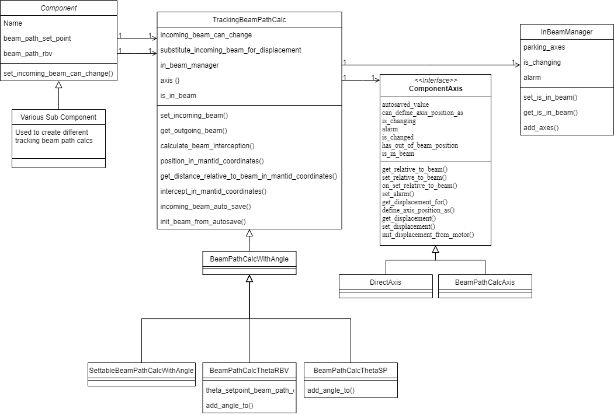

> [Wiki](Home) > [The Backend System](The-Backend-System) > [Specific Device IOC](Specific-Device-IOC) > [Miscellaneous motion control](Miscellaneous-Motion-Control) > [Reflectometry IOC](Reflectometry-IOC) > [Geometry Components](Reflectometry-Geometry-Components)

A component represents a point of interaction with the beam on the beamline; for example, a slit set or mirror. They form the relationship between:

- the incoming beam: the position in space and angle of the beam which will intersect the components movement
- outgoing beam: the beam path after the beam has interacted with the component (which may or may not be altered)
- user set value relative to the beam: where the user would like an object relative to the beam (e.g. for something on the beam 0mm above the beam) on a given axis (e.g. linear / rotational offset)
- Mantid coordinates: the values for position in the room or of underlying PVs value, often a motor. Theses value don't change based on moving the beam.

In effect, the component layer is responsible for translating motor values/mantid coordinates (relative to straight-through beam) to high-level parameter values (relative to current beam path) and vice versa.

Each component captures the relationships for both set points (where the user wants the beamline to be) and readbacks (where the beamline actually is) separately i.e. the system maintains two separate models of the beam path. 

**For more information on implementation specifics see the [Beamline Configuration page](https://github.com/ISISComputingGroup/ibex_developers_manual/wiki/Reflectometry-Configuration#components)**

## Architecture

The next section is *Work in progress*

The architecture of a component is ....

During init of the component it must setup the set point and read back beamline calculations. These are mostly separate calculations down the beam line; although they occasionally borrow values from each other. The basis of each beamline calculation is the original position angle relationship calculation and this continues to be true. It is assumed that each component wants to track the beam using this relationship. 

