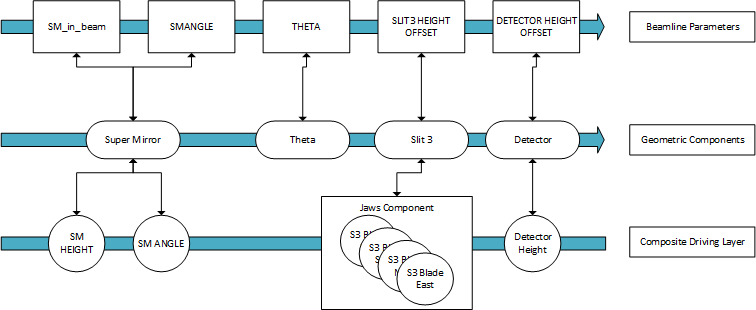

> [Wiki](Home) > [The Backend System](The-Backend-System) > [Specific Device IOC](Specific-Device-IOC) > [Miscellaneous motion control](Miscellaneous-Motion-Control) > Reflectometry IOC

> [Wiki](Home) > [Project overview](Project-Overview) > [Design documents](Design-Documents) > [Reflectometers](Reflectometers) > Reflectometry IOC

### High level Requirements

As described in the physics background page ([Reflectometers Science](Reflectometers-Science)), we need to calculate where a beamline should physically be based on higher level parameters, and track a changing beam path with multiple components. The user workflows we need to support are:

1. Delayed move (the user wants to move one or multiple devices on the beamline and they want to confirm the entered value(s) before committing to the move):
    1. Set a parameter (or multiple)
    1. Ensure the value is correct by reading it
    1. Move to the set value – either:
        1. Trigger move for a single parameter – the new value is applied for this parameter, all others retain their current values.
        1. Trigger move for all parameters – any new values are applied for all parameters
1. Immediate move (the user knows the value is correct and just wants to move):
    1. Set a single parameter
    1. Beamline immediately moves parameter to that position, while keeping all other parameters at their current value
1. Readback values (so the user knows where the beamline actually is)
    1. When any component, moves the actual position of the parameters should be reported
1. Visual indicators (so the user has extra information on the state of parameters without thought, usually indicated on the GUI via a colour)
    1. If a parameter setpoint is changed but not moved to (default colour yellow)
    1. If an underlying motor of a parameter is moving (default colour green)
    1. If a setpoint readback and readback are different from each other and not moving (default colour red)
    1. If a setpoint and setpoint readback are different and the setpoint is not changed (default colour red)
        1. TBD - we are not sure, we don't just want to copy values up from lower components.

### Design Details

Reflectometry IOC sits on top of:
- **Motor Driver Layer:** This layer is responsible for communicating with the galil and other motors.  This is complete.
- **Motor Group Layer:** This layer groups together motors from the motor driver layer into more natural groups. For instance a jawset, which allows a user to set jaw gaps and height, not just positions of individual blades. 

The reflectometry IOC is composed of layers, each layer talking to the layer below and above it:

- **Beamline Parameters:** In this layer, the user is specifying where they want a component to be positioned in relation to the incoming beam. The user will specify theta, for instance, which will then set the position of the geometry component related to theta. They will also read whether the geometry component has changed and report a readback of the positions on the actual beamline. The beamline parameters are calculated in a strict order starting with those closest to the source to ensure the path is correct. Parameters can be disabled in which case they do not automatically track the beam. 

- **Geometry Components:** This layer calculates the beam path, and handles the conversion of positions between parameter values (relative to current beam path) and motor values (absolute room coordinates). The beamline parameters set the positions from above and the composite driving layers sets the parameters from below.

- **Composite Driving Layer:** This layer pushes values from the parameters into motor group and motor driver PVs. They also push the readbacks up to the geometry layer. This layer contains some logic to allow concurrent moves with very simple synchronization (complete all moves in time with the slowest axis).

The whole system is coordinated by the Beamline object.

### Beamline Parameters

Beamline parameters store something a user wishes to set. They can have blocks or the GUI controls pointed at them. These parameters are transformations of low-level motor values. Each contains:

- Name: name of the parameter
- Readback: the value as calculated from the low level motor positions.
- Setpoint: when set, the reflectometry server will move the parameter this value
- Setpoint read-back: the last value that this parameter was moved to.
- Setpoint and no move: if this is set the setpoint is stored but not applied to the motor until the next time a move is triggered on this parameter.
- Move: moves this parameter to the setpoint
- Changed: true if the setpoint has been changed via setpoint no move, and has not yet been applied to the motor.

Types of beamline parameter:

- `AngleParameter`: a parameter which controls the angle of a component relative to the incoming beam angle.
- `TrackingPosition`: a parameter which controls a linear position relative to the incoming beam intercept. E.g. How far from the beam a slit should be, the position is measured along the movement axis. This is useful e.g. for scanning over this parameter for alignment.
- `InBeamParameter`: a parameter which controls whether a component is in or out of the beam. Some components can be parked out of the beam so they don't change its path e.g. the super mirror
- `SlitGapParameter`: a parameter which changes the gap of a slit set. Since this does not care about tracking the beam path, it does not talk to a geometry component, but directly to the underlying jaws PV. It is also used within the footprint calculator.

### Geometry Component

A component represents a point of interaction with the beam on the beamline; for example, a slit set or mirror. They form the relationship between:

- the incoming beam: the position in space and angle of the beam which will intersect the components movement
- outgoing beam: the beam path after the beam has interacted with the component.
- user set value relative to the beam: where the user would like an object relative to the beam (e.g. for something on the beam 0mm above the beam)
- PV value: the value for the underlying PV (often a motor)

Each component captures the relationships for both set points (where the user wants the beamline to be) and readbacks (where the beamline actually is) separately i.e. the system maintains two separate models of the beam path. 

The types of component currently are:

- `Component`: Component manages the distance between the incoming beam and the component without affecting the beam (e.g. a slit).
- `TiltingComponent`: Component manages the angle and distance between the incoming beam and the component without affecting the beam (e.g. a slit with a rotation stage).
- `ReflectingComponent`: Component manages the angle and distance between the incoming beam and the component, outgoing beam is reflected from this angle (assumes infinitely long reflector at angle and distance from the incoming beam)
- `ThetaComponent`: Component manages the angle between the incoming beam and the outgoing beam at the sample position. 
    - The readback calculates the angle to the theoretical beam intercept of another component (ignoring any positional offset on that component). The component used is the first component on the list of the theta component (as defined in the configuration) that is in the beam. For example, a beamline may contain an analyser followed by a detector. If the analyser is in the beam, theta is the angle of the beam to the analyser, otherwise it is the angle to the detector.
    - The setpoint works in the same way as the ReflectingComponent except that it will update the beam path of disabled components which define its angle.

### Composite Driving Layer

The composite driving layer sets the PV values which will make the moves happen. 

The layer consists of drivers which take setpoint values from components and push these values into a PV wrapper, and take readback values and push them into the components. The types we currently have are:

- `DisplacementDrivers`: Set the position of the motor based on the displacement, this includes moving to a parked value if the component is out of the beam
- `AngleDriver`: Set the position of the motor based on the angle.

There are various PV wrapper types which handle the mapping of parameters to the correct PVs based on different conventions. These are:
- PVWrapper: base wrapper that has all the utility functions (e.g. monitors and change listeners) but will not point at a real PV
- MotorPVWrapper: read and write to a motor pv
- AxisPVWrapper: read and write to an axis
- VerticalJawsPVWrapper: read and write to a jaw set without a height stage (height defined by vertical centre)

TODO: I think we need a parameter driver and then we can more easily separate SlitGapParameter from their pv wrappers.

### Beamline Object

This is the coordinating object for the system, it performs the correct movements based on the beamline parameters and mode which is currently active. The mode dictates which parameters are active in the calculation and preset values for any parameters. There are a number of modes which need to be supported in the system; for example NR mode, polarised, disabled etc. There is also a natural ordering of beamline parameters and components when it comes to calculations due to the direction of the beam, i.e. parameters for components closer to the source should be calculated before those further away as the latter have to be calculated relative to the changed beam path. For example the polarising mirror and all calculation to do with it should be done before the sample point calculations. The architecture is that a beamline object holds the order of both the components and beamline parameters. The composite drivers do not have a natural order but these are also contained by the beamline object. It makes sure that all calculations are done in the order in which they are held. The following is a subsection of the configuration showing beamline parameters at the top, components in the middle and drivers at the bottom.

 

#### Whole Beamline Move

When move for the whole beamline is triggered, the new positions of the motors are calculated using the following procedure. 

1. Each of the sample parameters is considered in turn, going down the beam. 
1. The beamline parameter is "moved to" if it has changed or if it is in the mode and a previous beamline parameter in this mode has changed.
1. When the beamline parameter is "moved to" the result of the calculation will be passed down to the component it controls.
    1. At this point the set point readback value will read the same as the set point
    1. The component will then recalculate the beam path and instruct those components down beamline to recalculate their beam paths.
1. Once all beamline parameters have finished calculating along with new component positions, the composite driving layer calculates the time taken for the slowest movement and performs the move in that time for all components.

#### Single Beamline Parameter Move

When a single beamline parameter is set and moved on its own then:

If the beamline parameter is in the current mode:

1. Each beamline parameter in the mode is considered in turn, going down the beam starting from the beamline parameter which just moved.
2. If the parameter is in the mode the beamline parameter moves to its last set point (i.e. the one in the set point readback). This will pass down the calculation to the component it controls.
3. As above, the drivers then tell the motors to move.

If it is not in the mode:

1. That beamline parameter sends its setpoint to the component it controls.
2. Then the beamline is recalculated
3. Motors are then moved

#### Changing the Mode

When the mode is changed to (not disable mode) the following happens:
1. In beamline parameter order each pre-set is applied to the setpoint (but not moved to).
    1. This includes setting whether the components are in the beam or not
2. The parameters in the beamline are activated/deactivated as defined by the newly set mode.

#### Disabled Mode

A mode can be declared as ”disabled mode” via parameter in its constructor. Disabled mode is special because in this mode the movements are relative to the positions when the mode was entered into. This is done by disabling the beam calculation for each component. The idea of disabled mode is to unlink all components from each other and stop tracking the beam path. Only theta related parameters should be in this mode, since theta is an angle between two components and by definition will not make sense if those are unlinked.

### Other Concepts

#### Footprint Calculator

The footprint calculator calculates the resolution and footprint on the sample based on the slit gaps, distances between slits and sample length. This object is owned by the beamline. Currently, the footprint and resolution values are read only.
