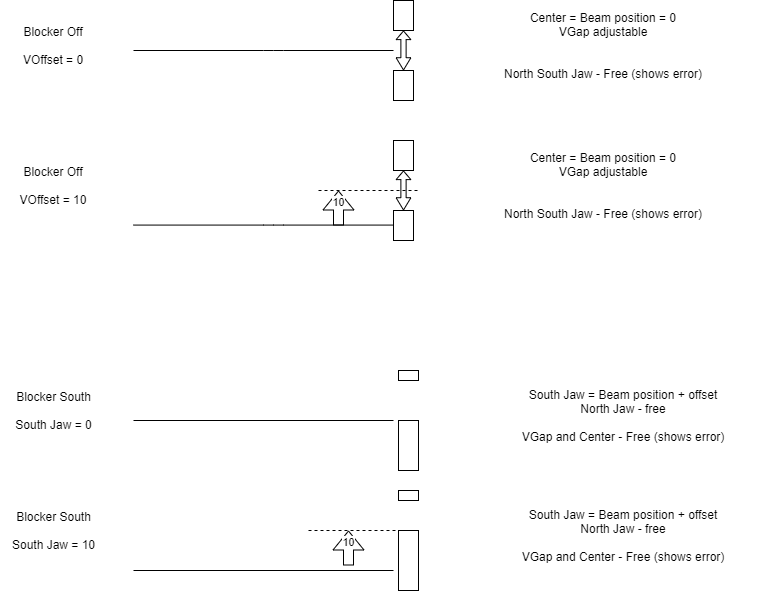

> [Wiki](Home) > [The Backend System](The-Backend-System) > [Specific Device IOC](Specific-Device-IOC) > [Miscellaneous motion control](Miscellaneous-Motion-Control) > [Reflectometry IOC](Reflectometry-IOC) > [CRISP](Reflectomtery-IOC-CRISP)

Specific information about Crisp

### Slit 3/Beam blocker

Slit 3 is a tall set of piezo jaws. They are not mounted on a height stage; instead the centre tracks the beam. To set the centre the `S3OFFSET` parameter must be set and this is the distance from the calculated beam reflected from the sample to the detector to the centre (usually set to 0).
Slit 3 can also be set into [beam blocker](Reflectometry-Beam-Blocker) mode for the south jaw. In this state the south jaw will track the beam and the `S3OFFSET` is the distance from the beam to the jaw in the up direction. The North jaw is controlled with `S3N` and is measured from the 0 position. The `S3S` parameter has been hidden in the reflectometry server to make it clear it is not controllable. To enable the `S3Offset` to set the south slit in the positive direction a user function engineering correction is used which inverts the jaws natural direction (from downwards to upwards).

### Blocks

Unlike some reflectometers there is only a single sample height and it is defined by the block:

- `Height`: Distance from the sample centre of rotation to the sample. This is used to align the sample with the beam.

