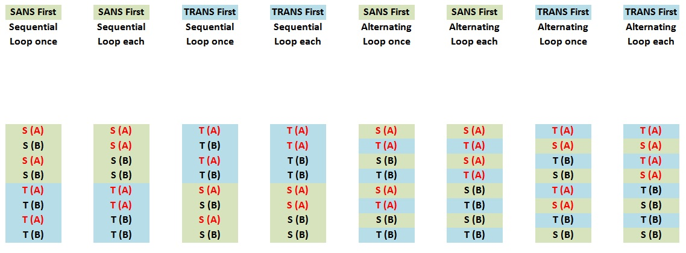

### Overview

The behaviour of the IBEX script generator plugin is modelled after the existing script generator which can generate OpenGenie Scripts for SANS2D and LOQ, and genie_python scripts for LARMOR. [Download](GUI_development/resources/scriptgen.zip)

The script generator takes a table of rows where each row translates into a do_sans and do_trans instruction. The amount of times and the order in which these are run is determined by the rest of the settings.

### Row Parameters:

   - _POSITION_ - The sample's position in the rack. Rack contains a top (T) and bottom row (B), with 20 columns (A to T). A position can range from AT to TB.
   - _SAMPLE_NAME_ - The name given to the sample by the user. Alphanumeric values only.
   - _TRANS_ - Transmission. Numerical value of the period of time to wait for when collecting TRANS data.
   - _TRANS_WAIT_ - The units of time used with the TRANS value. Can be microamp-hours, seconds, minutes or frames.
   - _SANS_ - Small Angle Neutron Scattering. Numerical value of the period of time to wait for when collecting SANS data.
   - _PERIOD_ - (For future use)
   - _THICKNESS_ - Numerical value for the thickness of the sample.

### Script Generator Settings:

   - _Order_ - Drop-down for the order in which to collect data via TRANS and SANS. (see the graphic at the bottom of this page illustrating the expected running order based on different settings) The options are:
     -  _All TRANS first_ - All TRANS data collection will be completed first.
     - _Alternate - TRANS first_ - Data collection alternates between TRANS and SANS, starting on TRANS firstly.
     -  _All SANS first_ - All SANS data collection will be completed first.
     - _Alternate - SANS first_ - Data collection alternates between TRANS and SANS, starting on SANS firstly.
   - _Do SANS_ - The number of times to collect SANS data. Loops through the SANS values in the table this number of times.
   - _Do TRANS_ - The number of times to collect TRANS data. Loops through the TRANS values in the table this number of times.
   - _Loop over each run?_ - When enabled, the script will loop n times over each sample before moving on to the next one, rather than looping over all samples in sequence n times (n being the number specified under the Do SANS/TRANS parameters). See the graphic at the bottom of this page.
   - _A1, S1 Setting_ - The size of the aperture (small, medium, large)
   - _Sample Geometry_ - What the sample is placed in. Options are: disc, cylindrical, flat plate, single crystal. 
   - _Sample Height_ - The height of the sample container in millimetres.
   - _Sample Width_ - The width of the sample container in millimetres.  
   - _Collection Mode_ - The way the data is recorded. Options are: histogram (visual) and events (logged entries). 
   - _Preview Script_ - A button that, when pressed, generates a preview of the script in a pop-up window.
   - _Write Script_ - A button that, when pressed, offers a save selection in a pop-up dialog and writes the final script to this location.
   - _Estimated Script Time_ 
     - _Est. count rate_ - Numerical value in microampere-hours for ...
     - _Est. time between moves_ - Numerical value in seconds for ...
     - _Est. script time_ - The estimated script time generated by the software, based on the estimated count rate and time between moves.
     - _Calculate_ - A button that will calculate and fill the estimated script time field.

### Expected running order:
Below is a graphic illustrating the expected running order for different settings on an example table with 2 rows and 2 loops per sample.

S(A)=SANS(sample A), T(B)=TRANS(sample B) and so on...

