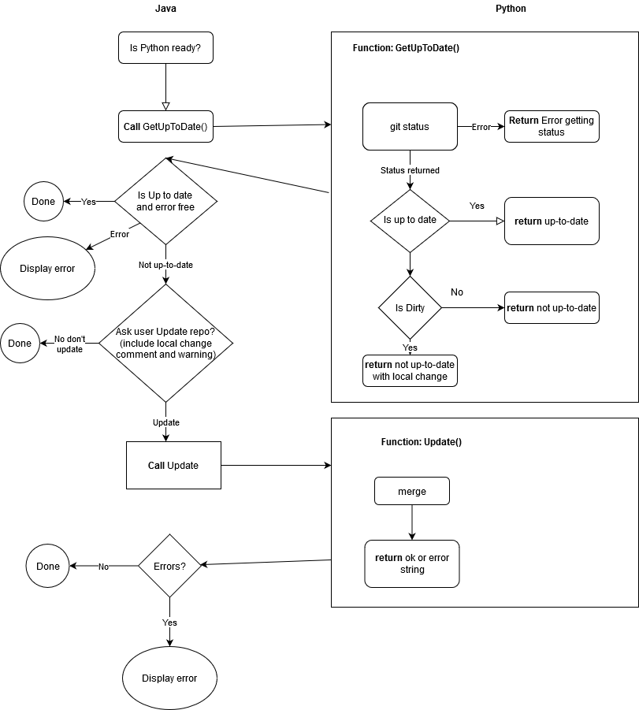

Meeting to discuss this happened. Summary of the main points that were discussed is below:

# High level design

A high level design to use **Eclipse RCP** was agreed. We will build this in two configurations:
- As a perspective in the IBEX GUI, similar to other existing perspectives
- As a standalone application <br>
**Note:** these two configurations will be using the same code (except for build-specific files).

The following general design points were agreed:
- The GUI will be written in Java (eclipse rcp). It should have minimal logic in it other than pure display logic
- It will talk to a python process embedded in the GUI, whose responsibility it is to generate a python script based on the input that a user has provided
  * Py4j is already included in our GUI build and allows for Java-Python communication
  * We need this process to be implemented in Python because it needs to be able to run arbitrary user-supplied python parameter validators (see also "The `ScriptDefinition` class", below).

# The `ScriptDefinition` class

Scientist defined script definitions must be python 2/3 compatible to work with genie python currently.

A `ScriptDefinition` is the base building block that the script generator will use to build up scripts. It is essentially a wrapper around a Python function that can tell us:
- Whether a given set of inputs is valid
- The types of the parameters
- How long each action will take (optionally)
- Possibly other metadata in future

As an example, consider a class that looks something like:

```python
from genie_python.genie_script_generator import ScriptDefinition, cast_parameters_to

def mytype(string_input):
    if string_input == "default":
        return 0.0
    else:
        return float(string_input)


class DoRun(ScriptDefinition):

    @cast_parameters_to(temperature=float, field=float, uamps=mytype)
    def run(self, temperature=0.0, field=0.0, uamps=0.0):
        g.cset("temperature", temperature)
        g.cset("field", field)
        g.begin()
        g.waitfor_uamps(uamps)
        g.end()

    @cast_parameters_to(temperature=float, field=float, uamps=mytype)
    def parameters_valid(self, temperature=0.0, field=0.0, uamps=0.0):
        errors = ""
        if not 0.1 <= temperature <= 300:
            errors += "Temperature outside range\n"
        if not -5 <= field < 5:
            errors += "Field outside range"
        if not -20 <= uamps <=32:
            errors += "uamps outside of range"
        if errors != "":
            return errors
        return None   

    def get_help(self):
        return "Help string"
    
    @cast_parameters_to(temperature=float, field=float, uamps=mytype)
    def estimate_time(self, temperature=0.0, field=0.0, uamps=0.0):
        return temperature * 10 + uamps * 100 
```
(this is not necessarily the final API)

We would probably supply some default `ScriptDefinition`s, but instrument scientists would be responsible for writing and maintaining their own instrument-specific script definitions (in a similar way to the current instrument scripts).

Currently, a default value has to be provided for every argument of `parameters_valid` and `run` due to the way we are passing kwargs. The parameters that are passed are all currently strings and must be converted to whatever type the user wants. We are providing a decorator `cast_parameters_to` to allow scientists to easily cast parameters and also define their own converters (see example `mytype` above). The custom converters means they can handle edge cases they are expecting from users.

The default values are used by the script generator to populate initial values for an action. However, this does not rely on the presence of a default value. In the absence of a default value the default is set to the name of the parameter.

# User interface

There are two main types of user interfaces that support slightly different workflows. We have decided that we will eventually need to support both, but as part of the MVP we should only implement the table-based view.

### Table based (part of MVP)

This interface is a simple table. It is configured for one (and only one) type of `ScriptDefinition`. It configures it's columns to match the parameters of the script definition.

For example, for the `ScriptDefinition` given above, the table in the script generator would look like this:

| temperature | field | uamps | Validity |
| --- | --- | --- | --- |
| 50.0 | -1 | 100 | ✘ |
| 80.0 | 2 | 100 | ✔ |

Each row in the table corresponds to exactly one `Action`. The type of action must be the same for all rows (otherwise, the columns would no longer make sense).

A row will be highlighted red if invalid and have a heavy cross mark against it in the validity column. If the row is valid it will be the regular table colour with a validity column cell that is green and has a heavy tick mark.

A user is able to get the reason for invalidity (provided by the script definition) by hovering over the row or by clicking the 'Get Invalidity Errors' button.

### List/tree view (not part of MVP, but likely to be requested in future)

This interface is a list of Actions and their parameters. In this UI, each action can be of a different type. The actions are executed sequentially. This is a more flexible approach, however it looks closer to the final python script, so is slightly more complex to use (as a user) than the table-based approach. The UI would look more like a set of bullet points:
- `doRun - temperature=50, field=5, uamps=100`
- `changeSomething - value=1000`
- `doRun - temperature=100, field=5, uamps=100`

In this sense, it is quite a thin wrapper over a python script. The main advantage it gives you is parameter type/value checking (and arguably. In future we may be able to extend this approach to allow for loops or other types of more complex statements.

# Script Definitions

The script generator will be configured by loading in a script definition file. This script definition file can initially be written in Python - though we have not necessarily ruled out moving to another format in future if the need arises.

This script definition file will define the available `Action`s, and will be editable by the instrument scientists. Each instrument that uses the script generator will need at least one script definition file (maybe more if they have different experimental setups which require very different scripts).

## Workflow for editing script definitions

The workflow for creating or modifying script definitions is:
1. The instrument scientist creates a new or edits an existing a script definition using a text editor (e.g. Notepad++).
1. The instrument scientist saves the script definition:
   1. if using his/her office (or cabin or home) PC, the script is saved locally (to a directory of the scientist's choosing)
   1. if using the instrument control PC, the script is saved `<where?>` (to a directory of the scientist's choosing?)
1. The instrument scientist transfers the saved script definition to the script definition repository.
   * the scientist will use a command (in practice a python or batch script) to perform the transfer
   * the command will print a message to inform the instrument scientist of success or failure of the save operation
1. If the transfer:
   1. succeeds: the scientist need do nothing more
   1. fails: the scientist should contact the Experiment Controls group for support.

Notes:
1. We expect instrument scientists to create/modify script definitions.  We do not expect users to create/modify script definitions.  We should advise instrument scientists not to allow users to create/modify script definitions.
1. We will create a python/batch script to manage transfer of saved scripts to the git repository
1. We will prevent instrument scientists from committing as `spudulike`, the script will have to ask for a username (e.g. `fedID`) and password to commit with
1. Script will generate a commit message that identifies that the push was done by the script (i.e. to help us to identify situations in which someone has tried to circumvent the script by using git commands directly)
1. Script will prevent the user from setting username and password to use all the time for pushing to this repository
1. The script will do: pull, add, commit and push to master
1. Must have git and python installed
1. Must have access to repository origin

## How Script Definitions Repo is Updated on Start



On start up we want to get the current repository of script if possible and the user lets us. If there is a problem because they have edited their code in the repository we assume this is because they know what they are doing. To edit the code they will need to know how to commit it back to the central repo anyway so we don't need to cover that case except to warn them (they are power users). For normal users they just want it up-to-date or not.
