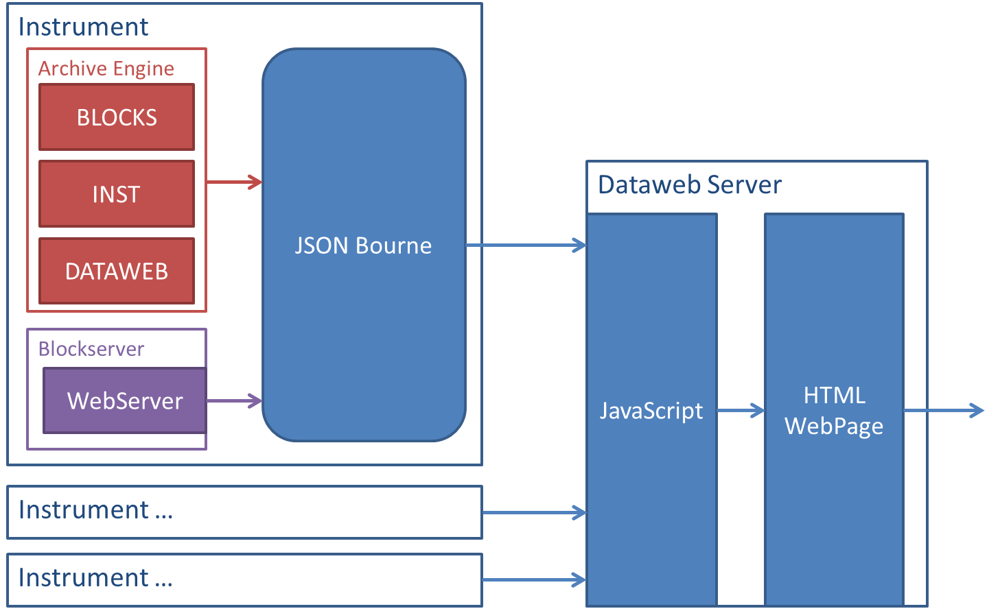

# Web Dashboard

The dataweb service allows some information about each instrument to be viewed in a webpage from both inside and outside the ISIS network. This service already exists for SECI instruments.

## The Overall Architecture

The dataweb system consists of a number of parts running on each instrument:

---

### The Archive Engine

The archive engine shown in the [high level design](High-Level-Architectural-Design) produces internal webpages that provides live data on various PVs in HTML format:

* INST (located at http://localhost:4812/group?name=INST) gives data on the PVs associated with the DAE etc.
* BLOCKS (located at http://localhost:4813/group?name=BLOCKS) gives data on the current status of all block PVs
* DATAWEB (located at http://localhost:4813/group?name=DATAWEB) gives data on hidden blocks

### The WebServer

The webserver is run as part of the BlockServer and provides all of the data on the current configuration in JSON format. This is the exact same data that is served on the GET_CURR_CONFIG_DETAILS PV. The webserver is currently serving the data on localhost:8008.

---

### On the Dataweb Server

There are also parts of the system running on a central dataweb server, which provides external access. 

### JSON Bourne

The program collates all the data from the other sources, on all the EPICS instruments, such as putting the blocks and their values into the relevant groups as given by the configuration. This information is served as JSON to localhost:60000.

### The Website

Currently a simple JS script takes the JSON created by JSON Bourne and provides a simple webpage for an external client to view. This can be accessed from http://dataweb.isis.rl.ac.uk/

## Deployment
To add a new EPICS instrument to the web dashboard the following is required:
* Add the instrument hostname to EPICS_INSTS within JSON_bourne\webserver.py
* Add a link to the main page of the dataweb to IbexDataweb/default.html?Instrument=_hostname_