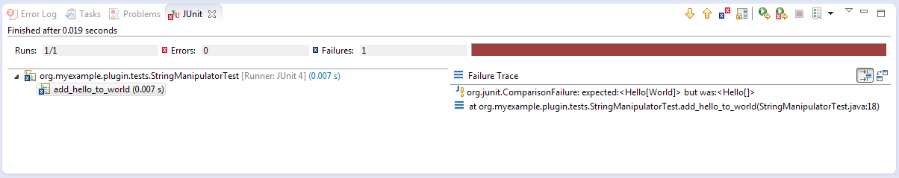
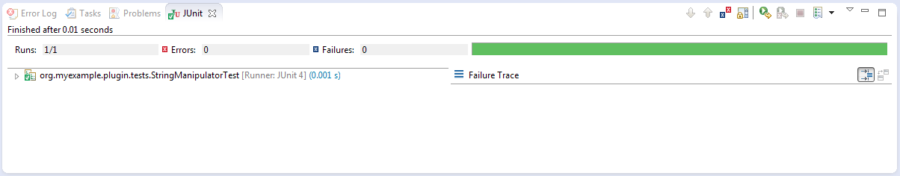

============
Unit Testing
============

To create unit tests for an Eclipse plug-in a Fragment Project is used. When creating a Fragment Project we assigned the plug-in we wish to test as a Host Plug-in.
Eclipse automatically gives the Fragment access to the classes in the original plug-in.

In the Fragment Project we create classes to test the classes in the original plug-in.

A simple example
----------------

Open the wizard for creating a standard plug-in in Eclipse (File->New->Plug-in Project) and complete the following steps (if values not specified then use the defaults):

* Set "Project name" to org.myexample.plugin
* Click "Next"
* Uncheck "Generate an activator, a Java class that controls the plug-in's life cycle"
* Uncheck "This plug-in will make contributions to the UI"
* Put "No" for "Would you like to create a 3.x rich client application?"
* Click "Finish"

The will create the plug-in. Inside the src folder create a package called org.myexample.plugin.classes and add a class called StringManipulator.
Add the following code to the class:

.. code::

    package org.myexample.plugin.classes;

    public class StringManipulator {
        
        public String addStrings(String one, String two) {
            return one;
        }
    }
    
Now to create the Fragment Project. Open the Fragment Project wizard under File->New->Other->Plug-in Development->Fragment Project and complete the following steps:

* Set "Project name" to org.myexample.plugin.tests (i.e the original plug-in name plus ".tests" - this is our naming convention)
* Click "Next"
* Under "Host Plug-in" click the "Browse" button and select the original plug-in
* Click "Finish"

Eclipse will now create the Fragment Project. We need to manually add the JUnit plug-in as a dependency for the Frgament Project, to do this:

* Open the MANIFEST.MF file
* Select the "Dependencies" tab
* Under "Required Plug-ins" click the "Add" button
* In the dialog, type org.junit and select the plug-in listed (it should be version 4+)
* Click "OK"
* Save the changes

In the src directory of the Fragment Project create a package called "org.myexample.plugin.tests". 
Add a class called "StringManipulatorTest" - the name **MUST** end in Test for the build system to recognise it.

Okay let's create a test, add the following code to the StringManipulatorTest class:

.. code::

    package org.myexample.plugin.tests;

    import static org.junit.Assert.*;

    import org.junit.Test;
    import org.myexample.plugin.classes.StringManipulator;

    public class StringManipulatorTest {
        @Test
        public void add_hello_to_world() {
            // Arrange
            StringManipulator strMan = new StringManipulator();

            // Act
            String ans = strMan.addStrings("Hello", "World");

            // Assert
            assertEquals("HelloWorld", ans);

        }
    }
    
To run the test right-click on the Fragment Project and select Run As->JUnit Test. The test should run and fail like so:

    
Clearly there is something wrong with the original code in addStrings, so let's fix that by changing:

.. code::

    public String addStrings(String one, String two) {
        return one;
    }

to:

.. code::

    public String addStrings(String one, String two) {
        return one + two;
    }

Now the test should pass if it is run again:

    
JUnit has many useful features, here are a select few.

* other asserts such as assertTrue, assertArrayEquals,  assertNotEqual and assertNotNull

* assert that an error is thrown:

.. code::

    @Test(expected=IndexOutOfBoundsException.class)
    public void raises_IndexOutOfBoundsException() {
        ArrayList emptyList = new ArrayList();
        Object o = emptyList.get(0);
    }

* set-up and teardown methods - these are code snippets that are run before and after **each** test:

.. code::

    private List<String> names;
	
	@Before
    public void setUp() {
        // Called before each test
        names = new ArrayList<String>();
        names.add("Tom");
        names.add("Dick");
        names.add("Harry");
    }

    @After
    public void tearDown() {
        // Called after each test
        names.clear();
    }
    
	@Test
	public void concatenate_names() {
		// Arrange
		StringManipulator strMan = new StringManipulator();

		// Act
		String ans = strMan.concatenateNames(names);

		// Assert
		assertEquals("Tom, Dick and Harry", ans);

	}
    
Note: Each test should be independent of the other tests as there is no guarantee of the order they are run in.

* BeforeClass and AfterClass - these are run once before the first test and after the last test in a class respectively:

.. code::

    @BeforeClass
    public static void oneTimeSetUp() {
        // Perhaps create a dummy file or something shared by more than one test
    }

    @AfterClass
    public static void oneTimeTearDown() {
        // Clean up
    }
    
Naming conventions
------------------

Java methods are usually lower CamelCase (e.g getNameValue), but for the tests we have adopted the convention of using underscore spaced method names (e.g. does_two_plus_two_equal_four).
This is probably easier to read that CamelCase, but it does upset CheckStyle; to tell CheckStyle to ignore the name format add a warning suppression to the top of the class:

.. code::

    @SuppressWarnings({ "checkstyle:magicnumber", "checkstyle:methodname" })
    public class StringManipulatorTest {
    
It may be worth adding the magic-number suppression too depending on the type of tests.

Mockito
-------

