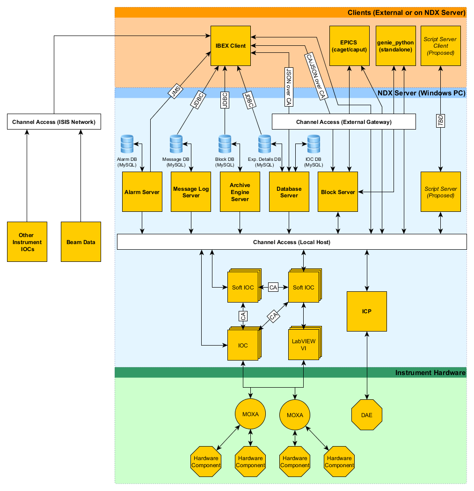

====================================
IBEX High Level Architectural Design
====================================

This document describes the high level design for IBEX. Eventually there should be outlines of the architectural design for each part of the high level design.

High Level Design
-----------------

    
Notes on the figure:

* CA - Channel Access
* External Gateway - This exposes the PVs running on the NDX server to the rest of the ISIS network, as read-only
* JDBC - Java Database Connectivity
* JMS - Java Messaging Service
* Soft IOC - These IOCs do not talk directly to hardware

Clients
-------

Clients can run on the NDX machine or elsewhere on the network. The external gateway defines the rules of which network addresses are allowed to read or write from PVs. At ISIS all machines in the blockhouse are allowed to write to PVs, and other machines on the ISIS network have read-only access to PVs.

NDX Server
----------

This is the Windows PC running the control software for the instrument (e.g. NDXLARMOR). This machine provides the PVs for the instrument externally, for example on Larmor all the PVs prefixed with ``IN:LARMOR:``.

Instrument Hardware
-------------------

Coming soon...

Low Level Design Documents
--------------------------

Below is a list of the lower level architectural design documents.

.. _Alarms: https://trac.isis.rl.ac.uk/ICP/wiki/Alarms
.. _Client: client_design.html

* Alarms_
* Client_

