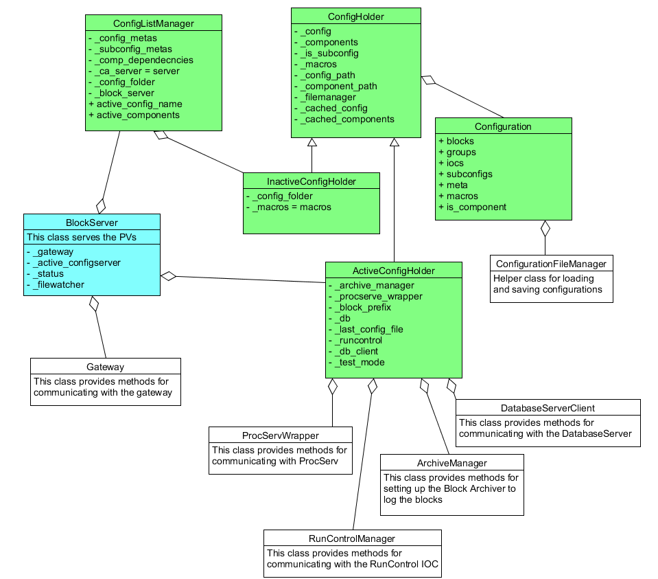
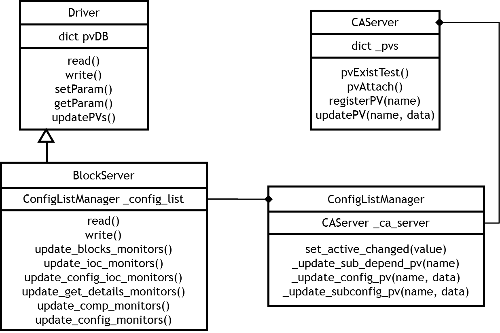
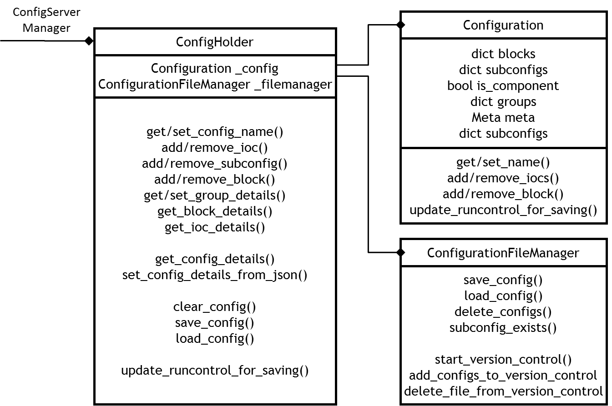
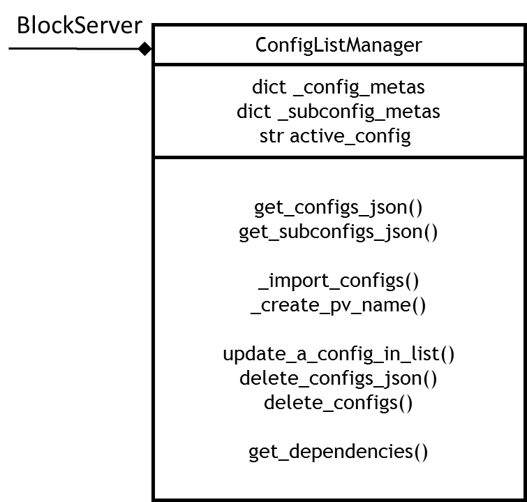
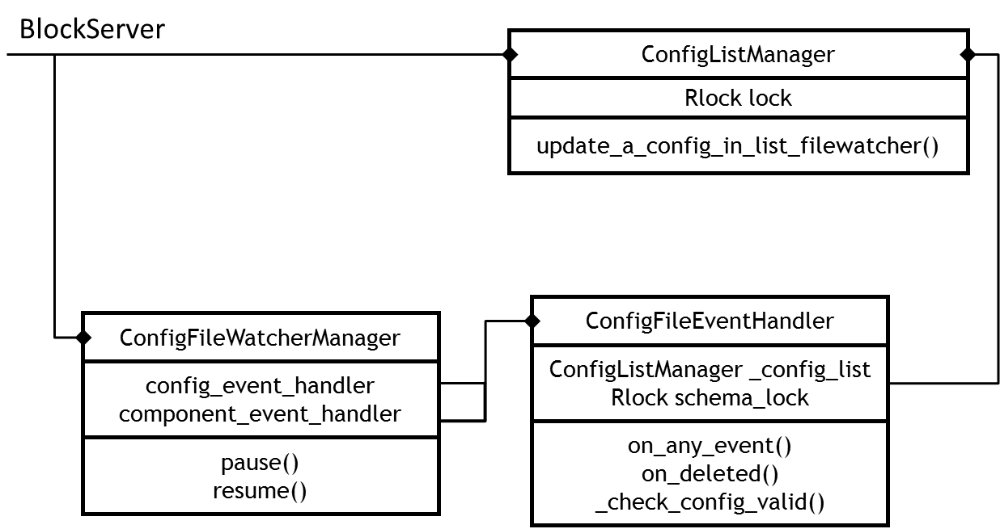

*********************************
The BlockServer Program Structure
*********************************

This document is intended to outline the internal structure of the BlockServer for reference by future developers. Please be
aware that the BlockServer is a work in progress and as such this document is liable to change.

----------
Overview
----------

The BlockServer's main responsibility is to look after configurations and their associated files. It can be used to read/write
to both the active configuration on the instrument and other potential configurations in the filesystem. It also contains a
filewatcher to ensure that any manual changes to configurations are correctly handled. Below is an UML overview of the most 
significant parts:

----------------
Channel Access
----------------

The BlockServer uses the pcaspy Python module to implement channel access. There are two main means of implementing PVs in the
BlockServer, static PVs and dynamic PVs:

* Static PVs are created in a dictionary at startup and are intercepted by subclassing the Driver class and implementing the read()
  and write() methods. Most of the PVs the BlockServer uses are written like this and the method is well documented in the pcaspy 
  documentation_. 

.. _documentation: http://pcaspy.readthedocs.org/en/latest/

* Dynamic PVs are more complex and are required for serving PVs for each inactive configuration, the names of which are not known
  until startup. To do this we have created our own pcaspy server called CAServer that can be found in 
  inst_server\\server_common\\channel_access_server.py. This server has a number of simple methods to register new PVs within it's own 
  dictionary and pass them to channel access when requested. The server also assumes that all PVs will be in a string format, which is
  currently a good assumption. All dynamic PVs are created by the ConfigListManager as they relate to the inactive configs/components
  that are listed in that class. A simple diagram of this relationship is shown below:

   
A simple example of both the static and dynamic PVs is located in inst_server\\BlockServer\\blockserver_docs\\resources\\pcaspy_example.

-----------------------
Configuration Servers
-----------------------

There are two Configuration Server Manager classes. The ActiveConfigHolder class holds the currently configuration and deals with the
JSON communication between the BlockServer PVs and what modifications to make for the configuration. It also controls the running of 
the IOCs. This class is a subclass of ConfigHolder which is used to hold the basic details about the configurations as
well as save/load them to disk. Most, if not all, of the individual get/set methods in the ConfigHolder are being replaced by catch-all
get_config_details() and set_config_details(). A reduced description of the classes is given below:

.. figure:: img/config_servers_uml.png
   :width: 100%
   :align: center
	
----------------
Configurations
----------------

The ConfigHolder class does most of the implementation for the specifics of editing a configuration making sure that all parts of the 
configuration follow the correct rules. It holds a Configuration object which does very little other than contain all the relevant 
configuration details. There are also small container classes to hold seperate Blocks, Groups, IOCs and MetaData.

The ConfigHolder also uses the methods from the static class ConfigurationFileManager, which deal with the specifics of the file system
including version control of configuration files. This FileManager class uses a ConfigurationXmlConverter object to help convert into 
the xml used for saving and loading.

	
------------------
Inactive Configs
------------------

The ConfigListManager class is responsible for the details of all of the configurations, both the active one and the inactive ones, 
on the file system. When the BlockServer is first started this class will search through the configurations folder and do the following
for each config:

1. Check folders hold the expected files
2. Check the xml files against the schema (using the static ConfigurationSchemaChecker class)
3. Load the files into a dummy InactiveConfigHolder
4. Create a PV name based on the configuration name but ensuring only valid chars
5. Create a PV for the configuration that gives all data on it
6. For each component the configurations that contain it are noted in a dictionary

When modifications are made to configurations through the BlockServer PVs these steps are repeated for the modified configuration.

The ConfigListManager is also responsible for ensuring that configurations are correctly deleted. When a configuration is deleted via 
the DELET_CONFIG or DELETE_COMP PVs there will be a check that the any active configurations/components are not being deleted. If the 
configuration is safe to delete the corresponding PVs are unregistered and the files are removed from both the file system and version 
control.

	
--------------
File Watcher
--------------

The BlockServer also contains a File Watcher to ensure that any by-hand modifications made to configurations are done correctly and are
passed on to the client. On startup the BlockServer will create a ConfigFileWatcherManager object, which is passed an instance of the
ConfigListManager class. The ConfigFileWatcherManager will then create two ConfigFileEventHandler objects, one for configurations and 
another for the components. 

When a file is modified the Event Handlers will:

1. Check files against the schema
2. Load the files into a dummy InactiveConfigHolder
3. Update the PVs in the ConfigListManager (using a lock as the handler is on a different thread). The ConfigListManager must then pass
   this up to the BlockServer object to modify the CONFIGS/COMPS PVs.
4. Update version control with the modifications

The event handlers will also handle files being deleted by:

1. Recovering the deleted folder from version control
2. Check that part of a config hasn't been deleted
3. Call for the configuration to be deleted via the ConfigListManager

The ConfigFileWatcherManager can be paused and resumed when known modifications are being made to the file system.

	