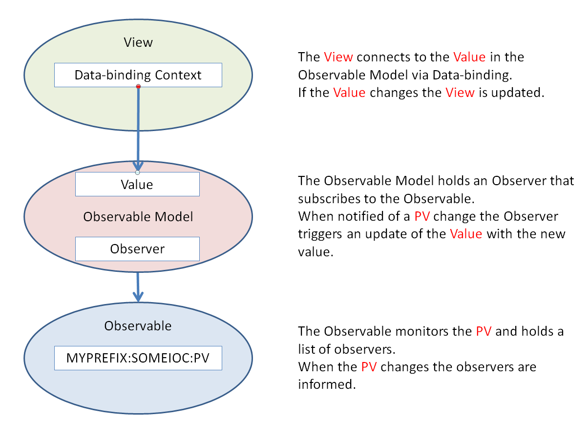

=========================
Connecting a View to a PV
=========================

The basic arrangement for the mechanism for connecting a View to a PV is shown below:

Adding an Observable
--------------------

The Observable is responsible for the connection to the PV and monitoring it for changes.

For this example we are going to connect and read the title PV on the DAE IOC. There is already a way of getting the title in the IBEX GUI, but for demonstration purposes we are going to ignore that!

First we need to create a new Plug-in in Eclipse:

* Select File->New->Plug-in Project

* Enter org.csstudio.isis.title for the project name

* Un-check 'Use default location' and browse to where the GUI code is located and append the project name to the path. For example, on my system the location would be C:\\Instrument\\Dev\\client\\ISIS\\base\\org.csstudio.isis.title
 
* Click 'Next'

* On the next screen, check the 'Generate an activator ...' check-box and un-check the others.

* Set 'Would you like to create a 3.x rich client application?' to 'No'

* Click 'Finish'

Now the Plug-in is created we can create an Observable:

* Open the MANIFEST.MF file in META-INF and under the 'Dependencies' tab add org.csstudio.isis.instrument to the list of required plug-ins

* Don't forget to save the changes

* Create a new Class called TitleVariable, this will be the class that holds the connection to the PV

* We require TitleVariable to inherit from Instrument Variables, so open the code file for TitleVariable and modify the code like so:

.. code::

    package org.csstudio.isis.title;

    public class TitleVariable extends InstrumentVariables {

    }
 
* The InstrumentVariables will have a red error indicator, so hover over it and select "Import 'InstrumentVariables' (org.csstudio.isis.instrument)" from the drop-down

* Now the error will have jumped to TitleVariable, this time hover over this and select "Add constructor 'TitleVariable(Channels channels)'" from the drop-down

* Next we add the observable for the PV:

.. code::

    package org.csstudio.isis.title;

    import org.csstudio.isis.epics.observing.InitialiseOnSubscribeObservable;
    import org.csstudio.isis.instrument.Channels;
    import org.csstudio.isis.instrument.InstrumentVariables;
    import org.csstudio.isis.instrument.channels.CharWaveformChannel;

    public class TitleVariable extends InstrumentVariables {
        
        public final InitialiseOnSubscribeObservable<String> titleRBV = reader(new CharWaveformChannel(), "DAE:TITLE");

        public TitleVariable(Channels channels) {
            super(channels);
        }

    }
    
Explanation on Channels, InitialiseOnSubscribeObservable and reader.

Adding a Model interface
------------------------

Next we create a Model interface:

* Create a new Interface called ITitleModel

* Implementing the interface will require getTitle and setTitle methods, so the code needs to look like:

.. code::

    package org.csstudio.isis.title;

    public interface ITitleModel {
        String getTitle();
        void setTitle(String value);
    }

Adding an ObservableModel
-------------------------

Next we create an ObservableModel which allows us to bind controls on the View to the PV Observable:

* Create a new Class called ObservableTitleModel

* ObservableTitleModel needs to inherit from ModelObject from org.csstudio.isis.model, so change the code to look like:

.. code::

    package org.csstudio.isis.title;

    public class ObservableTitleModel extends ModelObject{

    }
    
* To fix the errors we need to add org.csstudio.isis.model to the required plug-ins list in the MANIFEST.INF. We can either add it manually or hover over the error and select "Add 'org.csstudio.isis.model' to required bundles"

* The next error can be fixed via the drop-down by selecting "Import 'ModelObject' (org.csstudio.isis.model)"

* The class also needs to implement ITitleModel, so change the code to implement ITitleModel:

.. code::

    public class ObservableTitleModel extends ModelObject implements ITitleModel {

* There should now be an error because the methods of ITitleModel are not implemented. Hover over the error and select 'Add unimplemented methods'. The code should look like this:

.. code::

    package org.csstudio.isis.title;

    import org.csstudio.isis.epics.observing.BaseObserver;
    import org.csstudio.isis.model.ModelObject;

    public class ObservableTitleModel extends ModelObject implements ITitleModel {

        private String title;
        
        @Override
        public String getTitle() {
            // TODO Auto-generated method stub
            return null;
        }

        @Override
        public void setTitle(String value) {
            // TODO Auto-generated method stub
            
        }

    }
    
* The correctly cased getter and setter are requirements for the object to be bindable from a View (http://en.wikipedia.org/wiki/JavaBeans). We now need to add our own code to the methods:

.. code::

    package org.csstudio.isis.title;

    import org.csstudio.isis.model.ModelObject;

    public class ObservableTitleModel extends ModelObject{
        private String title;
        
        public String getTitle(){
            return title;
        }
        
        public void setTitle(String value){
            firePropertyChange("title", this.title, this.title = value);
        }
    }
    
The firePropertyChange method raises an event when the title changes.
    
* Next we create a BaseObserver inside the class, like so:

.. code::

    package org.csstudio.isis.title;

    import org.csstudio.isis.epics.observing.BaseObserver;
    import org.csstudio.isis.model.ModelObject;

    public class ObservableTitleModel extends ModelObject implements ITitleModel {

        private String title;
        
        private final BaseObserver<String> titleObserver = new BaseObserver<String>(){

            @Override
            public void onValue(String value) {
                setTitle(value);
            }

            @Override
            public void onError(Exception e) {
                
            }

            @Override
            public void onConnectionChanged(boolean isConnected) {
                
            }
        };
        
        
        public String getTitle(){
            return title;
        }
        
        public void setTitle(String value){
            firePropertyChange("title", this.title, this.title = value);
        }
    }

* The BaseObserver is responsible for observing changes in the TitleVariable, but for that we need to wire the objects up. Add a private variable for TitleVariable, like so:

.. code::

    ...
    public class ObservableTitleModel extends ModelObject implements ITitleModel {

        private String title;
        private final TitleVariable titleVar;
        
        private final BaseObserver<String> titleObserver = new BaseObserver<String>(){
    ...

* Now we add a constructor for that allows the wiring up of the BaseObserver and the TitleVariable:

.. code::

    public ObservableTitleModel(TitleVariable titleVar){
        this.titleVar = titleVar;
        titleVar.titleRBV.subscribe(titleObserver);
    }

* The final class looks like this:
    
.. code::

    package org.csstudio.isis.title;

    import org.csstudio.isis.epics.observing.BaseObserver;
    import org.csstudio.isis.model.ModelObject;

    public class ObservableTitleModel extends ModelObject implements ITitleModel {

        private String title;
        private final TitleVariable titleVar;
        
        private final BaseObserver<String> titleObserver = new BaseObserver<String>(){

            @Override
            public void onValue(String value) {
                setTitle(value);
            }

            @Override
            public void onError(Exception e) {
                
            }

            @Override
            public void onConnectionChanged(boolean isConnected) {
                
            }
        };
        
        public String getTitle(){
            return title;
        }
        
        public void setTitle(String value){
            firePropertyChange("title", this.title, this.title = value);
        }
        
        public ObservableTitleModel(TitleVariable titleVar){
            this.titleVar = titleVar;
            titleVar.titleRBV.subscribe(titleObserver);
        }
    }

The Activator
-------------

The Activator is the entry-point for the Plug-in - it gets created when the Plug-in is first used.
This is where we wire up the ObservableTitleModel and the TitleVariable:

* First we want to rename Activator because it is not a very descriptive name, let's refactor it to be called Title (okay that is not much better...)

* We want to make the Activator a singleton, so we need it to contain a static instance of itself, a constructor and a getInstance method:

.. code::

    package org.csstudio.isis.title;

    import org.osgi.framework.BundleActivator;
    import org.osgi.framework.BundleContext;

    public class Title implements BundleActivator {

        private static BundleContext context;
        private static Title instance;

        public Title() {
            instance = this;		
        }
        
        public static Title getInstance() {
            return instance;
        }

        static BundleContext getContext() {
            return context;
        }

        /*
         * (non-Javadoc)
         * @see org.osgi.framework.BundleActivator#start(org.osgi.framework.BundleContext)
         */
        public void start(BundleContext bundleContext) throws Exception {
            Title.context = bundleContext;
        }

        /*
         * (non-Javadoc)
         * @see org.osgi.framework.BundleActivator#stop(org.osgi.framework.BundleContext)
         */
        public void stop(BundleContext bundleContext) throws Exception {
            Title.context = null;
        }
    }
    
* Now we need it to wire up our classes from earlier, so we add the wiring up to the constructor:

.. code::

    ...
    private static BundleContext context;
	private static Title instance;
	
	private TitleVariable titleVar;
	private ObservableTitleModel model;
	
	public Title() {
		instance = this;		
		titleVar = new TitleVariable(Instrument.getInstance().channels());
		model = new ObservableTitleModel(titleVar);
	}
    ...
    
* Finally we add a method to retrieve the model so we can bind against it. The final code look like this:

.. code::

    package org.csstudio.isis.title;

    import org.csstudio.isis.instrument.Instrument;
    import org.osgi.framework.BundleActivator;
    import org.osgi.framework.BundleContext;

    public class Title implements BundleActivator {

        private static BundleContext context;
        private static Title instance;
        
        private TitleVariable titleVar;
        private ObservableTitleModel model;
        
        public Title() {
            instance = this;		
            titleVar = new TitleVariable(Instrument.getInstance().channels());
            model = new ObservableTitleModel(titleVar);
        }
        
        public static Title getInstance() {
            return instance;
        }
        
        public ObservableTitleModel model() {
            return model;
        }

        static BundleContext getContext() {
            return context;
        }

        /*
         * (non-Javadoc)
         * @see org.osgi.framework.BundleActivator#start(org.osgi.framework.BundleContext)
         */
        public void start(BundleContext bundleContext) throws Exception {
            Title.context = bundleContext;
        }

        /*
         * (non-Javadoc)
         * @see org.osgi.framework.BundleActivator#stop(org.osgi.framework.BundleContext)
         */
        public void stop(BundleContext bundleContext) throws Exception {
            Title.context = null;
        }
    }
    
A little tidying up
-------------------

By convention we should put any class etc. we don't want exposed outside outside of the Plug-in in a package ending in internal. In this example the package would be called org.csstudio.isis.title.internal.

Binding the View to the Model
-----------------------------

The simplest way to do this is to add a method for creating the binding to the View:

.. code::

    private void doBinding(Label lblTitle){
        DataBindingContext bindingContext = new DataBindingContext();
		bindingContext.bindValue(WidgetProperties.text().observe(lblTitle), BeanProperties.value("title").observe(Title.getInstance().model()));
    }

* Then the method can be called from the createPartControl method of the View