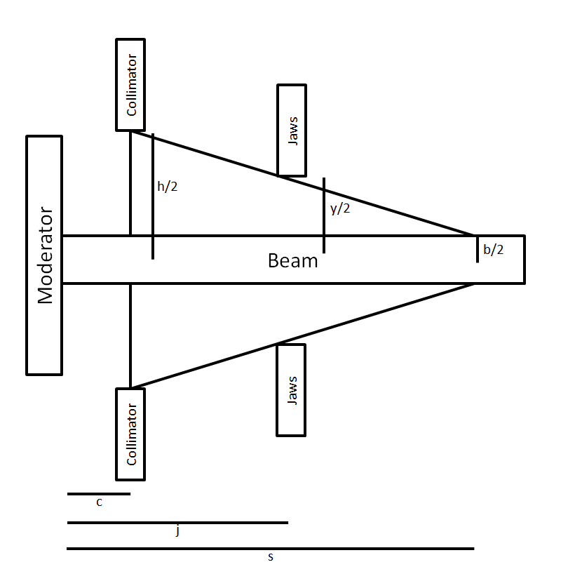

> [Wiki](Home) > [The Backend System](The-Backend-System) > [Specific Device IOC](Specific-Device-IOC) > [Jaws and Slits](Jaws-and-slits) > [Jaws Managers](Jaws-Managers)

On a number of different instruments users want to set up their jaws in a pyramid shape to aid in collimation. The science behind this is that as the jaws narrow they remove more and more of the neutrons with a velocity component perpendicular to the beam.

To create these pyramid shapes instruments have jaws managers, where users will set the gap at the moderator and at the sample and IBEX will calculate what the gaps of the intermediate jaws will be based on their distance from the moderator. In all cases scientists will count jaws from the moderator inwards so the highest numbered jaw (and the narrowest) will be the one next to the sample.

### The Mathematics

This diagram shows the mathematics for one jaw set.
 

Equation to work out the half width using similar triangle:

(y/2 - b/2 ) / (s-j) = (h/2 - b/2) / (s - c)

y = b + (h - b) * (s-j) / (s-c)

and similarly for the width.

### Software Implementation

The logic for this is implemented in db records and can be found in the [Motor Extensions repository](https://github.com/ISISComputingGroup/EPICS-motorExtensions).

Diagram and explanation 

### Examples

There is an example for how to use the system in `...\EPICS\support\motorExtensions\master\settings\jaws_manager\*.cmd` along with corresponding system tests in the IOCTestFramework.

There are currently three instruments using this system, each with their own quirks but generally sharing the same structure:
* [Polaris](Polaris-Jaws)
* [Gem](Gem-Jaws-Manager)
* [Nimrod](Nimrod-Jaws-Manager)