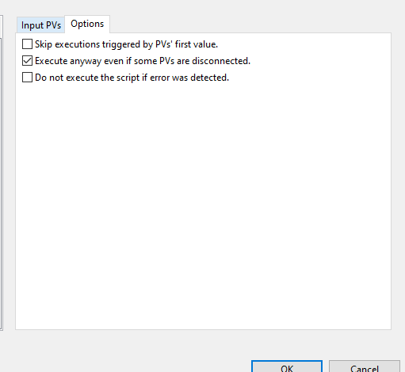

> [Wiki](Home) > [The GUI](The-GUI) > [CS Studio](GUI-CSS) > [OPI Programming tips and limitations](OPI-programming-tips-and-limitations)

# Opening a new Opi
CSS can display one or more windows, each of which can be divided into multiple views, each of
which can contain multiple tabs, so there is huge flexibility but CSS has its own ideas about
how to do things, which introduce some annoying limitations.

CSS allows you to open a new opi in many locations:
* In place of the current Opi
* In a new window
* As a new tab in the current view
* As a new tab in the top, bottom, left or right views of the current window

What it does not allow you to do is to replace the contents of another view.
Therefore you cannot have a window with navigation controls in the top view 
that change the opi shown
in the main view. They can only create new tabs in the main view

Alternatively the opi can be shown in a linking container

## Linking Containers

The contents of the linking container can be changed dynamically by setting the 'opi_file' property.

The macros seen by the contents of the container can be set by:

```
from org.csstudio.opibuilder.scriptUtil import DataUtil
...
macros = DataUtil.createMacrosInput(True)
macros.put('NAME', 'VALUE')
container.setPropertyValue('macros', macros)
```

but the new macros only take effect when a new opi is loaded. If the new opi has the same name as the previous one, nothing is loaded and the new macros do not take effect. To force a reload, set 'opi_file' to the empty string then back to its old value.

(Isabella: from within CSS scripts, it works by simply re-setting the 'opi_file' property with forcing the fire option set to true:

`widgetController.setPropertyValue("opi_file", widgetController.getPropertyValue("opi_file"), true)`

)

When an opi is displayed in a linking container, scripts on the opi display widget do not get run because the display widget is not loaded. The contents of the display widget instead become children of the linking container. If you want a script to run in these circumstances it has to hang off one of the child widgets.

# The CSS object model as viewed from Python
This is largely undocumented. The help in CSS/BOY says little and Google can find little.
The only way I was able to find out how to manipulate the actions on a button was to view the java source on [GitHub](https://github.com/ControlSystemStudio/cs-studio/tree/master/applications). The Python objects simply expose the public Java methods.

It is possible to use any java module or method from python code in an OPI. For example, instead of:

```python
# Note: this is BAD - do not do this!
sleep(1)
widget.doSomething()
```

which would block the UI thread for 1 second, we can import some CS-Studio and core Java classes from python directly, and do:

```python
# Correct approach
from org.csstudio.ui.util.thread import UIBundlingThread
from java.lang import Thread, Runnable
from org.eclipse.swt.widgets import Display
currentDisplay = Display.getCurrent()

class WorkerThread(Runnable):
    def run(self):
        Thread.sleep(1000)

        class UITask(Runnable):
            def run(self):
                widget.doSomething()
        UIBundlingThread.getInstance().addRunnable(currentDisplay, UITask())
        
thread = Thread(WorkerThread(), "some_thread_name")
thread.start()
```

Which will *not* block the UI thread for 1 second, as it's 1 second wait is in a different thread (it then uses `UIBundlingThread.addRunnable` to get back onto the UI thread once the wait is finished).

# Changing actions
The list of actions on a button is:

```
actionList = myButton.getPropertyValue('actions').getActionsList()
```

This is a Java list which can be subscripted and has methods like add() and clear().

If you have an existing action, new write PV actions can be created:

```
action = sourceList[0].__class__()
action.setPropertyValue('pv_name', 'loc://myPV')
action.setPropertyValue('value', valueToSet)
action.setPropertyValue('description', 'What appears in the menu')
actionList.add(action)
```

For some reason new open opi action created in this way do not work, but existing open opi actions can be altered and added to a different button:

```
action.setPropertyValue('replace', 1)
action.setPropertyValue('description', 'What appears in the menu')
action.setPropertyValue('path', 'my.opi')
actionList.add(action)
```

In the synoptic view I have a hidden button with actions than can be reused.

# Running a script on page load
You can make a script run on page load by setting it to trigger from a PV called `loc://$(DID)_CONST_1(1)` and making sure it executes even if there are errors.




# Storing State
Occasionally it makes sense to store some state in the OPI, e.g. which traces the user has made visible on the OPI. To do this you can use local PVs of the form `loc://MY_PV`. These can be written and read to like normal PVs.

`loc://` PVs get initialized to null, but you can provide an explicit initialization value by including it in parentheses e.g. `loc://my_pv(123)` would initialize `loc://my_pv` to `123`.

Local PVs (prefixed with `loc://`) usually have *application level* scope, i.e. a local PV with the same name will have the same value from all OPIs within IBEX. While this can be useful (e.g. to share state between OPIs), it can also be problematic for OPIs where we expect to have multiple instances of the OPI open.

The `$(DID)` macro is a unique-per-opi-view identifier which can be inserted into local PV names to ensure that multiple instances of the same OPI do not conflict with each other.

# Creating new widgets

Given an existing widget of the correct type, new widgets can be created and added to a container. 

The following will create a new widget of the same type as Label0 and set some of its properties:

```
label = group.getWidget('Label0')
source = label.getModel()
model = source.__class__()
model.setName('NewLabel')
model.setX(6)
model.setY(142)
model.setWidth(163)
group.addChild(model)
```

The model has set and get methods for the widget properties, or `group.getWidget('NewLabel')` can be used to obtain the widget so its properties can be set using `setPropertyValue()`.

The widget can be removed using `group.removeChildByName('NewLabel')`

Note that for dynamically create widgets that do not normally have click actions (e.g. the grouping containers that I use to fake transparent buttons), it seems to be impossible to hook an action to a left click but it is possible to add them to the right click menu.

# Threading

Bear in mind that both scripts and rules run **in the GUI thread** this can lead to unresponsiveness if you are doing a lot of work in them. You can write multithreaded scripts, see the jaws_display.opi for an example of this. 

Note that it is a programming error to call `sleep` or other similar functions directly in an OPI script - these will completely block the UI thread every time the script executes. Instead, use a threading pattern and only call `sleep` in a non-UI thread if you need an arbitrary wait in OPI scripts. `UIBundlingThread.addRunnable` can be used to get back onto the UI thread after the sleep is complete.

# Utilities

Seven utility classes are provided, but there seems to be no way to get to some of them in the online help other than to know their names and search for them:

* ConsoleUtil has methods for writing debug messages to the console.
    ```
    from org.csstudio.opibuilder.scriptUtil import ConsoleUtil
    ConsoleUtil.writeInfo(value )
    ```
* `DataUtil` has the `createMacrosInput` method.
* `FileUtil` has methods for reading and writing files and displaying an open file dialog. There is also a `saveFileDialog` method that has been omitted from the online help.
* `GUIUtil` has a yes/no dialog and methods for going to full screen or compact mode
* `PVUtil`
* !ScriptUtil
* !WidgetUtil

# Performance limitations

We have found that OPIs perform poorly on initial opening once you get past a few hundred widgets being rendered simultaneously.

At the time of writing, here are some representative numbers of widgets on a variety of OPIs. Note that widgets in tabs which are not shown don't count as they don't get rendered immediately.

- Eurotherm: 58 widgets
- ICE fridge (with complex schematic): 92 widgets
- Reflectometry front panel: 135 widgets
- CS-Studio "large" performance test: 200 widgets
- Table of motors OPI attempt: 674 widgets - took ~15 seconds to open on NDXSCIDEMO

See also section below on improving the performance of rules, if your OPI contains significant numbers of rules (e.g. more than 10). If your OPI contains significant numbers of rules, you need to ensure that all rule conditions have an associated fast-path handler.

# Implementing your own widgets in CS-Studio code

*Note: this is a significant undertaking; check with other developers that this is the correct solution before going down this route*

Firstly, you will need to import the CS-Studio code into eclipse by following the instructions [here](https://github.com/ISISComputingGroup/isis_css_top/blob/master/README.md)

The code for most widgets is defined in `cs-studio\applications\opibuilder\opibuilder-plugins\org.csstudio.opibuilder.widget`, you will need to import this project into eclipse if you haven't already.

The code follows an MVVM-like pattern, where the mapping is:
- `xxxModel` -> model
- `xxxEditPart` -> viewmodel
- `xxxFigure` -> view

As an easy way to get started, I suggest copying the above 3 classes from the most similar widget type and then editing them to suit your needs.

To get your new widget to show up in CSS' menus, it needs to be added to the extension point `org.csstudio.opibuilder.widget` in `MANIFEST.MF`.

To use a PV value, use a string with the special value `$(pv_value)`. This gets substituted for the actual value at runtime.

Most figures are implemented using the `draw2d` framework, which is a graphics toolkit. In general it allows a higher level of flexibility than RCP for drawing arbitrary shapes etc, with the disadvantage that this additional flexibility makes it more complex. It is also possible to implement a figure using an RCP widget - see for example `WebBrowserFigure` in `cs-studio\applications\opibuilder\opibuilder-plugins\org.csstudio.opibuilder.widgets.rcp`.

# Getting a macro value in a script

`display.getMacroValue("MY_MACRO")`

However, if your macro name is constant, it is better to use a local pv as a trigger for the script, which happens to be initialized to the value of the relevant macro. e.g. use a local PV like `loc://$(DID)_some_name("$(MACRO)")` - you can then use this as `pvStr0` as usual in your script/rule.

# Hotfixing an OPI

OPIs can be hotfixed on an instrument PC, with a built client, by modifying the OPI files in:
`\<built client location, usually \instrument\apps\client_e4\>\plugins\uk.ac.stfc.isis.ibex.opis_1.0.0.SNAPSHOT\resources` - this means you do not have to copy the entire client over, just the `.opi` file. You may also need to modify `opi_info.xml`, also in this folder, if you are adding a new OPI or modifying macros passed to an OPI. 


# Improving the runtime performance of rules in OPIs

As of [ticket 7212](https://github.com/ISISComputingGroup/IBEX/issues/7212), we are using a custom `ScriptStore` implementation in cs-studio called `RhinoWithFastPathScriptStore`. By default, CS-Studio uses a script store called `RhinoScriptStore`.

The primary difference is that `RhinoWithFastPath` will *attempt* to implement rules in pure java, without needing to call into javascript. This saves a significant amount of memory and CPU time. However, there are a number of limitations:
- All conditions in a rule must be listed either in `FAST_PATH_EXPRESSIONS` in `RhinoWithFastPathScriptStore` (in CS-Studio), or be added by the ibex client in `addFastPathHandlers` in `/uk.ac.stfc.isis.ibex.opis/src/uk/ac/stfc/isis/ibex/opis/Opi.java`
  * Note that fast path expressions are an exact string match, so `pvInt0 == 0` is a different fast-path condition to `pvInt0==0`.
- If a rule uses the "output expression" feature of CSS, then all output expressions must *also* be listed in `FAST_PATH_EXPRESSIONS` (or added by the ibex client in `Opi.java` as above). This is currently limited to output expressions of boolean type.
- Fast-path expressions can only use their linked PVs as variables - it is not currently possible to depend on the `widget` or macros directly. For example it is not currently possible to write a fast-path expression for `widget.getValue() == 1`.

If the above conditions are true, javascript will be bypassed and a pure java implementation used instead. The pure java implementation is significantly more performant in terms of CPU and memory use. The javascript implementation (Rhino) is used as a fallback if the above conditions are not true. This approach lets us be fully compatible with all CS-Studio rules & `.opi` files (which can use completely arbitrary javascript fragments as their conditions), while still getting significant performance gains on most rules in practice.

You can generate a list of all rule expressions used in IBEX by running:

```shell 
grep -roP "bool_exp=\".*?\"" | cut -d ":" -f 2 | sort | uniq -c | sort -nr
``` 

from a git bash terminal in `ibex_gui/base/uk.ac.stfc.isis.ibex.opis/resources`. The vast majority of our rules use a small number of simple expressions - such as `pvInt0 == 0` - these are the expressions which are good candidates for a "fast-path" expression.

On OPIs which have had significant performance issues, such as the reflectometry OPI, *all* rule expressions should have an associated fast-path handler, and should not use the "output expression" feature of CS-Studio. This ensures that all rules in this OPI do not use the javascript rules implementation.

### Checking which rules execute in JS

In `/uk.ac.stfc.isis.ibex.opis/src/uk/ac/stfc/isis/ibex/opis/Opi.java`, call `RhinoWithFastPathScriptStore.setLogScriptsUsingJS(true)`. This will log the script content the first time a rule is loaded and executes via the slow (JS interpreter) path.

### Forcing JS execution of all rules

If you need to execute *all* rules in JS (e.g. a major bug is found in `RhinoWithFastPathScriptStore`), it can be entirely disabled by editing `org.csstudio.opibuilder/java_script_engine=RHINO_WITH_FAST_PATH` to `org.csstudio.opibuilder/java_script_engine=RHINO` in `/uk.ac.stfc.isis.ibex.e4.client/plugin_customization.ini`. 

Note that you will need to increase the GUI heap size parameter if this is done, particularly on reflectometers, as the reflectometry OPI uses huge numbers of rules which cause excessive memory consumption under javascript.

# Importing scripts into other scripts

If you need complicated scripts with imports - first consider the design of your OPI. Most OPIs should aim not to require any scripts at all, for example by moving logic into the IOC layer.

However, in some cases it is useful to be able to create generic scripts and import them into other scripts. The CS-Studio Jython instance does not allow access to `__file__`, so it is not always possible to add a known import directory to python's path.

The workaround is to use something like:

```python
from java.lang.System import getProperty as getJavaSystemProperty

import sys
import os
resources_dir = getJavaSystemProperty("ibex.opis.resources_directory")
sys.path.append(os.path.join(resources_dir, "HV", "Scripts"))
# ... import from HV.Scripts.something
```

The `ibex.opis.resources_directory` property is set from Java before any OPIs load in `base/uk.ac.stfc.isis.ibex.opis/src/uk/ac/stfc/isis/ibex/opis/Opi.java`

Note that hard-coding a path like `c:\instrument\dev\ibex_gui\...\resources` would fail on an instrument as the client will be installed in a different location - so this system property **must** be used instead.

Note that bi and mbbi records that you are trying to use with an LED in an OPI will not work unless the values are 0 and 1. This is because the LED ignores the bit and ENUM settings and On state and Off State and goes of ONLY the PVName attribute.