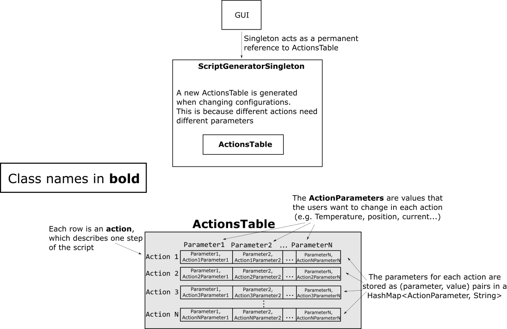
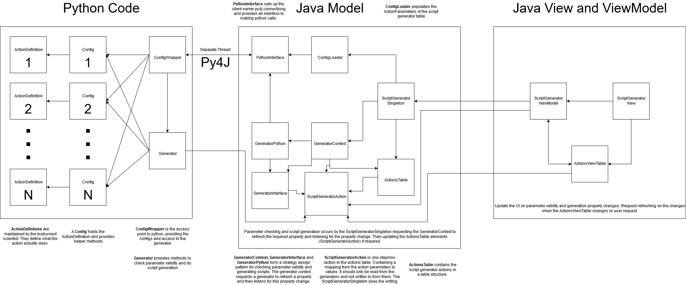

# Script Generator

The script generator developed as part of IBEX is held in the same repository as the IBEX client/GUI. The script generator requires both a perspective in the IBEX GUI and a standalone application.

To achieve this, the script generator can be built in both eclipse and using maven, with minimal packages required from the main GUI codebase. The build system for the standalone application mirrors that of the main IBEX gui, with an independent `tycho.parent`, see [below](#the-directory-structure)

To prevent duplication, the GUI perspective depends wholly on the standalone application.

```{toctree}
:glob:
:titlesonly:
:maxdepth: 1
:hidden:

script_generator/*
```

## The directory structure
| Purpose        | Location |
| -------------- |----------|
| Perspective for the IBEX GUI ONLY | `base/uk.ac.isis.ibex.scriptgenerator` |
| Standalone app build directories | `base/uk.ac.isis.scriptgenerator/*` |

## Eclipse build
To build and run the app through eclipse, the script generator product is found in `base\uk.ac.stfc.isis.scriptgenerator.client.product`. The instructions for setting up eclipse and loading the target platform (necessary for the script generator) are found in the instructions for the [main IBEX GUI setup](https://github.com/ISISComputingGroup/ibex_developers_manual/wiki/Building-the-GUI)

### Adding the perspective into the client
Currently the script generator perspective is not shown or selectable in the main IBEX GUI. It can be re-added by selecting `Preferences > Select Visible Perspectives` from the IBEX Main Menu.

## Maven build
To build the standalone app through maven run `build\build_script_generator.bat`

There is a Jenkins pipeline which will build the script generator with every new commit to the IBEX GUI master branch.


## Data structures in the GUI

Each 'action', or step in a script is represented in the GUI as a row. Each cell contains one parameter for an action, which the users change to define their experiment. A complete row of defined parameters should be enough information to run the action once (see [Script Generator High-Level Design](https://github.com/ISISComputingGroup/ibex_developers_manual/wiki/Script-generator-high-level-design#the-action-class))



The parameter values are stored as strings in the underlying action. These strings are passed to the python process for validation, and to insert them into the output script. When the value of an underlying cell is updated, the GUI is notified by firing a property change (`actions`).

To change the type of action represented in the table, the singleton drops the current table and replaces it with a new one constructed using the new action type.

## Importing user-supplied script definitions
The `ScriptDefinitions` are supplied by instrument scientists in [this form](https://github.com/ISISComputingGroup/ibex_developers_manual/wiki/Script-generator-high-level-design#the-actiondefinition-class). All the python modules containing an `ScriptDefinition` in a subdirectory are imported and stored in a `ScriptDefinitionWrapper` class. Using an instrument scientist supplied `ScriptDefinition`, a `ScriptDefinitionWrapper` class is created containing the `ScriptDefinition` with helper methods like `getParameters` and `parametersValid` to expose the parameters used in the action and their validation. These `ScriptDefinitionWrapper` classes are collected by the `ScriptDefinitionsWrapper`, which is then passed through the py4j interface to the GUI code.

On startup of the script generator, the latest versions of the Script Definitions are pulled from [this repository](https://github.com/ISISComputingGroup/ScriptDefinitions). The default location for this repository is in `path_to_script_generator\script_definitions` but can be changed in the `plugin_customisation.ini`. If this directory does not contain the ScriptDefinitions repository on script generator startup, a clone is attempted. If a clone of the ScriptDefintions repository failed from github, a clone is made from a `git bundle` form of the repository, which is shipped with the script generator and is created when the script generator is built.

Once in the GUI, the script generator table is created by generating `ActionParameters` from the parameter names exposed through the ScriptDefinitions class.




## Checking the validity and generating python scripts

Generator classes are used to check validity and generate scripts. They use the script definition's supplied `run` and `parameters_valid` methods to check validity and generate scripts. We do not want to block the execution of the UI thread, and as such, all parameter validity checking and script generation is done by running a Java CompletableFuture and then firing a property change and passing this up the chain to the UI. This allows updates to happen in the background without blocking the UI thread.

## Saving the Parameter values and loading back up
Parameters values from the Script Generator can be saved in a file. The file format chosen is JSON due to its flexibility and well-tested parser available for upgrading it using upgrade script in future. 

Parameters are saved as `.sgp` (Script Generator Parameters) files.

The format of the chosen JSON file is as follows:

```
{
  "version_JSON_format": "",
  "script_generator_version": "",
  "date_and_time": "",
  "script_definition_file_path": "",
  "script_definition_file_git_hash": "",
  "genie_python_version": "",
  "script_definition_content": "",
  "actions": [
    {
      "action_name": "",
      "parameter": [
        {
          "param1": "value",
          "param2": "value"
        }
      ]
    },
    {
      "action_name": "",
      "parameter": [
        {
          "param1": "value",
          "param2": "value"
        }
      ]
    }
  ]
}

```
Note: 

- For each action in `Actions` in the JSON file, there is a table in the script generator. 
- The `version` in the file is the version of the JSON format itself. This will be an integer and not tied to any other version number.
- configuration_path: this is the path of the configuration file within the git repository. Allowing us to group then by instrument if this becomes useful.
- configuration_file_git_hash: this is the git hash at the time the config file is used
- `configuration_content` contains the actual content of the config file that was used when saving parameters. This is to make sure that the configuration that was used to generate JSON file is the same configuration that is being used to load the data from the JSON file. 

We want the JSON in a separate file so that:
* It's language independent
* The user is less likely to modify it
* It would probably easier to upgrade at a later date if the JSON format changes

The generated script file will contain the compressed JSON. The compressed JSON can be used as a back up if the JSON file is lost to retrieve original values. For the MVP reading the JSON from the script will not be done and we will only read the JSON file.

JSON formats etc. were decided in a meeting on 20/02/2020 attended by Bish, Dom, John, Tom, Alistair and James.

On 12/05/2021 it was decided by James, Kathryn and Dom to hide this complexity from the user by removing references to parameter files and tying the two files directly to generating scripts. This was captured in [#6492](https://github.com/ISISComputingGroup/IBEX/issues/6492). 

## Pre-release Install Instructions

As dev:

1. Copy build to releases area (this is two part because of the deeply nested python) first copy to icp area then move to releases release number
1. Zip this folder because it is easier to get this on a machine
1. Copy current script definitions git repo to here
1. Then issue following instructions to user:

```
These are the instruction to install the beta release of the script_generator. It needs to be installed on a windows machine but does not need ibex running. To install this please do the following:

Either:

    i: Quicker but requires more disk space
        1. copy the zip file from <add zip path> to somewhere on your local machine.
        2. Unzip it
        3. Click on install_script_generator.bat
        4. Delete zip file and unzipped files     

    ii: Slower but requires less disk space
       1. Open the folder <location of release>
       2. Click on install_script_generator.bat

This will take a while to copy the script generator to your machine (it took at least 2 hours). The final directory is ~ 3 Gb and has ~50k files.

1.	Then copy the script definitions to your local machine from <add path to ScriptDefinitions> to c:\ScriptDefinitions

Finally:

1. Create a script dir to save scripts to in `c:\scripts`

You should then be good to go just double click C:\Instrument\Apps\script_generator\ibex-script-generator.exe. If it starts but with an empty window it may be that it failed to load something earlier in that case delete the folder c:\instrument\app\script_generator\workspace and try again.

```

## Script definitions

Script definitions are configuration files which specify the following in the script generator:
- How many columns to display and what their names are
- Any constraints on the data entered under a particular column
- How to "run" a row of the script generator (i.e. the python code that will eventually be executed)

The script definitions are stored in `c:\instrument\settings\ibex_script_generator\scriptdefinitions`. This location should exist on an instrument control machine. If this location does not exist, the script generator instead looks for a folder named `scriptdefinitions` next to the executable.

## Dynamic Scripting

[See here](https://github.com/ISISComputingGroup/ibex_developers_manual/wiki/IBEX-Script-Generator-Dynamic-Scripting)

## Interested instruments/groups

- Muons
- Reflectometry
- SANS
- MARI
- WISH
- IMAT
- HRPD
- ENGIN-X
- MERLIN
