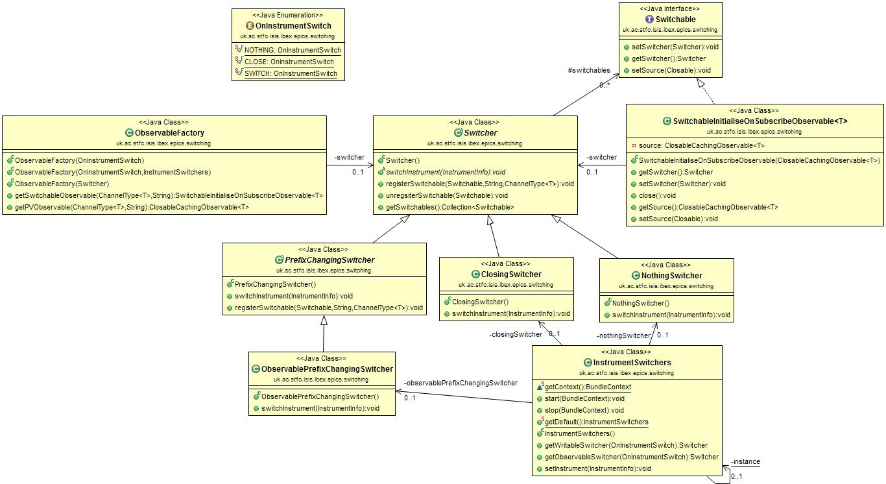
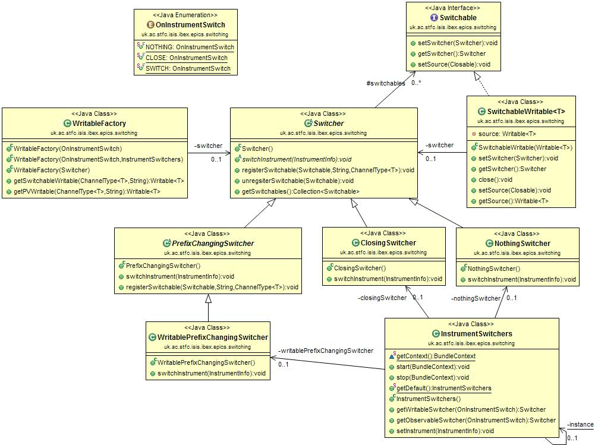

# Instrument & PV switching

To create a PV in the GUI which switches instrument, or closes, on instrument switch, use:

```java
ObservableFactory closingObsFactory = new ObservableFactory(OnInstrumentSwitch.CLOSE);
ForwardingObservable<String> pv 
    = closingObsFactory.getSwitchableObservable(new StringChannel(), "A_PV_ADDRESS"));
```

Subscriptions can then be attached to the PV and will be called when PVs change value.

## Design

### Extension point

Instrument switching in the GUI uses an extension point. This means that the switch can take place in a central place,
and each plugin which is interested can sign up to receive a callback on the switching event. 
This keeps a separation between the plugins and the instrument switching module; a plugin can be removed without
changing the instrument switching code.

The instrument switching in E4 is performed through the E3 compatibility layer, as E4 has no native support for
extension points. 
The equivalent behaviour in E4 is provided through services, which might be a necessary transition
as services and extensions points are not cross-compatible.

This extension point is setup in `uk.ac.stfc.isis.ibex.instrument/META-INF/MANIFEST.MF` (see the extension Points tab).
This sets up the name of the extension point and the schema. 
The schema is in `/uk.ac.stfc.isis.ibex.instrument/schema/uk.ac.stfc.isis.ibex.instrument.info.exsd`
(click Schema on previous page).
This defines the methods that should be fulfilled by the plugin that want to sign up to this extension.

In this case there are three methods:
- `preSetInstrument` - this will be called before the instrument is switched. This is useful for closing resources 
using the old instrument.
- `setInstrument` - this will be called to set the instrument and should actually perform the change.
- `postSetInstrument` - this will be called after the instrument is set. It can be used, for example, to perform final
clean up of resources or reopening of perspectives.

The instrument handler is responsible for calling this method on each registered plugin.
It does this in the method
`uk.ac.stfc.isis.ibex.instrument.Instrument.setInstrumentForAllPlugins` in the private method `updateExtendingPlugins`.
All `preSetInstruments` methods are called before any `setInstrument` methods.

To sign up to this event, the plugin must create a class which implements the interface
`uk.ac.stfc.isis.ibex.instrument.InstrumentInfoReceiver`. 
This will be instantiated when the instrument is switched to.
This class is registered in the plugin's extensions (this is similar to 
[adding a perspective](Perspectives)).

### Observables

The design of switchable PVs in the GUI uses a factory to create PV Observables, which are passed the switching
behaviour as a switcher class. Each of these switcher classes provides a different switching functionality and is
switched using the Eclipse extension point that is globally used for instrument switching in the GUI. 


 
- When an observable PV is required an instance of `ObservableFactory` is first created and passed an
`OnInstrumentSwitch` enum to describe which switching behaviour is required
- On initialisation the factory will then query the `InstrumentSwitchers` class for the specific Switcher class that
handles that type of switching.
- The original class that wanted the PV will subsequently ask the factory for PVs, providing the channel type and PV
address. This will be provided as a `SwitchableObservable` that can be subscribed to for value changes.
- Before providing the new `Observable` object the factory will register it with the relevant `Switcher` class, each of
which holds a list of all `Switchable` objects that it is required to switch. The `SwitchableObservable` is also
provided with a reference to the switcher so that it can remove itself from the relevant list if it is closed for any
reason.
- When the instrument is changed the `InstrumentSwitchers` class will call the `switchInstruments` method on each of the
switchers, which will then go on to perform the relevant switching behaviour - for example changing a `Switchable`'s
source, closing it, or doing nothing.

### Writables

A similar process also occurs when switching writable PVs, as can be seen in the UML diagram below. The differences
being that a `WritableFactory` is used, this can create a `Writable` that inherits from `Switchable` and can write
values to PVs. Both the `Switchable` interface and the abstract `PrefixChangingSwitcher` are provided, so that
the switching process is as similar as possible when dealing with `Writables` and `Observables`.


