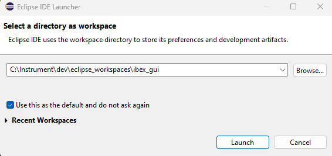

# Building the GUI

:::{important}
Before following this guide, ensure you have completed the following steps from
[the first-time installation guide](/overview/First-Time-Build):
- [Install Java JDK](#first_time_install_java)
- [Install Maven](#first_time_install_maven)
- [Install Git](#first_time_install_git)
- [Install Python (Uktena)](#first_time_install_uktena)
:::

{#gui_build_checkout_code}
## Checking out the code

Development builds of the IBEX GUI are conventionally located in `c:\instrument\dev`. Create this folder if it
doesn't already exist.

From a windows command prompt, navigate to `c:\instrument\dev` and run:

```
git clone --recursive https://github.com/ISISComputingGroup/ibex_gui.git
```

The code for the IBEX GUI will now be located in `c:\instrument\dev\ibex_gui`.

A [pre-commit hook](https://github.com/ISISComputingGroup/IBEX/issues/4786) should now be installed; to do this, run:

```
cd c:\instrument\dev\ibex_gui\build
install_pre_commit_hook.bat
```

{#gui_build_install_eclipse}
## Installing Eclipse

You must use a version of eclipse which supports the RCP and Java versions currently in use by the client. There are
two options for this:
- Use the most recent version in `\\isis\inst$\Kits$\CompGroup\ICP\Developer Tools`
- Download a recent Eclipse version directly from
[the eclipse website](https://www.eclipse.org/downloads/packages/); choose the package for "RCP and RAP developers"

By convention eclipse versions are installed into `c:\tools`, for example in 
`c:\tools\eclipse-rcp-2024-06-R-win32-x86_64`.

After installing eclipse from either of the above sources, you will need to add the line
```
-Djdk.util.zip.disableZip64ExtraFieldValidation=true
``` 
to the end of `eclipse.ini` (located next to the `eclipse.exe` executable), if it is not already present.

{#gui_build_via_eclipse}
## Building in Eclipse

:::{seealso}
If at any point during these instructions you get errors, there are troubleshooting notes for Eclipse
[here](../eclipse/Common-Eclipse-Issues) and for the GUI in general [here](../GUI-Troubleshooting).
:::

The first time the Eclipse IDE is started, it will ask you for a folder to use as a workspace. 
Unless you have a specific reason to choose a different location, use `c:\Instrument\dev\eclipse_workspaces\ibex_gui` 
(create this folder if it doesn't already exist).



From the menu bar choose File -> Import -> General -> Existing Projects into Workspace.
Choose "Select root directory" and browse to `c:\Instrument\dev\ibex_gui\base`. You should now see a list of plugins 
to import with names like `uk.ac.stfc.isis.ibex.*`. Eclipse should automatically select everything so you just need 
to click "Finish" to add them to the project. 

:::{tip}
If "Marketplace solutions available" dialogues appear, click cancel; these will be obtained later.
:::


From the "Project Explorer" tab on the left, expand the target platform folder (labelled as 
`uk.ac.stfc.isis.ibex.targetplatform`), double click on the `targetplatform.target` file and choose 
"Set as Active Target Platform". This may take some time as dependencies are downloaded - there is a progress bar
in the very bottom-right of the Eclipse IDE.

Once the target platform has finished downloading, the target platform view should look like this:


To run the application from within Eclipse: open `ibex.product` from the `uk.ac.stfc.isis.ibex.e4.client.product`
folder, select "Launch an Eclipse application". The IBEX GUI should now open.

Next, From the menu bar choose Run->Run configurations and select `ibex.product` from the left hand list under 
"Eclipse Application". In the "Main" tab, in **Run configurations**, tick the "Clear" tick box and untick the 
"Ask for confirmation before clearing".


In the "Configuration" tab, tick the "Clear the configuration area before launching" tick box, then click "Apply" 
and select "Run".

Lastly, you should [set up checkstyle](../eclipse/Checkstyle-setup).

{#gui_build_via_maven}
## Building via Maven

Firstly, ensure you have a recent Maven version installed. Generally a suitable version will be the highest version
number in `\\isis\inst$\Kits$\CompGroup\ICP\Binaries`. You can double-check your current Maven version by running
`mvn -v` in a command prompt.

To build using Maven, run:

```
cd c:\Instrument\dev\ibex_gui\build
build.bat
```

Once the build finishes, the IBEX client executable can be found in `.\built_client\`.
