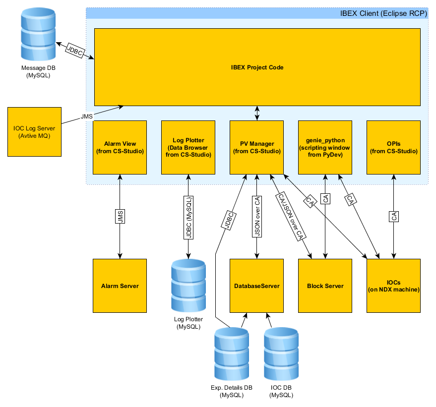

# Client Architectural Design

This document describes the architectural design for the IBEX client. Eventually there should be outlines of the architectural design for each part of the high level design.

### Client Design Overview

    
Notes on the figure:

* CA - Channel Access
* JDBC - Java Database Connectivity
* JMS - Java Messaging Service

### Eclipse RCP

The IBEX client is based on Eclipse RCP (Rich Client Platform).

### CS-Studio

The client makes use of CS-Studio components such as:

* Alarm Perspective
* Data Browser (called Log Plotter in the IBEX Client)
* OPI Views
* PV Manager

... and others to be listed later.

### PyDev

IBEX uses PyDev to provide the Python scripting window in the IBEX client.
