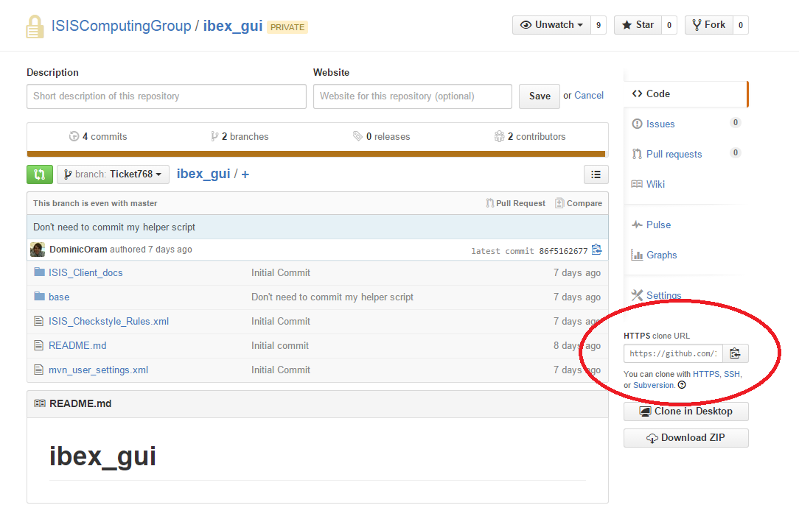
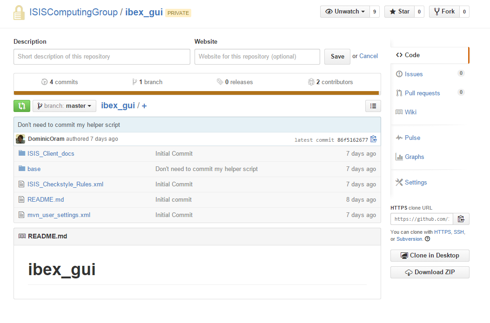
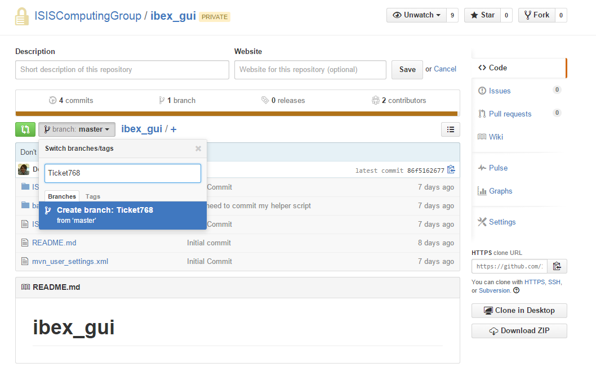
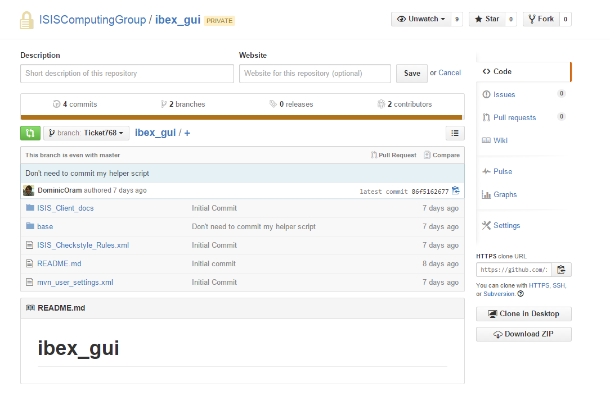
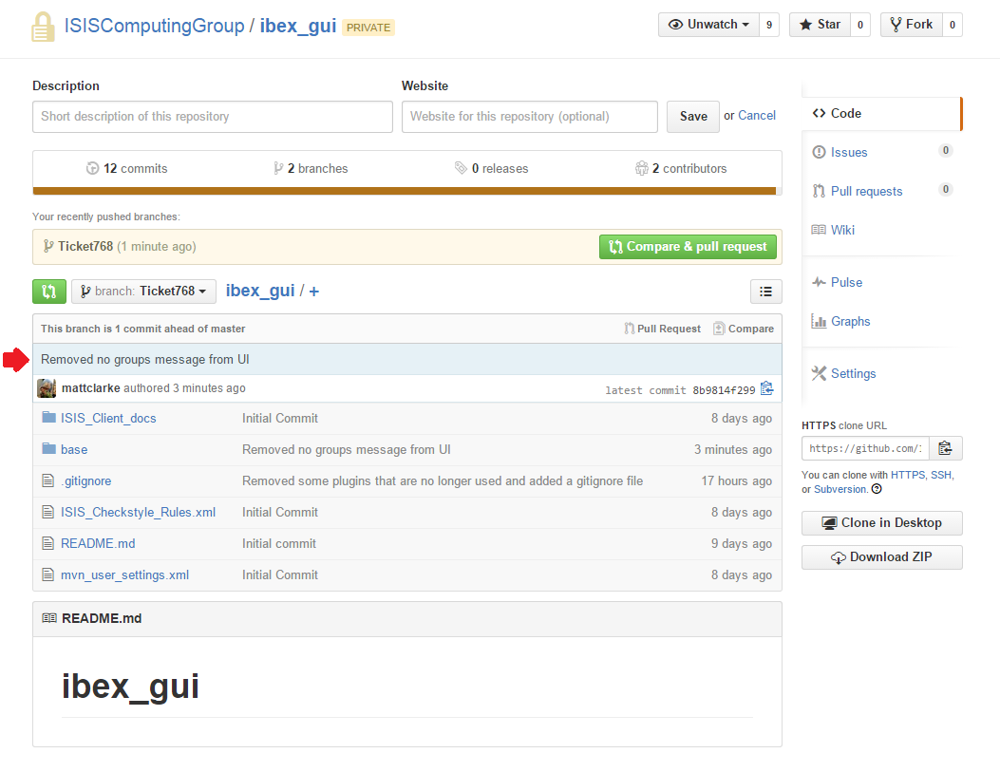
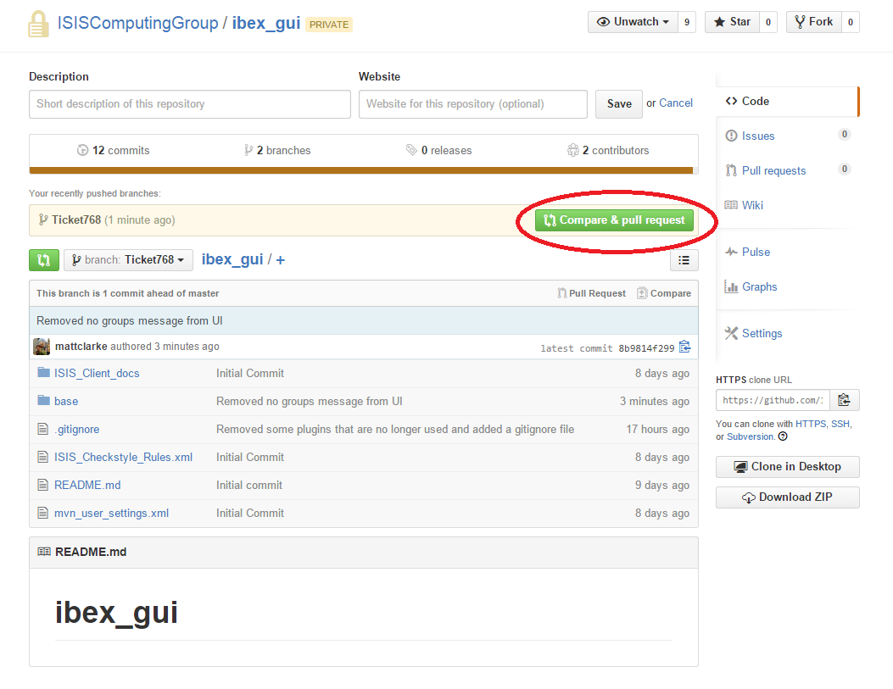
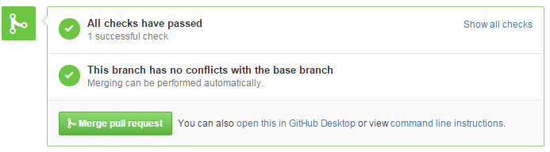

# Development workflow

## Quick overview of workflow

1. **Create a branch for the ticket (based on master) via GitHub (developer)**
    * Use the git issue number for the branch name followed by a brief description, e.g. Ticket780_SelectNewTarget
1. **Clone the branch locally (developer)**
1. **Modify the code (developer)**
    * Update any copyright notices to the current year to read ``Copyright (C) <first year> - <current year> ...``
1. **Push back the changes (developer)**
    * Make sure you have merged in any changes to master that have occurred since your ticket was created - makes reviewer's life easier
    * Please follow commenting guidelines below
1. **Create a pull request (developer)**
    * Reference the git issue in the comments, for example: ```ISISComputingGroup/IBEX/issues/1016```
    * Assign the correct milestone
    * Add a record of the changes to [Release Notes](https://github.com/ISISComputingGroup/IBEX/wiki/ReleaseNotes_Dev) under "Changes in software but still on a branch"
1. **Review (reviewer)**
    * Assign the pull request to yourself to indicate you are reviewing it and label`under review`
    * Check that the pull request has been built by Jenkins with no errors (if there is a Jenkins build)
    * Check that the ticket fixes the associated issue
    * If it is okay then move to the next step, otherwise inform the developer of the problem and add a comment to the pull request
1. **Merge the changes (reviewer or developer)**
    * If it is a simple merge the reviewer can do it, otherwise ask the developer to do it
    * Move the relevant entry in the [Release Notes](https://github.com/ISISComputingGroup/IBEX/wiki/ReleaseNotes_Dev) from "Changes in software but still on a branch" to "Changes merged into master"
1. **Delete the branch (reviewer or developer)**
1. **Close the ticket in Trac (reviewer or developer)**

Notes:

* You don't have to create branches on GitHub first, often it is more convenient to create them locally first instead (which you must do if you intend to rebase)
* Deleting a branch on github does not delete it from you local repository clone   

## Cloning the repository (first time only)

* From the repository page copy the "HTTPS clone URL":



* Open Git Bash or Git Shell from the Windows Start Menu

* In the console enter the following (paste the address from the previous step) to create a local copy of the repository:

```
user@MACHINE /c/Instrument/Dev/ (master)
$ git clone https://github.com/ISISComputingGroup/ibex_gui.git
```

* Now enter the ibex_gui directory:
```
user@MACHINE /c/Instrument/Dev/ibex_gui/base (master)
$ cd ibex_gui
```   
* The command line shows in brackets which branch you are on - probably master at this time

* Use the git branch command to list the available branches:

```
user@MACHINE /c/Instrument/Dev/ibex_gui/base (master)
$ git branch -a
* master
  remotes/origin/HEAD -> origin/master
  remotes/origin/master
```

* In the console enter `git checkout master` to change to a working copy of the E4 (latest) revision of the GUI

```
user@MACHINE /c/Instrument/Dev/ibex_gui/base (master)
$ git checkout master
Checking out files: 100% (994/994), done.
Switched to a new branch 'master'
Branch 'master' set up to track remote branch 'master' from 'origin'.
```

* The branch name in brackets after the working directory should change to `master`:
```
user@MACHINE /c/Instrument/Dev/ibex_gui/base (master)
$
```
## Creating a branch

* Go to the IBEX GUI GitHub repository https://github.com/ISISComputingGroup/ibex_gui
* The page should look something like this:



* Click the branch drop-down button which will list all the current branches. Type a name in the box and then click "Create branch" to create a new branch:


    
Note: Use the Trac ticket number for the branch name followed by a brief description, e.g. Ticket780_SelectNewTarget

* The page should switch to the new branch:


    
## Cloning the branch locally

It is necessary to clone the new branch locally if you don't already have it:

* First get an updated list of remote branches:
```
mjc23@NDW1373 /c/CodeWorkspaces/GitHub/ibex_gui/base (master)
$ git remote update
Fetching origin
From https://github.com/ISISComputingGroup/ibex_gui
 * [new branch]      Ticket768 -> origin/Ticket768
```
* The new branch should appear in the branch list:
```
mjc23@NDW1373 /c/CodeWorkspaces/GitHub/ibex_gui/base (master)
$ git branch -a
* master
  remotes/origin/HEAD -> origin/master
  remotes/origin/Ticket768
  remotes/origin/master
```      
* Switch to the new branch created earlier:
```
$ git checkout Ticket768
```
* Now you can start coding!

## Pushing the changes back

Now the code changes have been made, it is time to push the changes back to the repository on GitHub:

* From the command line we can see what changes we have made using the git status command like so:
```
mjc23@NDW1373 /c/CodeWorkspaces/GitHub/ibex_gui/base (Ticket768)
$ git status -s
 M uk.ac.stfc.isis.ibex.ui.blocks/src/uk/ac/stfc/isis/ibex/ui/blocks/groups/BannerComposite.java
 M uk.ac.stfc.isis.ibex.ui.blocks/src/uk/ac/stfc/isis/ibex/ui/blocks/groups/GroupsPanel.java
?? .metadata/
?? uk.ac.stfc.isis.ibex.client.tycho.parent/workspace/
?? workspace/
?? ../runtime-ibex.product/
?? ../surefire-reports/
```

We can see that I have modified two .java files (indicated by the M) and there are a few files not under source control (indicated by ??).
I am not interested in the files not under source control as they are default files created by Eclipse. Notice that there is a space before the M on the modified files.

* To be able to commit the changes back they have to be staged using the git add command like so:
```
mjc23@NDW1373 /c/CodeWorkspaces/GitHub/ibex_gui/base (Ticket768)
$ git add -u
```

The -u flag tells git to stage any modified files that are already in source control. To add new files or stage only specific files use the file name instead like so:
```
mjc23@NDW1373 /c/CodeWorkspaces/GitHub/ibex_gui/base (Ticket768)
$ git add some_file_name.txt
```    
* If we repeat the git status command we get something like this:
```
mjc23@NDW1373 /c/CodeWorkspaces/GitHub/ibex_gui/base (Ticket768)
$ git status -s
M  uk.ac.stfc.isis.ibex.ui.blocks/src/uk/ac/stfc/isis/ibex/ui/blocks/groups/BannerComposite.java
M  uk.ac.stfc.isis.ibex.ui.blocks/src/uk/ac/stfc/isis/ibex/ui/blocks/groups/GroupsPanel.java
?? .metadata/
?? uk.ac.stfc.isis.ibex.client.tycho.parent/workspace/
?? workspace/
?? ../runtime-ibex.product/
?? ../surefire-reports/
```
Notice that there is no longer a space before the M, this indicates that the file is staged.

* Now we commit the changes locally using the git commit command. 

The commit will require a comment and the format for comments should be as per https://robots.thoughtbot.com/5-useful-tips-for-a-better-commit-message i.e. 
50 char title, blank line, further details wrapped at 72 characters per line. 
```
mjc23@NDW1373 /c/CodeWorkspaces/GitHub/ibex_gui/base (Ticket768)
$ git commit 
```
* Check for upstream commits

Before we finally push to the server we will merge into our branch any changes that have been pushed to master on github, this
is to make the job easier for a reviewer as we will see potential merge conflicts and handle them ourselves. We update our local master branch with
changes on GitHub and then merge them into our copy: 
```
mjc23@NDW1373 /c/CodeWorkspaces/GitHub/ibex_gui/base (Ticket768)
$ git pull origin master
From https://github.com/ISISComputingGroup/ibex_gui
 * branch            master     -> FETCH_HEAD
 Already up-to-date.   
mjc23@NDW1373 /c/CodeWorkspaces/GitHub/ibex_gui/base (Ticket768)
$ git merge master
Already up-to-date.
```
(Advanced usage note: if your branch does not yet exist on GitHub, and has not been otherwise shared with another developer, then you may wish to consider doing a rebase rather than a merge) 
    
* Next we push the changes back to GitHub using the git push command like so:
```
mjc23@NDW1373 /c/CodeWorkspaces/GitHub/ibex_gui/base (Ticket768)
$ git push origin Ticket768
Counting objects: 31, done.
Delta compression using up to 8 threads.
Compressing objects: 100% (8/8), done.
Writing objects: 100% (15/15), 965 bytes | 0 bytes/s, done.
Total 15 (delta 6), reused 0 (delta 0)
To https://github.com/ISISComputingGroup/ibex_gui.git
   86f5162..8b9814f  Ticket768 -> Ticket768
```
* If we navigate back to the branch on the GitHub page we can see that the changes have been pushed back:



## Create a pull request

* Create a pull request by clicking the 'Compare & pull request' button while on the correct branch:



* The new page allows you to add comments and to review the modifications before creating the pull request. 
Notice that for my changes it says "Able to merge". This means that my changes don't clash with any other changes that have been made on the master while I have been working on the branch.


* Clicking the "Create pull request" button will create the pull request

* Reference the git issue in the comments by paste a link to the issue. For example ```ISISComputingGroup/IBEX/issues/1016```

* Assign the correct milestone

* Ensure that the code has built and tested correctly, this can be seen by a message on the bottom of the PR. Note that any increase in checkstyle issues will result in a failed build. If you believe these to be unavoidable discuss with the reviewer.


	
* That is us done for now as the ticket now needs to be reviewed
* Add a summary of your changes to the table under "Changes in software but still on a branch" in the [Release Notes](https://github.com/ISISComputingGroup/IBEX/wiki/ReleaseNotes_Dev). If your changes require modifications to files on some or all of the instruments to work correctly, document these in the relevant section.

## Reviewing a pull request

Before reviewing the pull request it is necessary to copy the branch locally if you don't already have it:

* First get an updated list of remote branches:
```
mjc23@NDW1373 /c/CodeWorkspaces/GitHub/ibex_gui/base (master)
$ git remote update
Fetching origin
From https://github.com/ISISComputingGroup/ibex_gui
 * [new branch]      Ticket768 -> origin/Ticket768
```
* The new branch should appear in the branch list:
```
mjc23@NDW1373 /c/CodeWorkspaces/GitHub/ibex_gui/base (master)
$ git branch -a
* master
  remotes/origin/HEAD -> origin/master
  remotes/origin/Ticket768
  remotes/origin/master
```
* Now checkout the branch:
```
mjc23@NDW1373 /c/CodeWorkspaces/GitHub/ibex_gui/base (master)
$ git checkout Ticket768
Branch Ticket768 set up to track remote branch Ticket768 from origin.
Switched to a new branch 'Ticket768'
```

* The code can now be loaded into Eclipse and reviewed

* Once the code has been reviewed either you can merge the changes yourself via GitHub or you can pass it back to the developer to do it

## Merging changes

Basically there are two types of merges: one where the code changes don't clash with other changes on master; and, one where it does clash.

If it does not clash then it can be merged via the "Merge pull request" button on the pull request page on GitHub.

Otherwise, GitHub will say "We can't automatically merge this pull request" on the pull request page.
This requires manual intervention:

* From the command line switch to the the master branch if not already on it

* Next fetch the most up-to-date version of master:
```
mjc23@NDW1373 /c/CodeWorkspaces/GitHub/ibex_gui/base (master)
$ git fetch origin
    
* Merge the master with the branch:

mjc23@NDW1373 /c/CodeWorkspaces/GitHub/ibex_gui/base (master)
$ git merge Ticket768
Auto-merging base/uk.ac.stfc.isis.ibex.ui.blocks/src/uk/ac/stfc/isis/ibex/ui/blocks/groups/GroupsPanel.java
CONFLICT (content): Merge conflict in base/uk.ac.stfc.isis.ibex.ui.blocks/src/uk/ac/stfc/isis/ibex/ui/blocks/groups/GroupsPanel.java
Automatic merge failed; fix conflicts and then commit the result.
```
* The merge has failed (as expected) but we can now view the code conflict in Eclipse:
```java
...
<<<<<<< HEAD
                    showBanner("No groups to display!");
=======
                    // Leave text blank
                    showBanner("");
>>>>>>> Ticket768
...
```

* For this example I decide to keep my changes and ignore the master, so the next step is merge the new changes and update on GitHub:
```
mjc23@NDW1373 /c/CodeWorkspaces/GitHub/ibex_gui/base (master|MERGING)
$ git status -s
M  uk.ac.stfc.isis.ibex.ui.blocks/src/uk/ac/stfc/isis/ibex/ui/blocks/groups/BannerComposite.java
UU uk.ac.stfc.isis.ibex.ui.blocks/src/uk/ac/stfc/isis/ibex/ui/blocks/groups/GroupsPanel.java
?? .metadata/
?? uk.ac.stfc.isis.ibex.client.tycho.parent/workspace/
?? workspace/
?? ../runtime-ibex.product/
?? ../surefire-reports/

mjc23@NDW1373 /c/CodeWorkspaces/GitHub/ibex_gui/base (master|MERGING)
$ git add uk.ac.stfc.isis.ibex.ui.blocks/src/uk/ac/stfc/isis/ibex/ui/blocks/groups/GroupsPanel.java

mjc23@NDW1373 /c/CodeWorkspaces/GitHub/ibex_gui/base (master|MERGING)
$ git status -s
M  uk.ac.stfc.isis.ibex.ui.blocks/src/uk/ac/stfc/isis/ibex/ui/blocks/groups/BannerComposite.java
M  uk.ac.stfc.isis.ibex.ui.blocks/src/uk/ac/stfc/isis/ibex/ui/blocks/groups/GroupsPanel.java
?? .metadata/
?? uk.ac.stfc.isis.ibex.client.tycho.parent/workspace/
?? workspace/
?? ../runtime-ibex.product/
?? ../surefire-reports/

mjc23@NDW1373 /c/CodeWorkspaces/GitHub/ibex_gui/base (master|MERGING)
$ git commit -m "Resolved conflict with Ticket768"
[master 2aaaf10] Resolved conflict with Ticket768

mjc23@NDW1373 /c/CodeWorkspaces/GitHub/ibex_gui/base (master)
$ git push origin master
Username for 'https://github.com': matt.clarke@stfc.ac.uk
Password for 'https://matt.clarke@stfc.ac.uk@github.com':
Counting objects: 1, done.
Writing objects: 100% (1/1), 229 bytes | 0 bytes/s, done.
Total 1 (delta 0), reused 0 (delta 0)
To https://github.com/ISISComputingGroup/ibex_gui.git
   06cecee..2aaaf10  master -> master
```
* Now if you look at the pull request on GitHub it should say it has been merged and closed.
* Move the changes documented in the [Release Notes](https://github.com/ISISComputingGroup/IBEX/wiki/ReleaseNotes_Dev) down into the table in the "Changes merged into master" section, as well as any required instrument-specific modifications related to the same ticket.

## Deleting the branch

Once the branch has been merged into master it can be deleted via the pull request page on GitHub. Don't worry it is not permanently deleted!
You will also have to delete the branch locally.