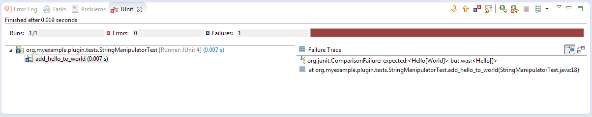
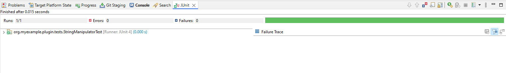
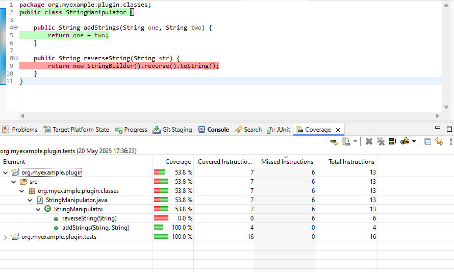

# An introduction to unit testing

To create unit tests for an Eclipse plug-in, a Fragment Project is used. 
When creating a Fragment Project, we assign the plug-in we wish to test as a Host Plug-in.
Eclipse automatically gives the Fragment access to the classes in the original plug-in.
In the Fragment Project we implement test classes to test the original plug-in's implementation.

## A simple example

Open the wizard for creating a standard plug-in in Eclipse (File->New->Plug-in Project) and complete the following
steps (if values not specified then use the defaults):

* Set "Project name" to `org.myexample.plugin`
* Click "Next"
* Uncheck "Generate an activator, a Java class that controls the plug-in's life cycle"
* Uncheck "This plug-in will make contributions to the UI"
* Put "No" for "Would you like to create a rich client application?"
* Click "Finish"

This will create the plug-in. Inside the src folder create a package called `org.myexample.plugin.classes` and add a
class called StringManipulator. Add the following code to the class:

```java
package org.myexample.plugin.classes;
public class StringManipulator {
  
    public String addStrings(String one, String two) {
        return one;
    }
}
```
    
Now create the Fragment Project. Open the Fragment Project wizard under
File->New->Other->Plug-in Development->Fragment Project, and complete the following steps:

* Set "Project name" to `org.myexample.plugin.tests` (i.e. the original plug-in name plus `.tests` - this is our naming
convention)
* Click "Next"
* Under "Host Plug-in" click the "Browse" button and select the original plug-in
* Click "Finish"

Eclipse will now create the Fragment Project. We need to manually add the JUnit plug-in as a dependency for the
Fragment Project, to do this:

* Open the `MANIFEST.MF` file
* Select the "Dependencies" tab
* Under "Required Plug-ins" click the "Add" button
* In the dialog, type `org.junit` and select the plug-in listed (it should be version 4+)
* Click "OK"
* Save the changes

In the src directory of the Fragment Project create a package called `org.myexample.plugin.tests`. 
Add a class called `StringManipulatorTest` - the name **MUST** end in Test for the build system to recognise it.
 
Now create a test, add the following code to the `StringManipulatorTest` class:

```java
package org.myexample.plugin.tests;

import static org.junit.Assert.*;

import org.junit.Test;
import org.myexample.plugin.classes.StringManipulator;

public class StringManipulatorTest {
    @Test
    public void add_hello_to_world() {
        // Arrange
        StringManipulator strMan = new StringManipulator();

        // Act
        String ans = strMan.addStrings("Hello", "World");

        // Assert
        assertEquals("HelloWorld", ans);

    }
}
```
    
To run the test right-click on the Fragment Project and select Run As->JUnit Test. The test should run and fail like so:



The test failed, so there is something wrong with the original code in `addStrings`; fix that by changing:

```java
    public String addStrings(String one, String two) {
        return one;
    }
```

to:

```java
    public String addStrings(String one, String two) {
        return one + two;
    }
```

Now the test should pass if it is run again:

    

JUnit has many useful features, here are a select few.

* Assertion helpers such as `assertTrue`, `assertArrayEquals`,  `assertNotEqual` and `assertNotNull`
* Assertions that an error is thrown:
```java
    @Test(expected=IndexOutOfBoundsException.class)
    public void raises_IndexOutOfBoundsException() {
        ArrayList emptyList = new ArrayList();
        Object o = emptyList.get(0);
    }
```
* Setup & teardown methods - marked by the `@Before` and `@After` annotations - these are code snippets that are run
before and after **each** test:
```java
    private List<String> names;
    
    @Before
    public void setUp() {
        // Called before each test
        names = new ArrayList<String>();
        names.add("Tom");
        names.add("Dick");
        names.add("Harry");
    }

    @After
    public void tearDown() {
        // Called after each test
        names.clear();
    }
    
    @Test
    public void concatenate_names() {
        // Arrange
        StringManipulator strMan = new StringManipulator();

        // Act
        String ans = strMan.concatenateNames(names);

        // Assert
        assertEquals("Tom, Dick and Harry", ans);

    }
```
* `BeforeClass` and `AfterClass` - these are run once before the first test and after the last test in a class
respectively:
```java
    @BeforeClass
    public static void oneTimeSetUp() {
        // Perhaps create a dummy file or something shared by more than one test
    }

    @AfterClass
    public static void oneTimeTearDown() {
        // Clean up
    }
```

:::{note}
Each test should be independent of other tests; there is no guarantee of the order they are run in.
:::

    
## Naming conventions for unit tests

See [test naming](Test-naming).

## Mockito

Mockito is a framework for creating mock objects that can be substituted for real objects to make testing easier and
more specific. For example: writing tests that don't rely on a database, file or network connection being present.

Like JUnit, it can be used inside a Fragment Project after the dependency is added (`org.mockito`).

:::{seealso}
For more detail & examples on Mockito see [here](Mockito), and the upstream documentation
[here](https://javadoc.io/doc/org.mockito/mockito-core/latest/org.mockito/org/mockito/Mockito.html).
:::

## Code coverage

It is useful to see what parts of a plug-in's code are used or not used by the unit tests. 
If a piece of code is not used by the unit tests, then that may mean that an extra test is required.

To examine code coverage, right-click on the test project and select Coverage As->JUnit Test. 
This will run the tests and calculate the coverage, the results should look something like this:

  
    
From the results it can be seen that 63.2% of the StringManipulator code is used by the unit tests. 
The code that isn't used is highlighted in red - for this example we can see that we need to write a test that tests
the `reverseString` method.

:::{tip}
Code coverage is provided by the `EclEmma` add-on, which is installed by default in the "Eclipse for RCP developers"
build of the IDE. If it is not already installed, it can be installed from the Eclipse marketplace.
:::
    
## Troubleshooting

### `ClassNotFoundException`

Running the tests in Eclipse might crash with an error like:

```
Class not found org.myexample.plugin.tests.StringManipulatorTest
java.lang.ClassNotFoundException: org.myexample.plugin.tests.StringManipulatorTest
    at java.net.URLClassLoader.findClass(Unknown Source)
    at java.lang.ClassLoader.loadClass(Unknown Source)
    at sun.misc.Launcher$AppClassLoader.loadClass(Unknown Source)
    at java.lang.ClassLoader.loadClass(Unknown Source)
    ...
```

This is a known bug and there is a workaround:

* Right-click on the test plug-in, and under "Run As" select "Run Configurations"
* In the new dialog click on the "Classpath" tab
* Select "User Entries" and click the "Advanced" button
* Select "Add Folders" and click "OK"
* In the new dialog, expand the test plug-in and select the "bin" folder and click "OK"
* On the original dialog, click "Apply" and then "Run"
* The tests should now work, and you should be able to re-run them in the normal way

### Eclipse is not picking up new tests

If Eclipse is not picking up changes when you add tests, you may need to change the default output folder for tests for
Maven to pick it up.

* Right-click on the tests plug-in, go to properties, Java build path
* Change the output folder to target/test-classes (you may need to create this folder first by clicking browse,
selecting target and adding the test-classes folder)
* If this does not work try deleting the target/test-classes folder first, if it existed already, and do a clean
rebuild of the workspace

### `IncompatibleClassChangeError`

If the tests are failing because of an `IncompatibleClassChangeError` error, then the solution is to delete the
`bin` and `target` folders for both the main plug-in and the corresponding test plug-in, and then re-run the tests.
