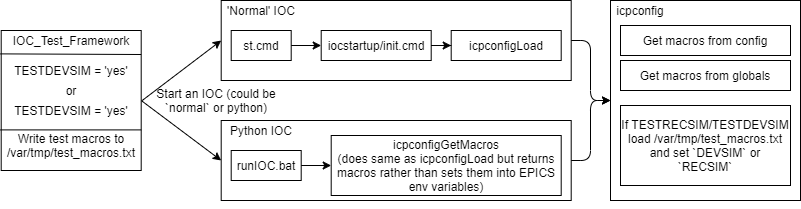

# ICP Config

ICP config is a set of C functions that are called by every IOC on startup to define the macros used within the IOC. The code for this is [here](https://github.com/ISISComputingGroup/EPICS-icpconfig). Macros can come from the following:
* Default macro values defined in the ioc's config.xml
* The current configuration
* `\Instrument\Settings\globals.txt` - See [here](../testing/Running-IOCs)
* `\Instrument\var\tmp\test_macros.txt` - A file create by the IOC_test_framework to create macros for testing. Only used if the environment variables `TESTDEVSIM=yes` or `TESTRECSIM=yes`.

Macros are loaded in the order above, such that default values are overwritten if any other source is presented, `globals.txt` will override macros in the configuration and test macros will override all others. See diagram below for an idea of how this works.

