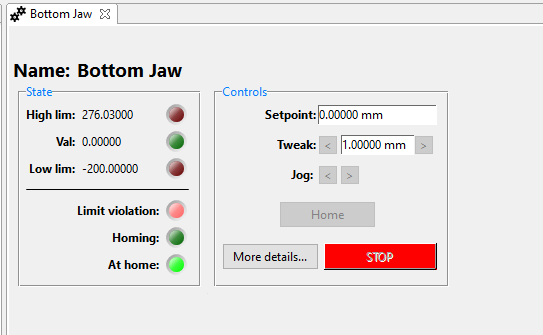
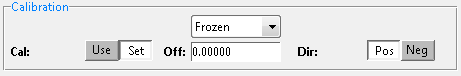
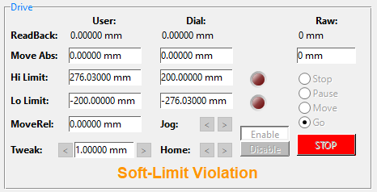
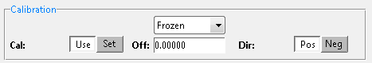

# Set the raw position of the motor without moving it

### Setting the motor position/offset
*Note that this applies to multiple motor types but not [McLennans](/specific_iocs/motors/McLennan-motors)*

Sometimes it is desirable to change the reported position of the motor without it physically moving, effectively changing the origin of the axis. 
This can be achieved through EPICS by applying an offset to the reported motor position and by setting the position in steps in the motor. TO do this:

1. See if you can home the axis instead of setting the value directly
1. Ensure the motor IOC is running
1. Put the instrument in to manager mode if it is not already in the mode
    * Menu bar: IBEX -> Manager mode
1. Go into the `Motors` perspective in the client
1. Bring up the OPI for the desired motor by double clicking the relevant square in the table

1. Click on `More details...`
1. In the `Calibration` section, 
    - ensure that it says Frozen above the offset box
    - switch `Cal` from `use` to `set`
    - 
1. Either
    1. Change the `Off` field to apply an offset to the current position
    1. Change the current position directly by changing the `MoveAbs` `User` field in the `Drive` section

1. **Don't forget** to switch the `Cal` field back to `Use` once you're done or the motor won't move.

1. Finally leave manager mode

