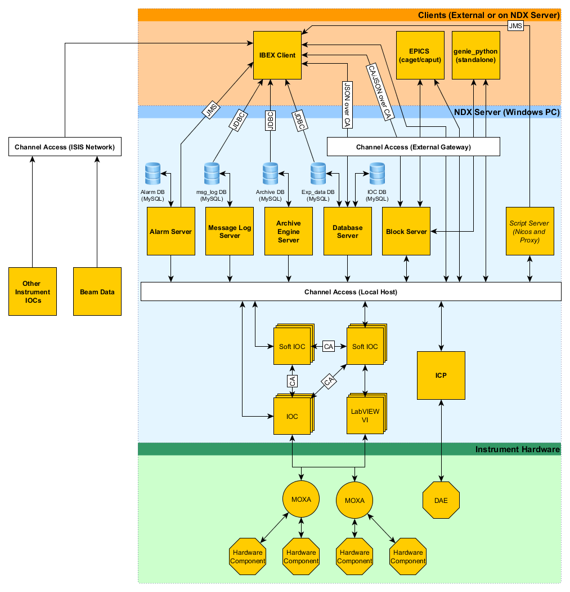

# High level architectural design

This document describes the high level design for IBEX. Eventually there should be outlines of the architectural design for each part of the high level design.

### High Level Design

    
Notes on the figure:

* CA - Channel Access
* External Gateway - This exposes the PVs running on the NDX server to the rest of the ISIS network, as read-only
* JDBC - Java Database Connectivity
* JMS - Java Messaging Service
* Soft IOC - These IOCs do not talk directly to hardware

### Clients

Clients can run on the NDX machine or elsewhere on the network. The external gateway defines the rules of which network addresses are allowed to read or write from PVs. At ISIS all machines in the blockhouse are allowed to write to PVs, and other machines on the ISIS network have read-only access to PVs.

### NDX Server

This is the Windows PC running the control software for the instrument (e.g. NDXLARMOR). This machine provides the PVs for the instrument externally, for example on Larmor all the PVs prefixed with ``IN:LARMOR:``.

### Instrument Hardware

Coming soon...

### Low Level Design Documents

Below is a list of the lower level architectural design documents.

* [Alarms](/system_components/Alarms)
* [BlockServer](/system_components/blockserver/BlockServer-Structure)
* [Database Schemas](/system_components/mysql/Database-Schemas)
* [Client](/client/design_docs/Client-Architectural-Design)
* [Script Server Back End Design Document](/system_components/nicos/design_docs/Script-Server-Back-End-Design-Document)
* [Script Server Front End Design Document](/system_components/nicos/design_docs/Script-Server-Front-End-Design-Document)
* [Configuration & Component Architecture](/client/design_docs/Configuration-and-Component-Architecture)
* [Reflectometers](/specific_iocs/reflectometry/design_docs/Reflectometers)
* [Muon Active Compensation](/specific_iocs/magnets/Muon-Active-Compensation)
* [In situ DSC](/specific_iocs/temp_controllers/In-Situ-DSC)

### Notes

The figures are made in the freely available [yEd](https://www.yworks.com/products/yed), and are stored in the images folder when you check out the Wiki.

### Nexus Files and Data

Nexus files are created on run end and hold the spectra data and the block values. The block values are present if logging is enabled on the block. Once the logging is enabled the values get written to the archive database. There is a thread which pulls this data from the MySQL into the SQLite database. On end of run the nexus file is created fro the SQLite database.

