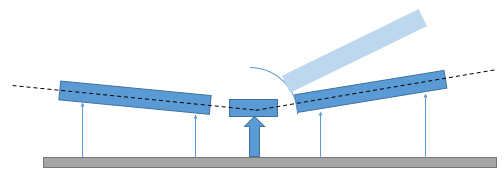

# OFFSPEC

## Background & Timeline ##
OFFSPEC is an advanced reflectometer instrument at ISIS, on TS2. The [OFFSPEC](https://www.isis.stfc.ac.uk/Pages/OFFSPEC.aspx) web page describes the background to the instrument.

This page collects information that will be useful for the implementation of the IBEX control system on OFFSPEC.

## Information about OFFSPEC (and reflectometers in general) ##



Bench moves so that angle is correct this requires motors at front and back to change positions and the bench to slide in and out. This maintains the distance from the detector to the sample in an arc.

## Control System ##
OFFSPEC will migrate from the SECI control system to the IBEX control system in MMMMMMMM YYYY.

## OFFSPEC Equipment ##
The equipment listed below is used on OFFSPEC. Please add new information (e.g. new items of equipment, new notes, information about drivers, etc. to this table).


|  VI | Config(s) | Config last updated | IBEX equivalent |
| --- | --- | --- | --- |
| `beam logger.vi` | | | standard IBEX |
| `dae control.vi` | | | standard IBEX / ISISDAE |
| `delft/coldasever.vi` | `OFFSPEC-DELFT-MAIN.conf` | 18/05/2022 | https://github.com/ISISComputingGroup/IBEX/issues/7437 |
| eurotherm |  |  | EUROTHRM |
| galil ToM |  |  | standard IBEX / GALIL |
| Glassman LV power supply | `OFFSPEC - no logging.conf` | 2019 | Obsolete, not required |
| Hitachi L7100 |  |  | *Obsolete* |
| Mk3 Chopper |  |  | MK3CHOPR |
| Jasco 4180 |  |  | JSCO4180 |
| Julabo (several models) |  |  | JULABO |
| Kepco |  |  | KEPCO |
| Keyence TM 3001P |  |  | KYNCTM3K |
| Knauer K-6 |  |  | KNRK6 |
| Knauer 1050 |  |  | KNR1050 |
| motion control (various) |  |  | REFL - assume being handled in https://github.com/ISISComputingGroup/IBEX/issues/6245 |
| Newport SMC100 |  |  | SMC100 |
| Nima Trough |  |  | NIMATRO |
| Mercury ITC |  |  | MERCURY_ITC |
| SM300-5 (power supply) |  |  | https://github.com/ISISComputingGroup/IBEX/issues/4461 |
| Tektronix AFG 3000 series |  |  | TEKAFG3XXX |
| Thurlby EX355P |  |  | TTIEX355P |
| Thurlby TGA1240 |  |  | None (hardware is obsolete; functionality to be replaced by Tektronix function generators - we should not need to convert this driver) |
| Thurlby TSX 3510P | all | - | https://github.com/ISISComputingGroup/IBEX/issues/7434 |
| Aladdin-1000 syringe pump |  |  | ALDN1000 |
| WPI 2XX syringe pump |  |  | SP2XX |
| inter galil dio |  |  | Digital i/o already covered in GALIL ioc |
| surf galil dio|  |  | Digital i/o already covered in GALIL ioc |
| `delft_dc_mc - front panel.vi` |  |  | https://github.com/ISISComputingGroup/IBEX/issues/7492 |
| `delft/eltromatdriver` | all | - | https://github.com/ISISComputingGroup/IBEX/issues/7494 |
| `delft/hfcontroldriver` | DELFT, NIMA, "Single Config" | 2011/2012 | Deprecated, not required |
| hydrocell |  |  | One-off user kit; not required |
| ISIS sample environment (digital i/o) |  |  | https://github.com/ISISComputingGroup/IBEX/issues/7436 |
| Linkam |  |  | LINKAM95 |
| Newport motor |  |  | NEWPORT |
| OFFSPEC BH |  |  | Functionality covered in IBEX by a combination of KEPCO, KHLY2400, and scans library. https://github.com/ISISComputingGroup/IBEX/issues/7435 to write equivalent scans script to existing VI |
| OFFSPEC DELFT RF |  |  | https://github.com/ISISComputingGroup/IBEX/issues/7493 |
| OFFSPEC high level |  |  | REFL |
| PI motion stage |  |  | PIMOT |
| Danfysik |  |  | DFKPS |
| ITC 503 |  |  | ITC503 |

<details>
  <summary>Older information:</summary>

```
Manufacturer | Model | Type | Connection | Driver | Notes |
------------ | ------------- | ------------- | ------------- | ------------- | -------------------------------------------
ISIS | DAE 2 | Detector Electronics | Ethernet | | [see DAE note](#note-dae)
ISIS | Mk3 | Chopper | N/A |     | [see Chopper note](#note-chopper)
GALIL | [DMC2280](http://www.galilmc.com/products/dmc-22x0.php) | Motion Controller | Ethernet | [EPICS](http://www.aps.anl.gov/epics/modules/manufacturer.php#Galil%20Motion%20Control) | | 
??? |  | 4-blade jaws |  |  | [see Jaws note](#note-jaws)
ISIS | ??? | ISIS Vacuum System |  |  |[see Vacuum System note](#note-vacuum)
Pfeiffer | TPG300 | Vacuum Gauge | RS-232 | EPICS | [see Vacuum System note](#note-vacuum)
Eurotherm | Temperature Controller | All models at ISIS | RS-232 | [EPICS](http://www.aps.anl.gov/epics/modules/manufacturer.php#Eurotherm) | [see Eurotherm  note](#note-eurotherm)
Julabo | FL1703 | Re-circulating Cooler | RS-232 | | [see Julabo note](#note-julabo)
Julabo | FL300 | Re-circulating Cooler | RS-232 | | [see Julabo note](#note-julabo)
Julabo | FP-50 | Water Bath | RS-232 | | [see Julabo note](#note-julabo)
Julabo | FP-52 | Water Bath | RS-232 | | [see Julabo note](#note-julabo)
Keithley | 2400 | Source Meter | RS-232 | | [see Keithley note](#note-keithley)
[Knauer](http://www.knauer.net/) | K6 | Electric valve drive | RS232 |  |[see Knauer note](#note-knauer)
[Knauer](http://www.knauer.net/) | 1050 | HPLC pump | ??? | | [see Knauer HPLC note](#note-knauerHPLC)
~Hitachi~ | ~L-7100~ | ~HPLC pump~ | ??? | | [see Hitachi note](#note-hitachi)
[Jasco](https://jascoinc.com/products/chromatography/)| PU-4180 | HPLC pump| ??? | | [see JASCO HPLC note](#note-jasco-hplc-pump)
Nima Trough | ??? | Trough | ??? | | [see Nima Trough note](#note-nima-trough)
[KEPCO](http://www.kepcopower.com/bop.htm) | BOP 100-10MG | Bi-Polar Power Supply | RS232 | #187 |[see Kepco note](#note-kepco)
[KEPCO](http://www.kepcopower.com/bop.htm) | BIT 4886 | I/F card | GPIB, RS-232 |  |[see Kepco note](#note-kepco)
[KEPCO](http://www.kepcopower.com/bop.htm) | BOP 50-2M-4886 | Bi-Polar Power Supply | RS232 | |[see Kepco note](#note-kepco)
Delta-Elektronika | SM300-5 | PSU | ??? | | [see Delta Elektronika note](#note-delta-elektronika )
Thurlby | EX355P | PSU | ??? | | [see Thurlby note](#note-thurlby)
Thurlby | TGA1240 | Arbitrary Waveform Generator | ??? | | [see Thurlby note](#note-thurlby)
Thurlby | TSX3510P | PSU | ??? | | [see Thurlby note](#note-thurlby)
Oxford Instruments | Mercury | Temperature Controller | RS-232 | | [see Oxford Instruments note](#note-oxford-instruments)
Oxford Instruments | ITC503 | Cryogenic System |   |  | [see Oxford Instruments note](#note-oxford-instruments)
Tektronix | AFG 3021B | Function Generator | Ethernet | #237 |[see Tektronix note](#note-tektronix)
[Linkam](http://www.linkam.co.uk/) | T95 |  | RS232 |  |[see Linkam note](#note-linkam)
Watson Marlow | 323 | Peristaltic Pump | ??? | | [see Peristaltic Pumps note](#note-peristaltic-pumps)
WPI | Aladdin-1000 | Syringe Pump | ??? | | [see Syringe Pumps note](#note-syringe-pumps)
WPI | SP2xx | Syringe Pump | ??? | | [see Syringe Pumps note](#note-syringe-pumps)

##### Note: DAE #####
See multi-detector and single-detector below.

##### Note: Choppers #####
OFFSPEC has a Mk3 chopper.<br>

##### Note: Jaws #####
Provide information about OFFSPEC jaws.

##### Note: Vacuum System #####
TPG300 support is implemented via [#216](https://github.com/ISISComputingGroup/IBEX/issues/216) and [#2063](https://github.com/ISISComputingGroup/IBEX/issues/2063)

##### Note: Eurotherm #####
[Eurotherms](http://www.facilities.rl.ac.uk/isis/computing/ICPdiscussions/OFFSPEC/OFFSPEC_Eurotherms.jpg) are used to control temperature Orange Cryostat, CCR and Furnace devices.

<a name="noteJulabo"></a>
##### Note: Julabo #####
OFFSPEC uses Julabo water baths & re-circulating coolers
1. [Julabo FL1703](https://www.julabo.com/en/products/recirculating-coolers/fl1703-recirculating-cooler)
1. [Julabo FL300](https://www.julabo.com/en/products/recirculating-coolers/fl300-recirculating-cooler)
1. Julabo Water Bath (which models?)

##### Note: KEPCO #####
1. [Kepco BOP 100-10MG PSU](http://www.kepcopower.com/bophimod.htm).<br>  See also [#3005](https://github.com/ISISComputingGroup/IBEX/issues/3005)
1. [Kepco BIT 4886](http://www.kepcopower.com/bit.htm) is an interface card for Kepco bi-polar ([BOP](http://www.kepcopower.com/bop.htm)) power supplies.
1. [KEPCO BOP 50-2M-4886 PSU](http://www.kepcopower.com/bophimod.htm).<br>  See also [#188](https://github.com/ISISComputingGroup/IBEX/issues/188) & [#200](https://github.com/ISISComputingGroup/IBEX/issues/200)

##### Note: Keithley #####
1. [Keithley 2400 Series Source Meter](https://uk.tek.com/keithley-source-measure-units/keithley-smu-2400-series-sourcemeter).<br>
See also tickets [#1826](https://github.com/ISISComputingGroup/IBEX/issues/1826), [#2695](https://github.com/ISISComputingGroup/IBEX/issues/2695), [#2801](https://github.com/ISISComputingGroup/IBEX/issues/2801) and [#3176](https://github.com/ISISComputingGroup/IBEX/issues/3176).

##### Note: Hitachi #####
Hitachi L-7100 HPLC pump (no longer supported at ISIS).  ~Can't find L-7100 on [Hitachi web-site](http://www.hitachi-hightech.com/global/about/corporate/group/hhs (may be obsolete).  Check existing SECI VI for logic and manual.~

##### Note: JASCO HPLC Pump #####
[JASCO HPLC pump](https://jascoinc.com/products/chromatography/hplc/modules/hplc-pumps/) is a new (for ISIS) model of HPLC pump.
   * See `C:\LabVIEW Modules\Drivers\Jasco PU-4180 HPLC Pump\Documentation` for documentation.
   * See also [#3743](https://github.com/ISISComputingGroup/IBEX/issues/3743) & [#3923](https://github.com/ISISComputingGroup/IBEX/issues/3923)

##### Note: Knauer #####
1. Knauer K-6 Electric Valve Drive.  [Knauer web site](https://www.knauer.net)<br>
   * K-6 model appears to have been superseded.  Check existing SECI VI for logic and manual.
   * Support now implemented (28-03-2019).  See [#3781](https://github.com/ISISComputingGroup/IBEX/issues/3781).

##### Note: Knauer HPLC #####
Knauer HPLC 1050 [Knauer HPLC 1050 is discontinued.](https://www.knauer.net/en/discontinued-smartline-pump-1050-successor-azura-p-61l/p14161).  Check existing SECI VI for logic and manual.
   1. Support now implemented (04-01-2019).  See [#3262](https://github.com/ISISComputingGroup/IBEX/issues/3262).

##### Note: Nima Trough #####
Nima Trough: SECI used a manufacturer supplied VI.  We may need to do the same in IBEX (via lvDCOM).<br>
   * **Note:** NIMA Technologies Ltd now seems to be part of [Biolin Scientific](https://www.biolinscientific.com/ksvnima).<br>
   * The NIMA trough is used regularly on SURF.  The manufacturer supplied VI is used to view graphs showing information about thin films.
   * The manufacturer has made additional software available for download.  A copy of this software is located in `\\isis\shares\ISIS_Experiment_Controls\NIMA Trough\Nima_TR8.1.zip`.
   * Support now implemented (25-05-2019).  See [#3783](https://github.com/ISISComputingGroup/IBEX/issues/3783)

##### Note: Delta-Elektronika #####
1. Delta-Elektronika SM300-5 is a DC power supply.  It is listed on page for [Delta-Elektronika SM1500 series](http://www.delta-elektronika.nl/en/products/dc-power-supplies-1500w-sm1500-series.html) products.

##### Note: Thurlby #####
[Thurlby Thandar Instruments](https://www.aimtti.com/)
1. [Thurlby Thandar Instruments EX355P PSU](https://www.aimtti.com/product-category/dc-power-supplies/aim-ex-rseries)
   * see [#155](https://github.com/ISISComputingGroup/IBEX/issues/155) and [#198]
   * IOC & OPI updated (18-07-2019).  See [#3784](https://github.com/ISISComputingGroup/IBEX/issues/3784)
(https://github.com/ISISComputingGroup/IBEX/issues/198).
1. [Thurlby TGA1240 Arbitrary Waveform Generator](https://www.aimtti.com/product-category/arbitrary-generators/aim-tga1240series)
1. [Thurlby TSX3510P DC Power Supply](https://www.aimtti.com/product-category/dc-power-supplies/aim-tsxseries)

##### Note: Oxford Instruments #####
1. Support for OI ITC503 created as part of [#2593](https://github.com/ISISComputingGroup/IBEX/issues/2593)
1. Support for Mercury Temperature Controller was created as part of [#2840](https://github.com/ISISComputingGroup/IBEX/issues/2840)

##### Note: Linkam #####
There are VIs for this.<br>
See also [Linkam T95 controller](http://www.linkam.co.uk/t95-system-controllers/) and tickets [#1106](https://github.com/ISISComputingGroup/IBEX/issues/1106), [#1496](https://github.com/ISISComputingGroup/IBEX/issues/1496), [#1509](https://github.com/ISISComputingGroup/IBEX/issues/1509).

##### Note: Peristaltic Pumps #####
1. [Watson Marlow 323 Peristaltic Pump](http://www.watson-marlow.com/gb-en/range/watson-marlow/300-tube-pumps/323d/)
   * Support now implemented (14-08-2019).  See [#3786](https://github.com/ISISComputingGroup/IBEX/issues/3786)

##### Note: Syringe Pumps #####
1. [WPI Aladdin-1000 Syringe Pump](https://www.wpi-europe.com/products/pumps--microinjection/laboratory-syringe-pumps/al1000-220.aspx)
   * Support now implemented (20-06-2019).  See [#3787](https://github.com/ISISComputingGroup/IBEX/issues/3787)
1. [WPI SP2xx Syringe Pump](https://www.wpi-europe.com/products/pumps--microinjection/laboratory-syringe-pumps.aspx) - check specific model.
   * Support now implemented (05-07-2018).  See [#3261](https://github.com/ISISComputingGroup/IBEX/issues/3261)

##### Note: Tektronix #####
1. Tektronix Function Generator: [AFG 3021B](https://www.tek.com/datasheet/afg3000-series)
   * See also [#237](https://github.com/ISISComputingGroup/IBEX/issues/237)

##### Note: ISIS Environment Monitor #####
1. The ISIS Environment Monitor is a device to monitor various environmental properties (temperature, pressure, humidity, etc).  There is an existing list of commands and a VI to work from.

## OFFSPEC Notes ##
OFFSPEC has the following specialist panels/systems:
1. OFFSPEC High Level
1. OFFSPEC Delft System
1. OFFSPEC ISIS Sample Environment
1. OFFSPEC Linkam
   * [see Linkam note](#noteLinkam)
1. OFFSPEC Newport Piezo Stage
1. OFFSPEC BH (KEPCO 100-10MG & Keithley 2400)
   * [see Kepco note](#noteKepco) & [see Keithley note](#noteKeithley)
1. OFFSPEC Delft RF
1. OFFSPEC PI Motion Stage
1. POLREF Danfysik
1. SURF Galil DIO
1. INTER Galil DIO

OFFSPEC has the following devices under motion control:
1. benches
1. coarse jaws
1. FOMs (Frame Overlap Mirror)
1. jaws
1. laser gimbal
1. OFFSPEC Analyser
1. point detector
1. Polarizer
1. reflectometer sample stack

## OFFSPEC SECI Configs ##
Document information about OFFSPEC SECI configs here.

Configuration Name                     | Sub-Configurations                                 | Last Accessed | Required |
---------------------------------------|----------------------------------------------------|---------------|----------|
OFFSPEC_place_holder1.conf             | -                                                  | dd/mm/yyyy    | -        |
OFFSPEC_place_holder2.conf             | -                                                  | dd/mm/yyyy    | -        |

```

</details>

## OFFSPEC Genie Scripts ##
Similarly, Document information about OFFSPEC SECI Genie scripts here.

