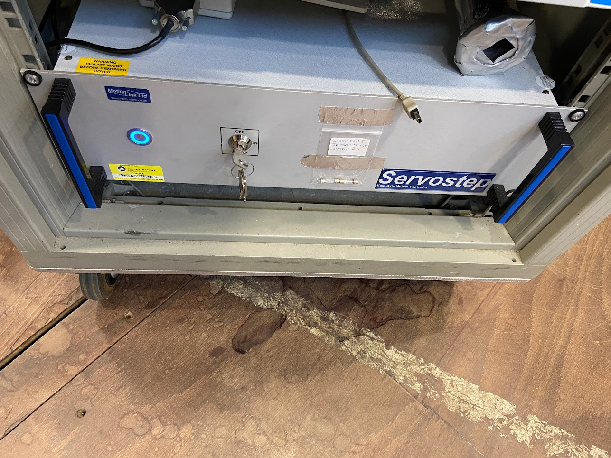

# PEARL

This page collects information that will be useful for the implementation of the IBEX control system on PEARL.

## Background & Timeline ##
PEARL is a powder diffraction instrument on TS1 at ISIS, dedicated to high-pressure studies.  The [PEARL](https://www.isis.stfc.ac.uk/Pages/pearl.aspx) web page describes the background to the instrument.

### PEARL networking 

PEARL has a slightly complicated networking situation, where they have some patch panels that propagate through to next to their sample prep/setup cabin. 

To summarise: 

Ports `SC0-SC10` are patched through to the top patch panel in the setup cabin. `SC6-9` are actually on the outside wall of the setup cabin, near where their vacuum tanks live. `W269-272` should patch from the setup cabin to the patch panel at the back of the main cabin. 

Galils, choppers etc are fed through `DS31-DS35` which lives in the little server room down the stairs.

There is a large patch panel in the main PEARL cabin which links to the blockhouse ports, sat above some Eurotherm racks. The confusing bit - there are also ports that live outside the setup cabin, on the left side above the beamline itself. Ports 1-5 here ALSO route through to the large rack-mounted patch panel which lives in the main cabin. For example, port 3 outside the setup cabin, commonly used for the `PACE 5000` pressure controller, routes to port 3 on the large patch panel (in the rack in the PEARL cabin). This is then fed to the Moxa which is sat above. Each of the ports on the large patch panel have a code that looks like `9MC4180` which means nothing to us - we only care about the patch panel number which is underneath. 

## Control System ##
PEARL will migrate from the SECI control system to the IBEX control system.

## PEARL Equipment ##
The equipment listed below is used on PEARL. Please add new information (e.g. new items of equipment, new notes, information about drivers, etc. to this table).

Manufacturer | Model | Type | Connection | Driver | Notes |
------------ | ------------- | ------------- | ------------- | ------------- | -------------------------------------------
ISIS | DAE 2 | Detector Electronics | Ethernet | | [see DAE note](#note-dae)
ISIS | Mk3 Chopper | Chopper | Ethernet/.NET | #169 | [see Mk3 Chopper note](#pearl_note-mk3-chopper) |
GALIL | [DMC2280](http://www.galilmc.com/products/dmc-22x0.php) | Motion Controller | Ethernet | [EPICS](http://www.aps.anl.gov/epics/modules/manufacturer.php#Galil%20Motion%20Control) | [see Galil note](#note-galil) | 
[LINMOT](http://www.linmot.com/) | [P0x-23](http://www.linmot.com/fileadmin//user_upload/Downloads/software-firmware/servo-drives/linmot-talk-1-3-x/UserManual_1r3_e_recent.pdf) | Linear Motors and Motion Controller | RS-232 | [#2098](https://github.com/ISISComputingGroup/IBEX/issues/2098) | [see LinMot note](#note-linmot) |
??? | ??? | 1 x 4-blade jaws |  |  | [see Jaws note](#note-jaws)
[Pfeiffer](http://www.pfeiffer-vacuum.com/products/measurement/container.action) | TPG300 | ISIS Vacuum System | RS232 | #216 |[see Pfeiffer note](#note-pfeiffer)
Eurotherm | Temperature Controller | All models at ISIS | RS-232 | [EPICS](http://www.aps.anl.gov/epics/modules/manufacturer.php#Eurotherm) | [see Eurotherm  note](#note-eurotherm)
LakeShore | 336| Temperature Controller | RS-232 | [EPICS](http://www.aps.anl.gov/epics/modules/manufacturer.php#Lakeshore) | [see LakeShore note](#note-lakeshore )
~Oxford Instruments~ | ~ITC503~ | ~Cryogenic System~ |   |  | [see Oxford Instruments note](#note-oxford-instruments)
Sorensen | High-PT | PSU |  |  | [see Sorensen note](#note-sorensen)
Pace | 5000 | Pressure Controller | RS-232 |  | [see Pace note](#note-pace)
ISIS | PEARL | Pressure Cell Controller |  |  | [see Pressure Cell Controller note](#note-pressure-cell-controller)
ISIS | PEARL | MMP ~200~ or 210 Pressure Transducer |  |  | [see PEARL Pressure Transducer note](#note-pearl-pressure-transducer)
ISIS | PEARL | Temperature Controller |  |  | [see PEARL Temperature Controller note](#note-pearl-temperature-controller)
ISIS | ??? | Cold Valve| | | [see Cold Valve note](#note-cold-valve)

##### Note: DAE #####
Main Detector banks + one working fixed monitor upstream of sample position.

##### Note: Galil #####
PEARL uses Galil controllers.

##### Note: LinMot #####
PEARL uses LinMot P0x-23 motors, controlled by LinMot drives. 
[LinMot User Manual](http://www.linmot.com/fileadmin//user_upload/Downloads/software-firmware/servo-drives/linmot-talk-1-3-x/UserManual_1r3_e_recent.pdf)
1. Alignment Mirror:  Driven either IN or OUT by a single LinMot axis.
1. Also jaw sets mentioned below

##### Note: Jaws #####
1. Two sets of jaws are driven by LinMot P0x-23 motors...
1. ... and one by Galil
1. PEARL has custom screens for controlling the jaws
   * See `C:\LabVIEW Modules\Instruments\PEARL\PEARL Jaws\Screens`

{#pearl_note-mk3-chopper}
##### Note: ISIS Mk3 Choppers #####
PEARL has two ISIS Mk3 choppers.

##### Note: Pfeiffer #####
1. [Model TPG 26x](https://www.pfeiffer-vacuum.com/en/products/measurement/activeline/controllers/?detailPdoId=5724), used on the furnace vacuum system 
2. [Model TPG 300](https://www.pfeiffer-vacuum.com/en/products/measurement/modulline/controllers/?detailPdoId=3407), used on the tank/guide vacuum system 

##### Note: Eurotherm #####
Three Eurotherms in use on PEARL.  Used to control temperature of all top-loading CCR/ He-cryostats and furnaces.

##### Note: LakeShore #####
1. [Model 336](http://www.lakeshore.com/products/cryogenic-temperature-controllers/model-336/Pages/Overview.aspx):

There are [EPICS drivers](http://www.aps.anl.gov/epics/modules/manufacturer.php#Lakeshore) for a variety of Lakeshore temperature controllers.
Documentation on the Lakeshore 336 IOC setup can be found [here](/specific_iocs/temp_controllers/Lakeshore336).

##### Note: Sorensen #####
Sorensen appear to have been taken over by [AMETEK](http://www.programmablepower.com/brands/sorensen.htm). 
1. VI for Sorensen PSU is here: `C:\LabVIEW Modules\Instruments\PEARL\PEARL High-PT PSU Controller`

##### Note: Oxford Instruments #####
1. Support for OI ITC503 created as part of [#2593](https://github.com/ISISComputingGroup/IBEX/issues/2593)
1. No longer used on PEARL.

##### Note: Pace #####
PACE appear to have been taken over by [Baker Hughes Digital Solutions](https://www.bakerhughesds.com/) - specifically, Baker Hughes [Druck](https://www.bakerhughesds.com/measurement-sensing/druck-pressure-measurement) subsidiary.   
1. [Pace 5000 Pneumatic Modular Pressure Controller](https://www.bakerhughesds.com/measurement-sensing/pressure-measurement-and-calibration/test-and-calibration/pressure-controllers-pace)
1. Documentation: `\\isis\shares\ISIS_Experiment_Controls\PACE5000 Pressure Controller`
1. VI for Pace 5000 is located here: `C:\LabVIEW Modules\Drivers\PACE 5000`

##### Note: PEARL Pressure Transducer #####
1. VI for PEARL Pressure Transducer is here: `C:\LabVIEW Modules\Instruments\PEARL\PEARL Pressure Transducer`
1. **MMP 200/210 device is no longer used on PEARL**
1. Superseded by M905 (currently connected to Pressure Cell Controller, but would like to be read independently in other experiments)

##### Note: Pressure Cell Controller #####
1. Pressure Controller Repositories
- [Support](https://github.com/ISISComputingGroup/EPICS_PearlPressure) 
- [IOC](https://github.com/ISISComputingGroup/EPICS-ioc/tree/master/PEARLPC)
1. VI for PEARL Pressure Cell Controller is here: `C:\LabVIEW Modules\Instruments\PEARL\PEARL Pressure Cell Controller`

##### Note: PEARL Temperature Controller #####
1. Based on a [NI cDAQ 9181](http://www.ni.com/en-gb/support/model.cdaq-9181.html) device using 9213 Thermocouple module.
1. VI for PEARL Temperature Controller is here: `C:\LabVIEW Modules\Instruments\PEARL\PEARL Temperature`

##### Note: Cold Valve #####
1. The PEARL ColdValve is a motor driven needle valve that controls the flow of liquid nitrogen through their press.  The motor is driven by a standard Mclennan drive crate.
1. VI for the ISIS Cold Valve is located here: `C:\LabVIEW Modules\Drivers\ISIS Cold Valve`
1. They current model will (at some point in the future) be replaced by a new one which the Cryogenics team are making. Both the old and new models will use the same controller.
1. For the avoidance of doubt, the PEARL ColdValve is _**entirely unrelated**_ to the IRIS CryoValve.

##### Note: Camera #####
PEARL's camera is a blackfly model which we communicate with through the `areaDetector` module. There is a generic "webcam" device screen which needs to be set up for this pointing at the `PEARLCAM_01` IOC which lets them start acquiring image data with region of interest functionality. 

## PEARL Notes ##

PEARL has the following specialist panels:
1. PEARL Sample Alignment
   * This is a method to move the sample into position, using 'nudges' rather than setpoints
   * see `C:\LabVIEW Modules\Instruments\PEARL\PEARL Alignment`
1. PEARL Jaws & Beam Dimensions
   * PEARL Beam dimensions.vi (controls all jaw sets 1x Galil & 2x LinMot)

Compare with similar systems on GEM and POLARIS.

PEARL has the following devices under motion control:
1. Jaws
   * see `C:\LabVIEW Modules\Instruments\PEARL\PEARL Jaws\Screens`
1. Rotation stage
1. XYZ stage
1. Diamond Anvil Cell(DAC): uses XYZ stage, rotation stage.  All driven by Galil.

This is a weird `Servostep` box which contains a Galil 4000 series inside. It looks like this: 

Compare with similar systems on GEM and POLARIS.

There are some inaccessible front end jaws on PEARL controlled by the Galil, these are not used but must be kept open for operation. They are homed to the forward limit and seem to typically be kept about 4/5mm inside that position for running. This should be kept in mind when migrating the Galil.

## PEARL SECI Configs ##
Document information about PEARL SECI configs here.

Configuration Name                     | Sub-Configurations                                 | Last Accessed | Required |
---------------------------------------|----------------------------------------------------|---------------|----------|
PEARL_place_holder1.conf               | -                                                  | dd/mm/yyyy    | -        |
PEARL_place_holder2.conf               | -                                                  | dd/mm/yyyy    | -        |

## PEARL Genie Scripts ##
Similarly, Document information about PEARL SECI Genie scripts here.
