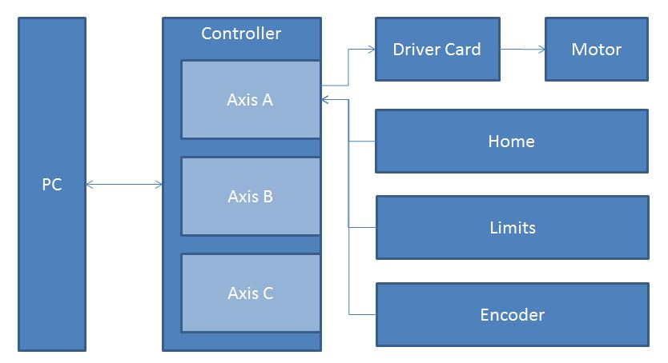

# Motors

The basis of the motor IOCs at ISIS is the [motor record](https://www3.aps.anl.gov/bcda/synApps/motor/index.html), which aims to provide a generic interface to all motors regardless of make or model. The motor record is a single PV that contains a number of fields for things like motor speed, position, encoder readback etc. Note that this is very different from the way other IOCs would normally be set up, where each of these values would be its own PV. 

Naming conventions for motor PVs are also different in that all motors are of the form `%PVPREFIX%MOT:MTR0101` where the first number gives the controller and the second gives the axis. These controller/axis numbers are what dictates the axis position in the table of motors.

For most motor IOCs the motor record itself is pulled in from `support\motor\master\motorApp\Db\motor.db`. However, the Galil contains its own copy of the motor record in `support\galil\master\GalilSup\Db`.

## IOC Structure

## Physical Hardware



In general one motor controller will control a number of different axes (the actual motors themselves). Each axis will most likely give some feedback to the controller, the most common types of feedback are:
* Encoder: This is some form of external device that is measuring where the axis actually is. This is normally fed back to the controller in _steps_, the motor record will convert this to a distance using a supplied resolution.
* Limits: A binary signal that tells the controller that the motor has reached the edge of it's travel. There will be a high and a low limit for each direction of travel.
* Home: A binary signal that tells the controller when the axis is at a known _home_ position.

## Software structure

All motor IOCs have a macro called `MTRCTRL` which defines the controller number. The controller number is used to [create the PVs for each axis](/iocs/conventions/PV-Naming) and gives the row where each axis will appear on the table of motors. 

Motors will tend to have a subset of the following *.cmd files for loading dbs:

| Filename | Description | Location |
| --- | --- | --- |
| `st.cmd` | Should be very simple, only loading the st-common.cmd | One in each iocBoot folder for each IOC |
| `st-common.cmd` | The main cmd for the IOC | A single version in the first IOC |
| `st-ctrl.cmd` | Creates IF macros for which controller we're loading | A single version in the first IOC |
| `st-max-axis.cmd` | Calculates the maximum axis we need to load | A single file in the first IOC |
| `st-axis.cmd` | Loads each individual axis | A single file in the first IOC |
| `st-motor.cmd` | Loads the actual db files for each individual axis | A single file in the first IOC |
| `galilXX.cmd` | Sets up the physical connection for a Galil | A file for each galil in `configurations\galil` |

## Creating a motor IOC

see [Create Motor IOC](/iocs/creation/Create-Motor-IOC.md)

## Motors used at ISIS

The motors currently used at ISIS are:

```{toctree}
:glob:
:titlesonly:
:maxdepth: 1

motors/Attocube
motors/Beckhoff
motors/EnginX-Sample-Positioner
motors/Galil
motors/Linmot
motors/McLennan-motors
motors/Newport
motors/PI-Rotation-Stage-setup
motors/SMC100
motors/SXD-Attocube
```

```{seealso}
See [Motor Extensions](Motors-Extensions) for information about extra configuration which can be applied to motion controllers, for example jaws.
```

## Troubleshooting information

```{toctree}
:glob:
:titlesonly:
:maxdepth: 1

motors/Motors-Trouble-Shooting
motors/Adding-motor-IOC-to-global-motor-moving-and-stop-all
motors/Clearing-the-Motors-are-Moving-state
motors/Set-the-raw-position-of-the-motor-without-moving-it
motors/Add-support-for-motor-extras
```

## See also

* [IMAT Lens Adjustment](motor_extensions/IMAT-Lens-Adjustment)
* [Motion Setpoints](motor_extensions/Motion-Set-points)
* [Creating soft motors to control real motors](motor_extensions/Creating-soft-motors-to-control-real-motors) This is useful if you need some logic for transformations between axes.
* [Portable Eulerian Cradle](motor_extensions/Portable-Eulerian-Cradle) see on ENGINX
* [SANS2D Front Beam Stop inhibit movement](motor_extensions/SANS2D-Front-Beam-Stop-inhibit-movement)
* [Disabling motor from view in the motor table](/iocs/testing/Disable-records)
