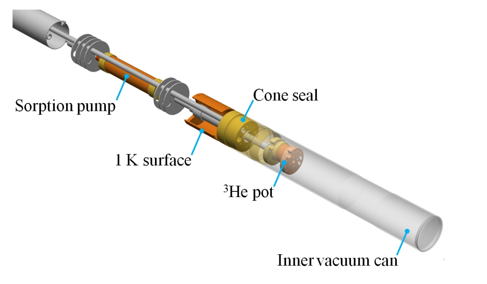

# Oxford Instruments Mercury Heliox

The mercury Heliox systems are a type of refrigerator which cools using Helium-3. Using this technique, temperatures of around ~300mK can be achieved. 

The heliox systems, like dilution fridges, are parasitic, which means they must sit in an outer cryostat or cryomagnet which provides the initial stage of cooling to low temperature (a few degrees Kelvin) before the heliox provides the final stage of cooling (to ~300mK). The outer cryostat is usually controlled by a standard Mercury ITC controller.

## Physical process - background

A sorption cooling stage works by evaporative cooling of Helium-3. To understand the process, consider the following picture:

The components which are interesting for us are:
- Helium-3 pot. The sample is mounted to the bottom of this.
- Helium-4 pot (also called "1K pot").
- Sorption pump

The Helium-3 pot and the sorption pump form a closed system. Helium-3 can move between these two areas, but cannot escape. This is done because Helium-3 is extremely expensive, so pumping it away would be very wasteful.

The sorption pump is a "pump" in the sense that it can control the pressure of the Helium-3 surrounding it. The physical process that achieves this is adsorption of Helium-3 onto the material (charcoal) in the pump. The pumping efficiency (i.e. pressure) of the pump can be changed by controlling it's temperature. The lower the temperature, the more Helium-3 the pump will adsorb per unit time. If the pump is warmed to ~30K, it will release all of the previously adsorbed Helium-3.

The Helium-3 pot is where the lowest temperatures (~260mK) are achieved. In this pot, Helium-3 cools by evaporation. The rate of evaporation of Helium-3 (i.e. the cooling power) is changed by varying the temperature of the sorption pump (and therefore the vapour pressure above the Helium-3 in this pot).

The Helium-4 pot is used to recondense Helium-3 back into a liquid after being released by the sorption pump (to release Helium-3, the sorption pump is warmed to 30K, and Helium-3 is a gas at this temperature).

## Communications

### Settings

The Mercury can be physically configured to use serial, ethernet or GPIB as it's transport layer. At ISIS, we use serial. The serial settings can be changed on the physical device, but we typically use 57600 baud as this is usually an acceptable compromise of transmission speed against line length restrictions. If there is a very long connection from the moxa to the heliox unit, and there is noise on the line, it may be useful to reduce the baud rate to see if this helps.

### Command set

The Heliox systems are physically based on the mercury ITC temperature controllers, but they do not use the same command set and cannot be controlled by the same drivers. The mercury heliox systems have their own driver.

The devices use an SCPI-like command syntax. There are two approaches to getting data using this protocol:
- Ask for everything in one go, e.g. `STAT:DEV:HelioxX`. This will return a huge status string containing every measurement under that category (~30 items). This approach is used by the LabVIEW driver (although it only actually looks at the data for a few measurements). It is also useful for enumerating the valid pieces of data that you can ask for individually.
- Ask for one thing at a time, e.g. `STAT:DEV:HelioxX:TEMP:SIG:TEMP`. This will only return the one measurement which we asked for. This approach is what the IOC uses.

### Channels

The mercury ITC driver essentially reads data from 5 distinct channels:

| Physical sensor location | Channel name on LET heliox | Channel name on Muon heliox | Notes |
| --- | --- | --- | --- |
| He3 Pot | `HelioxX` | `HelioxX` | This is the "main" heliox control channel. According to the OI manual this is the only channel which we should need to use to control the heliox's temperature. In the IOC and LabVIEW driver, this is the only channel on which we allow setting setpoints. It is a hardware alias of either `HeHigh` or `HeLow` depending on temperature (see below). |
| He3 Sorption pump | `He3Sorb` | `MB1_He3_Sorb` | Dedicated channel for the (helium-3) sorption pump. Monitoring only. Note: the He3 sorption pump and the He3 Pot are not the same! | 
| He4 Pot | `He4Pot` | `DB6_He4Pot` | Dedicated channel for the (helium-4) 1K-pot cooling stage. Monitoring only. Note: the way that ISIS run the Mercury Heliox systems means that this channel will read a constant value all the time, as there is no actual hardware present on the heliox to read this. This hardware would only be present if a single Mercury ITC unit was used to control both the main cryostat and the sorption stage. | 
| He3 Pot (high sensor) | `HeHigh` | `DB7_He3_Pot_CRN` | Monitoring only. This is a "high" (~2-80K) temperature thermocouple, used for measuring the temperature of the He3 Pot when the temperature is in it's range of validity. This channel will give invalid temperatures if the heliox is running at "low" temperature. | 
| He3 Pot (low sensor) | `HeLow` | `DB8_He3_Pot_Low` | Monitoring only. This is a "low" (~0.2-2K) temperature thermocouple, used for measuring the temperature of the He3 Pot when the temperature is in it's range of validity. This channel will give invalid temperatures if the heliox is running at "high" temperature. | 

Because the channel names vary between the Muon Heliox and the LET heliox, they must be supplied as IOC macros. (Apart from the `He3 Pot`, which is the same for both devices)

If a new heliox turns up on another beamline, the following is the process to figure out the required channel names:
- Connect to the device via your favourite terminal emulator (HTerm/PuTTY/HyperTerminal/etc).
- Issue the command `READ:SYS:CAT` (terminated with a line feed, `\n`)
- This will respond with a string like `STAT:SYS:CAT:DEV:<device 1 id>:<device 1 type>:DEV:<device 2 id>:<device 2 type>:...`. 
  * The IDs should look something like `DB1.H1` (meaning: daughter board 1, heater 1)
  * The device type could be one of `TEMP` (temperature), `PRES` (pressure), `HTR` (heater) or `AUX` (auxiliary output).
- For each of the devices in the catalogue response, issue the command `READ:DEV:<device id>:<device type>:NICK` (terminated with a line feed)
- The device will respond with a string that looks like `STAT:DEV:MB1.T1:TEMP:NICK:MB1_He3_Sorb`
- The last part of this response (`MB1_He3_Sorb` in this example) is the string that the IOC will need as a macro
- If it's not immediately obvious which channel name corresponds to which item in the table above, consult cryogenics for advice about how the channels have been named.

## Regeneration

### Physical process - background

Sorption cooling stages can only dissipate a finite amount of energy before they must be "regenerated". This is contrast to dilution cooling, which can be run (essentially) continuously.

A regeneration follows the following physical process:
- Regeneration is started either manually (by the user) or automatically by the IOC/LabVIEW driver if that option is selected
- The He3 sorption pump is warmed significantly (to about 30K).
- This heat causes the pump to release all of the Helium-3 stored in it.
- At the same time, the 1K pot is run, which causes the helium-3 to recondense when it comes into contact with the 1K pot
- Once all of the helium 3 has recondensed, the sorption pump is cooled back down. This causes it to start "pumping" and therefore cooling of the He3 Pot resumes.
- This process will take approximately 30-90 minutes depending on the starting temperature of the heliox.

The heliox typically needs a regeneration after 24-48 hours of cooling. I think this depends on the sample and the external heat load.

In effect, this means that the users lose temperature control while a regeneration is in progress. TODO: do the scientists know this or will they be surprised by this behaviour? Are regenerations typically done automatically or manually or does this depend on the scientist/experiment?

### Detecting when a regeneration is required

A regeneration is captured by a boolean with the following inputs:
- Mode = "Low Temp"
- And Heliox temperature > 0.4K
- And He3 Sorb heater in automatic mode
- And He3 Sorb heater percent heat < 0.2%
- And no comms errors within the last 120 seconds
- And auto-recondense enabled on VI front panel
- And one or both of:
  * Either:
    * Rate of change of temperature over the last 200 seconds > 0.0005K/min (calculated by line of best fit)
    * AND variance of temperature over the last 200 seconds > 0.0005K
    * AND (Heliox temperature - TSet) > 0.25K
  * Or:
    * (Heliox temperature - TSet) > 0.05K continuously for 600 seconds. This is the 'coarse check', where 600s is the 'coarse time'.

This boolean must then stay true continuously for 120 seconds. If it does, then a regeneration is triggered in the VI. Under IBEX, the value of the boolean will be displayed on the OPI but no action will be taken.

### Regeneration logic

When a regeneration is triggered, the existing LabVIEW driver simply sends a temperature setpoint of zero. There is logic to do something much more complicated, but it is "commented out" in an `if False` statement.

It appears to me as though the setpoint is never set back to the previous value in the LabVIEW code. There is a lot of code relating to this, but it is all disabled.

Under IBEX we currently only allow manual regenerations. The same conditions as above are displayed on an indicator on the IBEX OPI, but no action is taken. This is because the scientists don't trust the current regeneration conditions and so they have not been hooked up. We would need to book lots of time with the heliox to try and work out a better set of detection conditions if this logic were to be used in future.

## LabVIEW driver oddities

The following notes apply to the LabVIEW driver:
- The driver does not work with LabVIEW 2018. It works with versions from 2010 to 2014 - I am not sure in which intermediate version it stops working. The symptom is that it never even tries to send bytes to a serial port. I think it is crashing while trying to get a subVI by reference but I am not completely sure about this.

## Troubleshooting

### No comms to device but I'm sure the serial settings are correct

The symptom is that the device acts as if it's not there - you will see serial writes going out but nothing coming back. This can happen if the device is left in local mode (for example, after a cryogen fill). 

I am not aware of a remote command to set the device back into remote mode, so you will need to walk up to the physical mercury controller. It has a touch screen with a small `l` in the bottom-left of the touch screen. If it is shown in blue, tap it once. It should turn orange, which indicates the device is now in remote. Check you now have comms.

**NB** Only the main communications socket (25 pin d-type, labelled _RS232_) should be connected to a MOXA port, **not** any other sockets on the Mercury.

### I can read the main temperature but not any channels

Check channel assignments are correct - see table above and instructions for finding out channel names if unknown.

### Devices are communicating but readback values are not correct

Check the cables are connected correctly - you don't get super obvious errors if e.g. ITC and IPS cables are swapped. This issue may also be indicated by errors parsing responses from the device in the IOC log.

An error could look like this if the IPS and ITC cables are swapped: 

`ITC503_01:MODE: Input "0A0C3H0M50P03" does not match format "%{A0|A1|A2|A3}"`

### Regeneration starts but never finishes

The Heliox detects whether a regeneration has "finished" by checking whether the temperature of the Helium-3 pot is smaller than a threshold. From testing, I believe the threshold is somewhere around 1.7K. The outer cryostat should be capable of achieving 1.6K or better. The Helium-3 pot won't go colder than the outer cryostat while regenerating, so if the outer cryostat is at a higher temperature than about 1.7K the regeneration will appear to hang and never finish. 

The outer cryostat could be warmer than expected for various reasons:
- Try gently increasing the needle valve percentage on the outer cryostat (e.g. from 6% to 8%) and check how the temperature responds. 
  * If it gets much colder, it may solve the issue.
  * If it gets marginally colder or does not respond, or you have to adjust the needle valve beyond 10% or so, check with cryogenics group. There may be a leak or a cryogenic issue with the equipment meaning it is unable to reach the lowest temperatures.
  * If it gets warmer, gently decrease the flow of He. The minimum attainable temperature is a minimum on a curve, and it is possible that reducing the flow of He can get the cryostat colder.
  * If none of the above works or you are unsure, consult cryogenics section

### Temperature control unstable

The temperature control is known to be unstable at:
- Very close to base temperature, i.e. TSet < 300mK. This is because even the tiniest of heater changes cause a large change in temperature when this close to base temperature
- Near the "low temperature"/"high temperature" threshold, which is approximately 1.5-1.7K. This is a result of the Heliox changing it's mode of operation around this threshold.

Example ramp (260mK-1.8K in steps of 20mK) demonstrating these instabilities (notice significant overshoot below 300mK and large instabilities from 1.5-1.7K):

There is nothing the driver does in either SECI or IBEX which can affect these stabilities. Consult cryogenics to check outer cryostat performance, PID parameters, flow rates etc.

### Regeneration starts when I set temperature setpoint = 0

This is a feature of the heliox intentionally added by oxford instruments, when the device gets a setpoint of zero it interprets it as "regenerate and then cool" as opposed to just "cool".

This can be avoided by setting a temperature in the range 0 < T < base temperature to cool to base temp.
