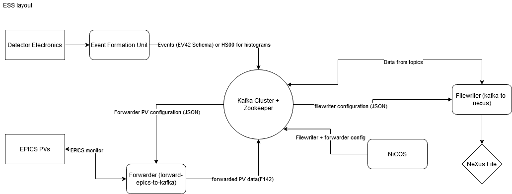
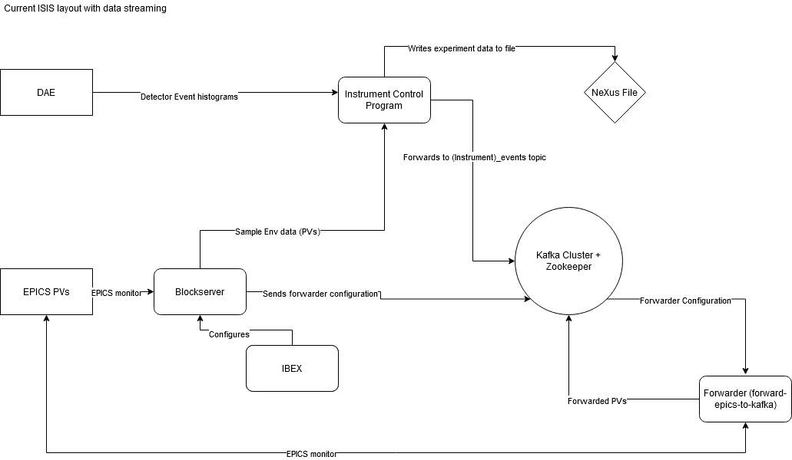
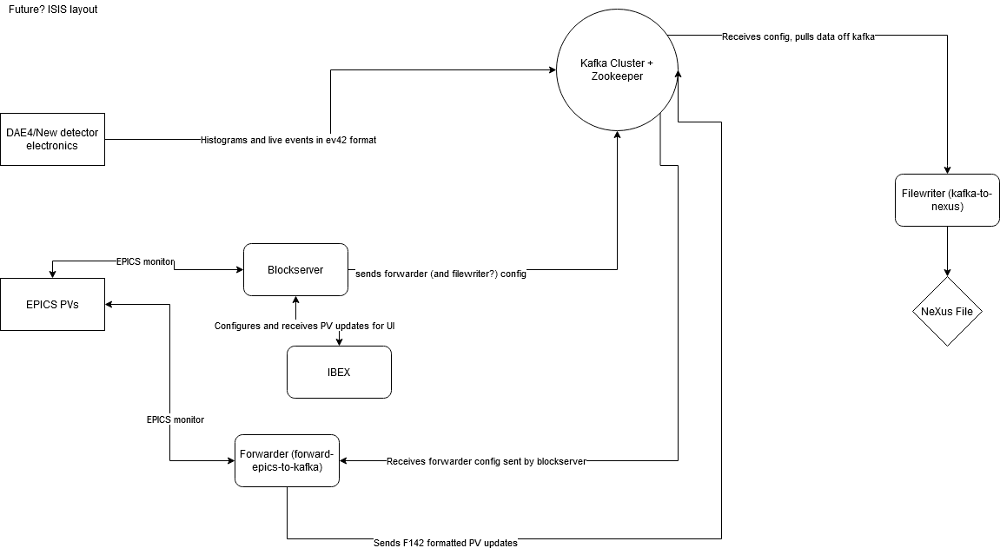

# Datastreaming

```{toctree}
:glob:
:titlesonly:
:maxdepth: 1
:hidden:

datastreaming/*
```

The datastreaming system is being built as part of in-kind work to ESS. It will be the system that the ESS uses to take data and write it to file - basically their equivalent to the [ICP](/specific_iocs/DAE-and-the-ICP). The system may also replace the ICP at ISIS in the future.

In general the system works by passing both neutron and SE data into [Kafka](https://kafka.apache.org/) and having clients that either view data live (like Mantid) or write the data to file, additional information can be found [here](http://accelconf.web.cern.ch/AccelConf/icalepcs2017/papers/tupha029.pdf) and [here](https://iopscience.iop.org/article/10.1088/1742-6596/1021/1/012013). 

All data is passed into flatbuffers using [these schemas](https://github.com/ess-dmsc/streaming-data-types) - we have a tool called [saluki](https://github.com/ISISComputingGroup/saluki) which can deserialise these and make them human-readable after they've been put into Kafka. 

The datastreaming layout proposed looks something like this, not including the Mantid steps or anything before event data is collected:



## Datastreaming at ISIS

Part of our in-kind contribution to datastreaming is to test the system in production at ISIS. Currently it is being tested in the following way, with explanations of each component below:



{#kafkacluster}
## The Kafka Cluster

There is a Kafka cluster at `livedata.isis.cclrc.ac.uk`. Port 31092 is used for the primary Kafka broker. 
A web interface is available [here](https://reduce.isis.cclrc.ac.uk/redpanda-console/overview).

:::{important}
It was decided that we no longer maintain the Kafka cluster, and it will be handled by the the Flexible Interactive
Automation team. See `\\isis\shares\ISIS_Experiment_Controls\On Call\autoreduction_livedata_support.txt` for their
support information.
:::

### I want my own local instance of Kafka

See {ref}`localredpanda`

## Neutron Data

The ICP on any instrument that is running in full event mode and with a DAE3 may stream neutron events into Kafka.

This is controlled using flags in the `isisicp.properties` file:

```
isisicp.kafkastream = true
# if not specified, topicprefix will default to instrument name in code
isisicp.kafkastream.topicprefix =
# FIA team run their kafka cluster on port 31092, not 9092
isisicp.kafkastream.broker = livedata.isis.cclrc.ac.uk:31092
isisicp.kafkastream.topic.suffix.runinfo = _runInfo
isisicp.kafkastream.topic.suffix.sampleenv = _sampleEnv
isisicp.kafkastream.topic.suffix.alarms = _alarms
```

In the same file, you will also need to ensure the following properties are set:

```
isisicp.incrementaleventnexus = true

# Event rate, can adjust up or down
isisicp.simulation.neventssim = 5000

# Ensure simulated data is switched on
isisicp.simulation.simulatedata = true
isisicp.simulation.simulatespec0 = true
isisicp.simulation.simulatebin0 = true
isisicp.simulation.spreadsimevents = true
```

You additionally need to ensure you are running in event mode. You can do this using the DAE tables `wiring_event_ibextest.dat`, `detector_ibextest.dat` & `spectra_ibextest.dat`. Copies of these tables can be found at:

```
\\isis\shares\ISIS_Experiment_Controls\event_mode_tables
```

## SE Data

See [Forwarding Sample Environment](datastreaming/Datastreaming---Sample-Environment)

## Filewriting

See [File writing](datastreaming/Datastreaming---File-writing)

## System Tests

:::{note}
These tests are not currently enabled.
:::

Currently system tests are being run to confirm that the start/stop run and event data messages are being sent into
Kafka and that a Nexus file is being written with these events. The Kafka cluster and filewriter are being run in docker
containers for these tests and so must be run on a Windows 10 machine. To run these tests you will need to
install [docker for windows and add yourself as a docker-user](https://docs.docker.com/docker-for-windows/install/#install-docker-desktop-on-windows).

## The future of streaming at ISIS

After the in-kind work finishes and during the handover, there are some proposed changes that affect the layout and
integration of data streaming at ISIS. This diagram is subject to change, but shows a brief overview of what the future
system might look like:


