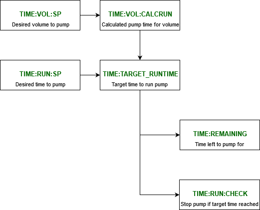

# JASCO HPLC Pump

## Documentation

Documentation is available for the pump at `\\ISIS\shares\ISIS_Experiment_Controls\Manuals\Jasco__PU-4180 HPLC Pump`

## Connection Details
  
|      RS-232C Specifications  |   |
|---------------|------------------|
|     Baud rate | 4800 Baud        |
|     Stop bits | 2 bit            |
|        Parity | None             |
|   Data length | 8 bit            |
|  Flow control | Xon/Xoff control |

Notes:
 - Communication command is terminated with CR.
 - Communication return is terminated with CR and LF.
 - When connecting the pump to the MOXA, be sure to use a different port from the Knauer pump.  This will allow the Knauer to use its own port as the one for the Jasco will be locked by its IOC (which runs continuously).

## Simulation

The driver has both a state machine and fairly complex logic in the IOC, therefore RECSIM for the device is not particularly supported.

## Pump Control

The device has the ability to control a number of parameters for a pump:

- Flowrate (in mL/min): `FLOWRATE:SP`
- Pressure Maximum and Minimum (in kg/cm^2): `PRSSURE:MAX:SP`, `PRESSURE:MIN:SP`
-- Setting these values will result in an error output and stop the pump if exceeded during a executed program.
- Composition components (A, B, and, C in %): `COMP:{}:SP`.

The user can then start the pump by using the `START:SP` record. The pump can be stopped using the `STOP:SP`

The user can also select a timed run for either a set time or volume. The user must first set a time `TIME:RUN:SP` (in seconds) or volume `TIME:VOL:SP` (in mL). Then a pump can begin by using the `TIMED:SP` record. 

The calculations for the time for a set volume (done in `TIME:VOL:CALCRUN`) and the calculation for the pumped volume for a set time (done in `TIME:RUN:CALCVOL`) use `FLOWRATE:SP:RBV`, not `FLOWRATE:SP`. The RBV value is different from the setpoint if the setpoint has never been set, in which case using the setpoint would produce an invalid time or volume.

Note that the Jasco IOC only allows one of these two values to be modifiable at a time (which then sets the other) - which method is used needs to be explicitly set via `TIME:CALC:SP`. This is to avoid race conditions i.e. if a user sets both `TIME:VOL:SP`and `TIME:RUN:SP` at the same time (for example via caLab or scripting) they could not be sure which one wins.

NB: The devices display screen does not show current pump status information when in operation.

## Additional commands not in the manual

The following status command has been confirmed by JASCO and is used in the IOC driver, although it is not documented in the manual:
```
command : { status load p }
A status value is a bitwise OR.

Bit0=0: Pump off
Bit0=1: Pump on
Bit1=1: Program hold
(Bit2-3: Reserved)
Bit4-5=1: Program stop
Bit4-5=2: Initial run
Bit4-5=3: Program run

Data value is returned as follows:
 0: Pump off
 1: Pump on (Program stop)
33: Initial run (Initial run, Pump on)
49: Program run (Program run, Pump on)
51: Program hold (Program run, Pump on, Program hold)
```
## Troubleshooting

There are three known issues with the pump that have been confirmed by JASCO. They have detailed the potential issues and the work around that is associated with them. The design of the pumps driver should mitigate them, but this information should help in the event these are encountered during support:

### Pump stops responding

This issue involves the pump being hard locked, and completely unresponsive. No data will be returned from the device, and the front panel will be unresponsive. The only way to resolve this is to power cycle the device. This is caused by the `flowrate set` command being executed at the same moment as a program step (such as setting component values). A script is available in the IOC directory called `exercise_jasco4180.py` that can be used to test if the device crashes under use. The driver has been designed to be resilient against this crash and should always successfully finish. This can be used to ensure new driver changes do not introduce device breaking bugs.

### Pump freezes with 'Program busy'

This issue involves the pump freezing and not interpreting commands briefly, and can result in commands being skipped. This is caused by the `fileno set` (Set a program file number) being executed while the run status is in `Initial` or `Run`. When the program file is opened other commands not related to creating a time program will not be accepted. You must ensure the program is closed after setting the time program.

### Composition control is locked

This issue involves the composition being locked into a manual mode, where no compositions will be accepted remotely, and the single channel (100% A, B, C, or, D) can only be switched using the front panel. This occurs when a time program has not been written correctly. For example, if the maximum number of lines in a program (64) has been exceeded or not closed. This should be resolved by first ensuring the file is closed, using `1 fileno set`, and then performing a re-run program using initial conditions `8 pump set`. Note that you might want to ensure you have a flow rate of 0 to ensure no liquid is pumped while troubleshooting.

### Target runtime calculation logic

Work was completed on the JASCO to update its calculation logic for pump runtime in [#4720](https://github.com/ISISComputingGroup/IBEX/issues/4720). This flow diagram illustrates this:


