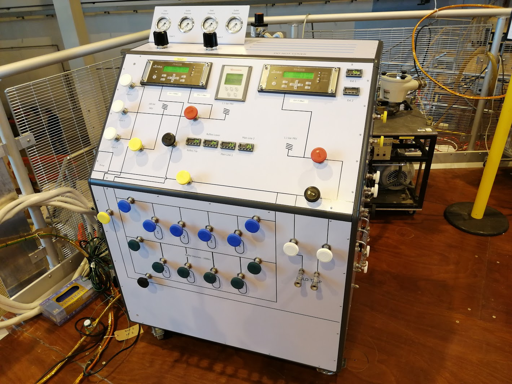

# MKS PR4000B

## Communications

Serial settings (baud rate, parity) can be changed on the front panel of the device. Ensure the IOC matches the physical device. Device communicates using a straightforward ASCII protocol with carriage-return terminators (`\r`).

## Channels

Each PR4000B unit can talk to two sensors independently. The controller can acquire a large amount of diagnostic data alongside the "primary" readings for each channel. This diagnostic data polls more slowly than the main readings, as they probably change less frequently.

## IOC

The IOC is forked from a Diamond repository, however it has been heavily modified to fit ISIS standards and working practices. In reality it should be treated as "our own" driver rather than as a "vendor" driver.

It has a couple of simple aSub records for converting the string representation of a unit to it's numeric representation. These are to get around a limitation in EPICS that `mbbi` records can only have 16 states (20 were needed). These aSub records could be removed in future if future versions of EPICS support MBBI records with more states (at the time of writing, this was not a feature of EPICS 7).

## Serial settings

The two MKS PR4000B units on NIMROD's gas panel use different serial settings. Settings are as per the table/photo below

| - | Unit 1 (left) - MKSPR4KB_01 | Unit 2 (right) - MKSPR4KB_02 |
| --- | --- | --- |
| Baud | 9600 | 9600 |
| Bits | 7 | 7 |
| Parity | even | odd |
| Stop | 2 | 2 |
| Null modem required | No | No |

