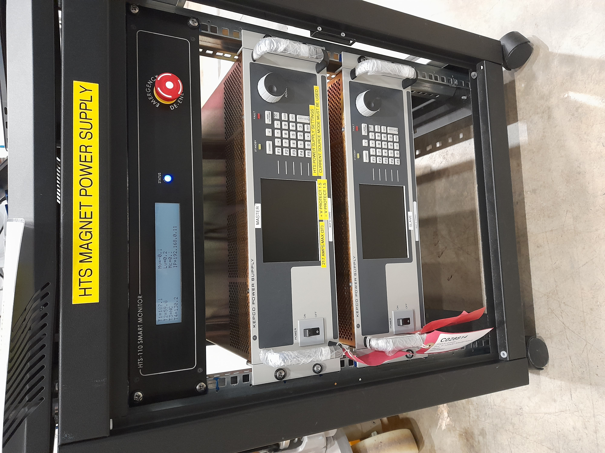

# HTS Magnet

## HTS Magnet System

Consists of an electromagnet powered by two KEPCO PSUs in master/slave configuration with monitoring by a Smartmonitor.

### KEPCO Power Supplies

The master KEPCO PSU (the uppermost in the rack) is connected to a MOXA NPort socket via a bespoke cable (_NOT_ standard MOXA cable) with an RJ45 (8P8C) on one end and an RJ11 (6P6C) on the other.  This flat grey cable is supplied with the device and is labelled accordingly (believed to be the only one and to date, no working spares exist).  The serial/remote/RS232 socket on the KEPCO is labelled "Trigger" and is in the bottom left corner of the rear panel.

The slave PSU is connected to the master (current output is shared between the two), with both connected to the Smartmonitor.

### Smart Monitor

The Smartmonitor is a _READ ONLY_ device which monitors the PSUs and magnet.  It shows the safe operating limits, hard limits and the current voltages and temperatures of the connected KEPCO.  Its only connection to the control system is via Ethernet on the private instrument network.  It has a fixed IP address on the R80 network, which is x.x.38.184. It has not yet been set up for R55 but if so the MAC address is available in the manuals area needed for setting up a new IP reserve.

Note that you cannot ping the smart monitor, but can telnet into it or view its web server at `<ip:8080>`

The status command response on the Smartmonitor does not match what we have written in the "manual" (which is just an email chain) and adds a timestamp (in the NZST timezone...) before the last status character - [#7397](https://github.com/ISISComputingGroup/IBEX/issues/7397) addresses this issue.

If the smart monitor can't talk by IP or on it's webserver, but all looks plugged in and otherwise healthy, try power cycling the system (after verifying field is zero) and/or check all ethernet cables are correctly seated.

### Newport SMC100 Motion Controller

This system is also used with an [SMC100](https://github.com/ISISComputingGroup/ibex_developers_manual/wiki/SMC100) single axis stage to position the sample inside the magnet itself.
