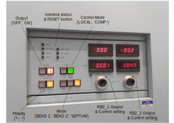

# RIKEN Power Supplies

## Setup

The serial connections to the RIKEN Front End power supply units (PSUs) were previously made in four daisy chains, which all terminated at a single MOXA NPort (i.e. using four of its serial ports).  Since the refurbishment project (concluded December 2022) which replaced all of the PSUs with Danfysik units, the connections are now made in a _radial_ fashion to each individual PSU using five MOXA NPort units placed strategically around the area.

See the `RIKENFE MOXA NPort Devices and IOCs` spreadsheet in the documentation area mentioned below for PSU <-> COM port <-> IOC mappings.

## Documentation

The SharePoint site [`Computing -> ICPdiscussions -> RIKEN FE`](http://www.facilities.rl.ac.uk/isis/computing/ICPdiscussions/RIKEN%20FE) contains documentation relating to the refurbishment project.

The original documentation on the physical setup is at `\\...\shares\ISIS_Experiment_Controls\Manuals\RIKEN_power_supplies\` with some schematics in `riken psu controls - issue C.ppt`.  Most of the information in this area is now out-of-date, particularly that which describes the daisy-chain serial connections to the power supplies.  The remote _changeover_ system (configuring RB2 magnet mode to direct beam to specific instruments), has now been removed entirely.

## IOCs and Macros

Each of the individual Danfysik power supplies is controlled by an individual [Danfysik](Danfysik) IOC (i.e. a one-to-one mapping).  Each IOC is configured accordingly using its macro values, with a different COM port for each (as described above).

The RB2 PSU is _also_ controlled by a Danfysik IOC (actually two - one for each board, see below).  Its protocol is very similar to a model 8500, and so the `DEVTYPE` macro is set to this, with the only difference being the command for setting the current.  Rather than writing an entirely separate protocol file, it was decided to create a `protocol_override` macro and set this to a file containing the single command definition.

The IBEX configuration contains several components, each of which relates to the type of magnet a group of PSUs control e.g. 'Quadrupole', 'Bending', 'Crossfield', etc.  (There is also a component for the 11 TPG300 units which control valves and read gauges in the vacuum system).

## Hardware notes

### RB2 (**Due to be replaced April 2023(?) with standard Danfysik units.**)

- RB2 is a power supply that can be put into three distinct modes: BEND1 (beam goes one way), BEAM2 (the other way), and SEPTUM (beam splits both ways). RB2, although one physical supply, has two Danfysik-like control boards. The first control board (called "RB2" in our system) supplies current for either BEND1, BEND2, or half of SEPTUM mode. The second control board ("RB2_2" in our system) is *only* used to supply the other half of the current in SEPTUM mode.

- It is the only remaining original PSU from before the refurbishment project.  Its replacement(s) were not ready in time to be installed during the long shutdown, and so it has had to be integrated into the new connection topology.  Adapters were made to enable each control board to be directly connected to a MOXA NPort, rather than via a daisy chain as previously.  Wiring details of these adapters are in the document `RIKEN PSU Communications Cables` on the SharePoint site mentioned above.

- The PSU itself is inside a restricted area, controlled by swipe access.  A Muon scientist, PSU group member, or MCR officer will need to be contacted should access be required.

## Debugging & Troubleshooting

For Danfysik PSUs, see separate [Wiki Page](Danfysik) for more specific information.

### Individual Danfysik PSU won't talk at all

- Check the PSU is powered on :wink:  The control mode should switch to `REMOTE` as soon as a command is received.
- Check the serial cable - it can occasionally become loose. It is attached to the rear of each supply (with null modem) and can be accessed from the rear door of the rack.  There is also an RJ45 socket for each PSU in each rack.  This is where the MOXA serial lead connects to be patched back to the MOXA NPort unit, and is also worth checking.

### RB2 PSU won't talk
- Check that the PSU is powered on at the isolator on the EPB wall and at its own local switch under the front control panel.
- Check that remote control mode is selected.  This is done by pressing the `COMP` switch in the `CONT.` section of the control panel.
- Double check that the appropriate MOXA port(s) is/are set to RS-422 mode. **This setting needs to be done in the MOXA itself (via the webpage) - IBEX can't do it!**  (See spreadsheet mentioned above for port information).

### Individual PSU won't talk sensibly / I get interleaved replies / I get delayed replies

This can happen, we are not sure why. The PSU seems to get into a communications mode where it is using a different terminator (I think its terminator when it gets into this state is `\n\r\n\r\n\r`, and no, that isn't a typo...).

The only (known) way to get out of this state is to power-cycle the power supply at its main switch.

## Magnet troubleshooting 

This section is from a document by James Lord; the original document on the manuals shared drive

### RB2
Sometimes RB2_2 reads back implausible numbers such as 75000A. RB2 may also be wrong by a factor of 2. This is often because the IOC (or all of IBEX) has been restarted and the calibration factors for the power supply have been reset to default (which now corresponds to SEPTUM).
- Run `inst.set_RB2_mode(mode,”CAL”)` with the mode that RB2 is in now.
- Run `inst.set_beamline()` to re-send the setpoints.
Note that this procedure may briefly change the value of RB2, so it is best to pause any runs in progress. The restart of IBEX itself would not have affected the magnets.
