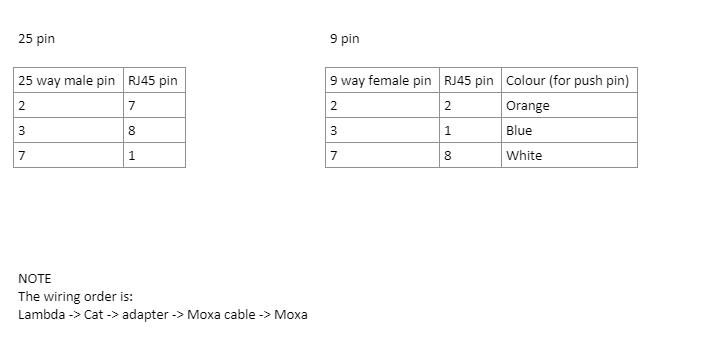

# TDK Lambda Genesys

The TDK Lambda Genesys is a power supply for conventional (non-superconducting) magnets. It is on use on several muon beamlines as a transverse field magnet, as well as several magnets in the muon front end.

These power supplies can be daisy-chained in groups of up to 10 power supplies simultaneously; one IOC talks to the entire chain of power supplies.

## Physical Connection
The connection on the back of the device is an RJ45. However, the device does not communicate through ethernet as this would imply but instead requires a serial adapter to convert it into a 9 pin D type connector that we can then plug the MOXA into. We can make our own adapter using the push-pin adapters (currently in the chalk pits) using the following configuration:

Note that there is a spare 25 way connector in the office (if you use it please replace it!). I couldn't get it working with a 9 way. 

## Macros

As well as the typical communication macros such as `BAUD`. `BITS`, `PARITY` etc, there are a number of specialist macros for each power supply in this IOC:

| Macro | Explanation |
| -- | -- |
| AMPSTOGAUSS | A factor which converts the Amps which are reported by the power supply to Gauss (a measure of magnetic field). This value depends on exactly which magnet the power supply is plugged in to. **Not all magnets use this factor; if it is set to the empty string, the "field" section will be hidden on the OPI. This is the case for all of the magnets on MUONFE (they just control on Amps/Volts for those magnets).** |
| MAX_VOLTAGE | The maximum allowable voltage (in Volts). |
| MAX_CURRENT | The maximum allowable current (in Amps). |
| READ_OFFSET | An offset, in Amps, which is added to the value reported by the power supply before being displayed on the OPI and used to calculate the field. |
| WRITE_OFFSET | An offset, in Amps, to add to any current setpoints before they are sent to the power supply. |

## Troubleshooting

If the Genesys fails to communicate and it has recently been replaced this may be due to it's internal address being set incorrectly. This can be changed in the front panel of the device. Devices are often shipped with internal address 6.

