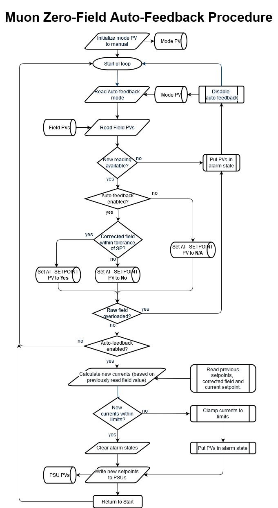

# Zero field controller design

This page describes our understanding of the requirements for the MUON zero-field controller and serves as documentation for how the system was designed (and therefore, why certain choices were made in the implementation).

If you only need troubleshooting information rather than design details, see [Zero field controller](Zero-field-controller)

## Background ##
On a muon instrument, the purpose of the MUON zero-field controller is to maintain a constant (not necessarily zero) magnetic field in the region surrounding the sample. The field should be maintained as external magnetic fields change (i.e. another instrument switches on their magnet). This is achieved by measuring the magnetic field at a fixed sample point. The field should be stable at around the `mG` level and needs updating at a frequency of ~1Hz.

The magnetic field in the sample region is generated by electromagnets (except on HIFI where they are shims to superconducting magnets). The magnetic field is generated by 3 coils perpendicular to each other, so there are 3 different currents that need controlling.  A magnetometer is used to measure the magnetic field (in `mG`) in the sample region; this is called the fixed sensor.  The magnetometer provides 3 magnetic field readings; one for the z component (along the beam), one for the y component (vertical and perpendicular to the beam) and x (parallel to the floor).  The fixed sensor is close to but not at the sample position.

On different instruments there is slightly different equipment:

- EMU, MuSR, ARGUS, CHRONUS
    - Magnetometer: flux gate (has lower maximum field than the hall probes) connected to a NI 9125 cDAQ
    - Magnets: Conventional magnets attached to Kepco power supplies
       - which model of Kepco?
    - Manual probe: ? not sure but we are not converting this now
- HIFI
    - Magnetometer: Group 3 hall probes connected to a DTM161
    - Magnets: Superconducting, shim values set from 0 field are used as offsets in these magnets
    - Manual probe: LS201 hall probe

## Existing MUON zero-field controller ##
All five muon instruments: ARGUS, CHRONUS, EMU, HIFI and MuSR use a zero-field controller, implemented as a collection of LabVIEW VIs.

There appear to be 3 variants of the MUON zero-field controller:
   1. EMU and MuSR both use one variant of the MUON zero-field controller.  This variant can be found in the folder `C:\LabVIEW Modules\Muon Magnets\Zero Field Controller`.
   1. ARGUS and CHRONUS both use a second variant of the MUON zero-field controller.  This variant can be found in the folder `C:\LabVIEW Modules\Instruments\ARGUS\Zero Field Controller`.  This variant is similar to the one used by EMU and MuSR.
   1. HIFI has its own unique MUON zero-field controller. This variant is included in the Group 3 Hall probe VI at `C:\LabVIEW Modules\Instruments\HIFI\Group3 Hall probe`. The behaviour of this VI needs to be validated. Note that this includes extra coefficients to allow for the shape of the gradients between the two sets of hall probes.

### Operation

The zero-field controller operates in one of two required modes, **_manual_** and **_auto-feedback_** (dead reckoning will not be required).

#### Manual Mode ####
In Manual mode, the user must adjust the currents manually to achieve the desired magnetic field.
The typical procedure is:

- Set Auto feedback mode
- Take muon measurements in zero field
- Set Manual mode – this maintains the same currents as have just been used in auto, so the field remains zero (for now)
- Apply a moderate field with the instrument’s main magnet (this could be above the maximum of the flux gate magnetometer, but small enough that the stray field we’ve compensated off would be significant)
- Take muon measurements in this exact applied field.
- Turn off the main magnet. The field will be back to near zero (possible offsets due to the external interfering fields having changed recently, or remnant magnetisation somewhere)
- Re-set Auto Mode. The feedback resumes starting with the currents that were in use in Manual, and smoothly reaches a good zero value.
- Take more zero field measurements.

#### Auto-Feedback Mode ####
In Auto-Feedback mode, the user specifies the desired field (in `mG`) and a feedback loop continually adjusts the current supplied by the PSUs to achieve and maintain the desired magnetic field.  

## Zero field set up procedure:

1. Calibrate the system (to relate current to field, undertaken via the `Test Zero Field.vi` within SECI):
    - Check for a huge stray field
         - Ensure that the absolute maximum of the fields are < 4000 mG 2 seconds after setting a current of 0, if it isn't the magnet is not in range, and there is a huge stray field
         - Calculate the magnitude of the field at this point (square root of the sum of the squared fields)
    - For each magnet and for a range of currents
         - Measure the magnetic field at the fixed sample position
    - Plot field against the current 
         - 21 evenly spaced steps of between the lower current limit and upper current limit, with a 2-second wait before taking the field reading in all three dimensions
    - Perform linear regression to work out the calibration coefficients (1 per axis). 
        - If the result is linear (falls in a tolerance for the RMS - tolerance TBD) these values should be displayed to the user for them to be inputted into the config
        - If not linear the user should be warned, warnings still to be defined from the VI
    - Check that the noise ratios are acceptable at 0 field in manual mode (3-second delay for settling)
         - Set field to 0
         - Put controller in manual mode
         - Wait 3 seconds
         - 20 readings a second apart
         - Calculate the variance for each field
         - Calculate the manual RMS value (`square root of the sum of the variance for each field`)
         - The system is noisy if the RMS value > 5
    - Check that the noise ratios are acceptable at 0 field in auto feedback mode (6-second delay for settling)
         - Set field to 0
         - Put controller in auto feedback mode
         - Wait 3 seconds
         - 20 readings a second apart
         - Calculate the variance for each field
         - Calculate the manual RMS value (`square root of the sum of the variance for each field`)
         - The system is noisy if the RMS value > 5
    - Plot the noise fields against time
    - This is performed once or twice a cycle
    - NB Coefficients should not be set automatically; scientists will take these numbers and save them later.
1. Measure offsets (to compensate for the stray field gradients):
    - Place a portable probe at the sample position
    - Set the field to 0
    - Update the offsets so that the portable probe measures 0.
        - The offsets should be printed to the user so that they can update them in the config
    - This is performed regularly

## Zero-Field Controller Feedback Loop ##
The zero-field controller feedback loop uses the following inputs:
   * **M** – measured magnetic field (it has three components: longitudinal (L), transverse (T) & vertical (V))
       - in IBEX this should use X, Y, Z, with Z being along the beam, y is vertical transverse and X is horizontal transverse.
   * **O** – Offset (to compensate for sensor placement)
   * _**C**_ – orientation matrix, derived from engineering drawing, this the direction of the field produced by each coil and because the coils are at right angles has +1, -1 and 0 as its components.
   * **S** – setpoints requested
   * **P** – magnetic field produced by a coil for a current. Measured in `A/mG` using the calibration procedure.
   * p – proportional value (feedback fiddle factor)
   * **I** – current on magnets
   * **I'** - new current to send

Quantities in bold are vector quantities.  Quantities in italic, bold are matrix quantities.

The new current to send is calculated as:  
**I'** = (**S** - (**M** - **O**) . _**C**_) . **P** * p + **I**

The following quantities are:
   * **Mc** = (**M** - **O**) . _**C**_ is the corrected field - turns measured field in the basis of the magnetometer into fields produced by the magnet in the basis of the magnets.
   * **Mc** - **S**  is the difference between the current field and required field
   * (**Mc** - **S**) . **P** * p  is the change required in the current for this iteration (in current version may need to multiply through by time between samples).

### Maximum Current

The process enforces maximum limits on the currents. These are set by the instrument scientist based on 

1. the current likely to be needed to compensate any feasible stray field
1. the current that would hit the voltage limit on the Kepco before its current limit, if the coils have high enough resistance
1. the maximum desired power dissipation of the coils
1. not wanting to exceed the magnetometer full scale. Each axis has its own limit. 

Higher currents are `clamped` to this maximum with the appropriate polarity and ARE then sent to the PSU! But there should be a warning as well. In Auto, the clamped value is used as the basis for calculations next time.

### Maximum Voltage

The process sets voltage limits on the PSUs to allow the current setpoints to be achieved. These should be automatically set in the power supply by the zero field controller whenever it is in auto mode.

### Maximum Field

When overloaded by a high field, the fluxgate magnetometer can read any random value on all three axes which might look like it's in range and may have the opposite sign to the actual field. Moderate overloads leave the reading close to the limit. The VI attempts to detect fields at or close to the limits and says `sensor overload` if this happens: typically the main magnet coil is still on or there’s a fault with the sensor.

**Notes:**
   1. ARGUS appears to use different magnetic field components, labelled LR (left-right), UD (up-down) and FB (forwards-backwards).  How do these differ from L, T and V?
       - A single set would be good X, Y, Z as described above.
   1. The offset value, O, appears to be a constant.  Why is this?
       - It is an approximation
   1. Are there limits on the input & output values?  If so, what are they?  If these limits are breached, what should happen?
        - The maximum current and voltage values are set as part of the initialisation file, and values beyond those limits are not sent to the PSU
   1. Is the above expression guaranteed to converge?  What if it doesn't?  How does the current zero-field controller guard against non-convergence?
        - No, we expect to get noise but at the 1 mG level. The signal is declared stable at the 10mG level

***

## Requirements ##
* There is a requirement that Zero field system control needs to be continuous, in the mathematical function sense of not having steps in, when configurations change or control is interrupted.".  How is this requirement currently achieved? (It may better to run the zero-field controller on a separate device (e.g. a Raspberry Pi).  This approach would eliminate the risk of interruption should IBEX be halted or the control PC re-booted.) What is this requirement in practice?
* Preserving the zero on restart: the usual use-case for this is switching (either way) between a dilution fridge configuration and a cryostat configuration which happens to use the dilution insert as a centre stick. The sample remains in position and cold (1.4K to 10K) throughout and we want to avoid a spike in the applied field which might upset a sensitive magnetic or superconducting state. Being able to preserve zero field through an IBEX crash or computer reboot, and thus avoid having to repeat a time consuming sequence of field/temperature steps to prepare a sample, is also useful assuming everything else in IBEX can be got running.
* There is no enforced maximum rate of change. The calculated new currents are applied immediately – the field change itself may be limited by the inductance of the coils and the Kepcos briefly hitting the voltage limits as a result. Similarly in manual, a new current entered should be applied immediately. In practice in a real experiment there might be a large step on initially zeroing the field for a new sample/cryostat but subsequently going back into Auto will only be a small change.
* The system should be monitored for the currents overloading and this should be fed back to the user

{#zero_field_implementation}
## Implementation ##
**Suggested operation of magnetometer IOC:** (see [ticket #4838](https://github.com/ISISComputingGroup/IBEX/issues/4838) for more details]
1. On a regular timescale the IOC will read the three axes of the magnetometer. It should then fill in PVs for the **raw field** and **corrected field**: `Mc = (M-O) * C`, as well as its **magnitude**: `Magnitude = sqrt(corrected_X_field^2 + corrected_Y_field^2 + corrected_z_field^2)`.
1. The PVs should go into alarm if the magnetometer is overloaded.

**Suggested operation of auto-feedback IOC:** (see [ticket #4855](https://github.com/ISISComputingGroup/IBEX/issues/4855) for more details]

Flowchart of procedure:

1. The magnetometer values should be checked for overload, if so the feedback is (temporarily) disabled.
1. If in Auto mode and the field is “good” it should then calculate the new currents based on the previous current setpoints, the corrected field and the setpoint. Then check the currents against the limits and if so, clamp the current to the limit value and put the PV into alarm state. It then writes these to the Kepcos (regardless of limit status).
1. If in Auto mode, the "AT_SETPOINT" PV is set to "Yes" if the corrected field is within some value (e.g. 10mG: perhaps set as a macro) of the setpoint, otherwise “No”. If in manual mode, the "AT_SETPOINT" PV is always set to "N/A".
1. In either mode and regardless of any alarms above, it then reads back the actual output current and voltage from the Kepcos and fills more PVs. (Option – put the output current PVs into alarm if the actual current is not close to the setpoint.  This would best be done in the Kepco IOC, if not already.)
1. Careful consideration should be given to the case when a PV is unavailable or in alarm.  i.e. what should the loop do when data required for a decision isn't available?

### Notes from instrument scientist (who wrote the original zero-field VI):
* The calibration step may be best implemented as a script that the scientists can then own. [See [ticket #4839](https://github.com/ISISComputingGroup/IBEX/issues/4839)]
* In “manual” offset calibration we need a simple way to vary the offsets and have the already-running zero field IOC take them into account (it will be in Auto Feedback mode). Perhaps this will be numbers we can adjust on an OPI. Typing g.set_pv(‘IN:MUONZF:OFFSET_X’,123.4) each time would be way too tedious. We then might want to save these values for future use perhaps by editing a .ini file, editing IOC macros, or similar (managers only). Or just press a “Save offsets” button?
* The calibrations should not auto-save anything at all without the instrument scientist saying so! It should be possible to calibrate and then run with those calibrated values, without saving them, such that the old values return after a restart of IBEX or a reload of a configuration. (Example – one-off user kit which has a stray field of its own which also needs correcting.) Saving values into one of our standard configurations should need manager level credentials just like any other changes to it. If the calibration is in a script it would have to open the .ini file explicitly and write the values – or perhaps print them to the scripting console for the instrument scientist to copy/paste into the ini file.
* The calibration values are initialised from .ini files, macros, etc but have PVs that the calibration script can read or write, with writes taking effect on the next pass through the feedback loop. The OPI should present these as adjustable values – especially the values of O where up/down buttons would be useful. The maximum currents should be available as read-only PVs.
* Most of the calibration factors are per-instrument and so should be stored somewhere global, or in the “instrument_base” configuration component which presumably loads the IOC.
* The offsets **_O_** (3 values for X,Y,Z) are changed more often and might vary between SE. Is it possible to set default values of **_O_** for the instrument and then any SE configuration which needs a different value can over-ride it?
* On MUSR (and CHRONUS) there are separate sets of calibration factors for the instrument in its longitudinal and transverse orientations. MUSR has a switch, fed into the Field point box, which indicates the orientation.
* Direct PV writes to the Kepco current are allowed only in manual mode and only up to the configured maximum current.
* The timing is important (in Auto mode). The delay from reading the magnetometers to writing to the Kepcos should be kept as steady as possible,  as should that from writing to the next magnetometer reading. The loop should also be reasonably fast – aim at around 2 loops per second. The calibration procedure checks this and the value of the feedback factor p is set accordingly. Do not attempt to compensate for varying time delays by adding additional factors into the maths!
* The last-written currents (**_I_**) are kept regardless of mode and updated by the feedback loop or writes to the PVs.
* There will be a “mode” PV that scripts can set to “auto” or “manual”. It may help to have a single PV to summarise the field-is-stable and alarm status (as a string value as well as perhaps going into alarm itself).
* On change from Manual to Auto the value of I is simply picked up and used.  On change from Auto to Manual it will simply stop writing values to the Kepco unless the user writes to the current PV.
* On IOC start up I’d suggest try to read the Kepco setpoints (if possible) or the output currents, initialise the last-written variable (I) to this value, and then go into Manual. A subsequent change back to Auto will not cause a significant bump assuming the field was zero before the shutdown and the stray fields have not changed much while the IOC was stopped.
* IOC shutdown should leave the currents on: no special action need be taken.

## EPICS implementation details

### High-level implementation

The Zero field system is usually comprised of 5 different IOCs:
- `ZFCNTRL_01` - the zero field controller. Primarily, it is responsible for taking readings from the magnetometer and figuring out the new fields to write to the power supplies. It also handles most of the top-level user PVs.
- `ZFMAGFLD_01` - the magnetometer IOC. It is responsible for getting new values from the DAQ hardware, offsetting to compensate for magnetometer placement, and converting to the power supplies' coordinate system via a calibration matrix.
- 3x power supply IOCs, e.g. `KEPCO_01` - `KEPCO_03` (on EMU and MuSR). On HiFi, these 3 power supply IOCs are replaced by 3 "shim" coils in the cryomagnet.

Because of a requirement to keep the delay between magnetometer readings and power supply writes as consistent as possible, it is not possible for the magnetometer IOC to scan independently. Instead, it is explicitly told to take a reading at suitable times from the controller IOC. This is done using a forward link from the controller ioc to `...ZFMAGFLD_01:TAKEDATA`.

Once the magnetometer has collected readings for all 3 coordinate axes (including the magnitude and whether the magnetometer is overloaded), the magnetometer indicates that new readings are ready by forward linking back to the controller using the PV `...ZFCNTRL_01:INPUTS_UPDATED`. This allows the state machine in the controller IOC to continue to the next step.

In automatic mode, where the controller is required to write new currents to the power supplies, the following algorithm is implemented:
- If the power supply is in voltage control mode, change it to current control mode. Allow up to 5 seconds (configurable via `ZFCNTRL_01:READ_TIMEOUT`) for this change to happen, and raise an alarm if it doesn't. If the power supply is already in current control mode, skip this step.
- If the power supply is off, send it an "on" command and wait up to 5 seconds (configurable via `ZFCNTRL_01:READ_TIMEOUT`) for it to switch on, and raise an alarm if it doesn't. If the power supply is already on, skip this step.
- Calculate new currents to write, and limit them to the interval `[ZFCNTRL_01:OUTPUT:CURR:SP.DRVL, ZFCNTRL_01:OUTPUT:CURR:SP.DRVH]`
- Send these new currents to the power supply by writing to `$(PSU_X):CURRENT:SP`.
- Allow up to 5 seconds (configurable via `ZFCNTRL_01:READ_TIMEOUT`) for the power supply current setpoint readbacks to get within `ZFCNTRL_01:OUTPUT:PSU_WRITE_TOLERANCE` Amps of the setpoint. If this doesn't happen, raise an alarm.

### Power supply interface

The Zero-field controller accepts an arbitrary PV prefix to use as a power supply to drive the X, Y and Z magnet coils. The controller expects whichever IOC it is pointing at to have the following PVs available:

| PV | Description / caveats |
| --- | --- |
| `CURRENT` | The (measured) current for this power supply. |
| `CURRENT:SP` | The setpoint for the power supply. In automatic mode, new floating-point values will be written to this PV at relatively quick intervals (somewhere between 2-10Hz). The new value should be sent to the hardware as soon as reasonably possible, as long delays can have an impact on the stability of the zero field system. |
| `CURRENT:SP:RBV` | The setpoint readback for the power supply. **This should be updated from hardware as soon as reasonably possible after a write to `CURRENT:SP`** - the zero field control state machine will wait for the setpoint readback to match the setpoint before continuing. For example, it can be updated from the protocol (via record redirection) as part of the setpoint write command. A fast scan is not sufficient to satisfy this requirement, because the delay between writing to `CURRENT:SP` and reading back the new value in `CURRENT:SP:RBV` needs to be consistent. |
| `VOLTAGE` | The (measured) voltage on the power supply. Not required by the state machine, but displayed for information. Therefore it is acceptable to update this relatively slowly. |
| `VOLTAGE:SP:RBV` | The voltage setpoint readback |
| `OUTPUTMODE` | A binary choice PV which returns 0 for voltage control and 1 for current control. If this choice is not applicable for a given PSU, it should always return "1" for current control. |
| `OUTPUTMODE:SP` | "1" is written to this PV by the zero-field system to put the power supply into current control mode - if `OUTPUTMODE` returned 0. This PV is never used if `OUTPUTMODE` is always 1 (see above) |
| `OUTPUTSTATUS` | A binary choice PV which returns 1 if the PSU is switched on, 0 otherwise. If this choice is not applicable, then this PV should always return 1. |
| `OUTPUTSTATUS:SP` | "1" is written to this PV by the zero-field system to turn the supply on - if `OUTPUTSTATUS` returned 0. This PV is never used if `OUTPUTSTATUS` is always 1 (see above) |

## Performance

The IBEX and SECI zero-field control systems were compared using an external magnetometer mounted at the sample position. This magnetometer is completely separate from the magnetometer which the zero-field system itself uses, and is plugged into a laptop to monitor the field completely independently (the scientist knows how to set this system up; this is not something we are involved with and is not code we support)

The following is a plot of the performance of both the IBEX and SECI zero field systems, as tested on EMU in January 2020. Y axis is in Gauss, X axis is in seconds.

When using the external magnetometer (connected to the laptop), be aware that this system has a faulty power supply. If the power supply is not correctly seated in the magnetometer, it can cause the field to appear to jump and/or drift wildly. To fix this, ensure the PSU is seated firmly in the magnetometer and avoid perturbing the magnetometer control box while it is taking data.
