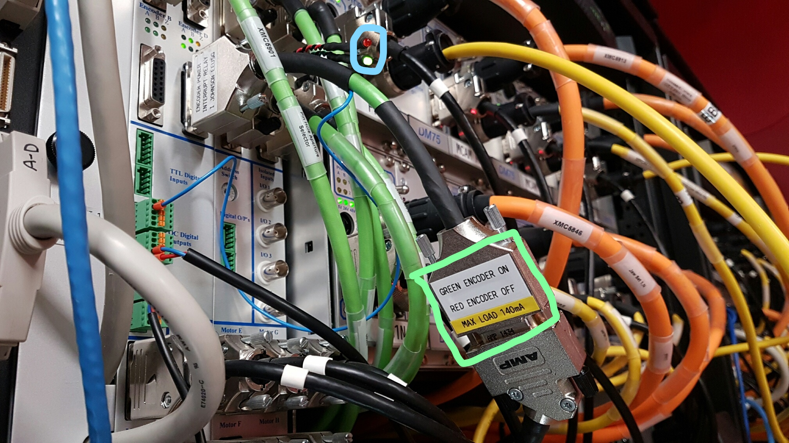

# IMAT Lens Adjustment

The lens adjustment axis on IMAT is on a Newport axis being controlled by a Galil on MTR0104. This axis is peculiar as the infra-red electronics from the axis encoder interferes with the neutron camera. To prevent this a relay has been placed on the power feed to the encoder as shown below:

where the blue highlighted LEDs and green highlighted key show the status of the relay.

The relay can be controlled via the digital output of the Galil. Sending `SB 1` to the controller will cause the power to be cut and `CB 1` will turn the power back on again. This is done in between moves in the axis record using the PREM and POST fields. `CB 1` is sent on `PREM` and `SB 1` on `POST`. This means that the encoder should always be off when the camera is stationary.

Unfortunately the feed for the encoder also powers the limits meaning that power will also be cut to these when stationary and they will appear as if a limit has been hit. The homing routine does not send a `CB 1` on start and so will not work. Therefore to do a home the relay will have to be manually switched. To do this there are some helper functions in the instrument scripts `IMAT_library.py` called `turn_on_encoder` and `turn_off_encoder`, use `turn_on_encoder` prior to a home and `turn_off_encoder` afterwards

During a move `IN:IMAT:MOT:DMC01:Galil0Bo0_STATUS` will show `Low` (from `CB 1`) and then return to `High` (from `SB 1`) afterwards. When not moving, the motor will show as both limits engaged as power will have been cut by the relay. 