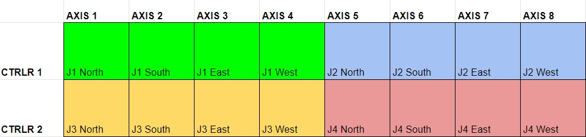
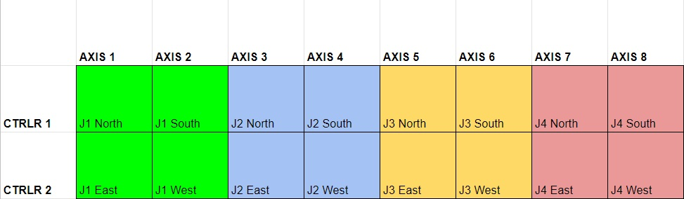

# Jaws

The jaws are an abstraction layer in the form of a set of records that can be placed onto 4 motors which represent the North, South, East and West blade. They will allow a centre and gap to be set in both horizontal and vertical directions. It is a requirement that if an underlying motor position is set then the gap and centre should adjust to be in sync.

The jaws are a `.db` record which can be added to most motors. The `.db` is assembled from records for individual jaw blades, and header records which describe the jawset as a whole (e.g. the overall lock status depending on the lock status of each individual blade). They are loaded via a `jaws.cmd` file in the configuration area which is read by the motor IOCs. The exact location is dependent on the type of motor.

## Standard Jaws

This is a standard full set of jaws (N,S,E,W blades) that are entirely controlled by one motor IOC.

### Example

For a galil they might be in a file in the instrument settings called `<inst name>\configurations\galil\jaws.cmd`:

```
# Define a set of jaws from first 4 motors on first controller (if present)
$(IFIOC_GALIL_01) dbLoadRecords("$(JAWS)/db/jaws.db","P=$(MYPVPREFIX)MOT:,JAWS=JAWS1:,mXN=MTR0101,mXS=MTR0102,mXE=MTR0103,mXW=MTR0104")
$(IFIOC_GALIL_01) dbLoadRecords("$(JAWS)/db/jaws.db","P=$(MYPVPREFIX)MOT:,JAWS=JAWS2:,mXN=MTR0105,mXS=MTR0106,mXE=MTR0107,mXW=MTR0108")

# Define a set of jaws from first 4 motors on second controller (if present)
$(IFIOC_GALIL_02) dbLoadRecords("$(JAWS)/db/jaws.db","P=$(MYPVPREFIX)MOT:,JAWS=JAWS3:,mXN=MTR0201,mXS=MTR0202,mXE=MTR0203,mXW=MTR0204")
$(IFIOC_GALIL_02) dbLoadRecords("$(JAWS)/db/jaws.db","P=$(MYPVPREFIX)MOT:,JAWS=JAWS4:,mXN=MTR0205,mXS=MTR0206,mXE=MTR0207,mXW=MTR0208")
```

The motor axes would then be mapped as follows:



## Split Jaws

Jaws can sometimes be set up such that individual blades of the same jaw set are controlled by separate motor controllers, e.g. North and South are controlled through `GALIL_01` and East and West are controlled through `GALIL_02`. There is a separate set of `.db` records that can be loaded by each IOC individually for this case. 

### Example

A `jaws.cmd` analog to the one above, but where all vertical blades are controlled by motor controller 01, and all horizontal blades are controlled by motor controller 02, would look like this:

```
# JAWS1
$(IFIOC_GALIL_01=#) dbLoadRecords("$(JAWS)/db/split_jaws_header_vertical.db","P=$(MYPVPREFIX)MOT:,JAWS=JAWS1:,mXN=MTR0101,mXS=MTR0102,mXE=MTR0201,mXW=MTR0202")
$(IFIOC_GALIL_02=#) dbLoadRecords("$(JAWS)/db/split_jaws_horizontal.db","P=$(MYPVPREFIX)MOT:,JAWS=JAWS1:,mXW=MTR0201,mXE=MTR0202")

# JAWS2
$(IFIOC_GALIL_01=#) dbLoadRecords("$(JAWS)/db/split_jaws_header_vertical.db","P=$(MYPVPREFIX)MOT:,JAWS=JAWS2:,mXN=MTR0103,mXS=MTR0104,mXE=MTR0203,mXW=MTR0204")
$(IFIOC_GALIL_02=#) dbLoadRecords("$(JAWS)/db/split_jaws_horizontal.db","P=$(MYPVPREFIX)MOT:,JAWS=JAWS2:,mXW=MTR0203,mXE=MTR0204")

# JAWS3
$(IFIOC_GALIL_01=#) dbLoadRecords("$(JAWS)/db/split_jaws_header_vertical.db","P=$(MYPVPREFIX)MOT:,JAWS=JAWS3:,mXN=MTR0105,mXS=MTR0106,mXE=MTR0205,mXW=MTR0206")
$(IFIOC_GALIL_02=#) dbLoadRecords("$(JAWS)/db/split_jaws_horizontal.db","P=$(MYPVPREFIX)MOT:,JAWS=JAWS3:,mXW=MTR0205,mXE=MTR0206")

# JAWS4
$(IFIOC_GALIL_01=#) dbLoadRecords("$(JAWS)/db/split_jaws_header_vertical.db","P=$(MYPVPREFIX)MOT:,JAWS=JAWS4:,mXN=MTR0107,mXS=MTR0108,mXE=MTR0207,mXW=MTR0208")
$(IFIOC_GALIL_02=#) dbLoadRecords("$(JAWS)/db/split_jaws_horizontal.db","P=$(MYPVPREFIX)MOT:,JAWS=JAWS4:,mXW=MTR0207,mXE=MTR0208")
```

The motor axes would then be mapped as follows:


#### Notes:
- `split_jaws_header_vertical.db` and `split_jaws_horizontal.db` each expect the other one to be loaded and the jaws will not work correctly if this is not the case.
- We currently do not support one direction (e.g. vertical) to be split across separate controllers, e.g. J1 North on `MTR0101` and J1 South on `MTR0201`

## Vertical Jaws

Some Jaw sets consist of only vertical jaws (i.e. east and west blades do not physically exist). A separate `.db` exists for this type of device which contains header and individual blade records assuming vertical blades only.

### Example

A `jaws.cmd` for one jaw set only consisting of vertical blades:

```
$(IFIOC_GALIL_01) dbLoadRecords("$(JAWS)/db/jaws_vertical.db","P=$(MYPVPREFIX)MOT:,JAWS=JAWS1:,mXN=MTR0101,mXS=MTR0102")
```

Note: We do not currently support horizontal only jaws.

## Alias Jaws

In some cases the jaws logic is performed by the controller itself. Noticeably for the [Beckhoff](../motors/Beckhoff). In this case there will be normal motor axes of the form `MOT:MTR0X0X` that describe the centres and gaps. The alias jaws `db` and `cmd` will load aliases for these so they look like conventional jaws.

## Archive deadbands

On jaw sets which have fluctuating positions, it was seen that the databases were getting filled up with updates from the jaws. To stop this happening, the archive deadband (`ADEL`) field is copied from the underlying motor to the jaw.

For the jaws positions that depend on more than one jaw blade (the centres and gaps), it was decided that the archive deadband should be taken from one of the jaws only. They follow this convention:
 * **Vertical** (`VCENT`, `VGAP`) positions take `ADEL` from the **North** jaw motor
 * **Horizontal** (`HCENT`, `HGAP`) positions take `ADEL` from the **East** jaw motor

## Instrument-specific Jaws information

```{toctree}
:glob:
:titlesonly:
:maxdepth: 1

jaws/*
```