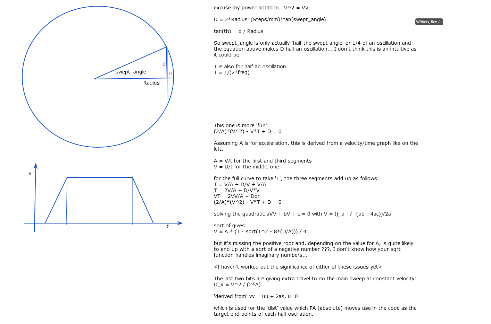

# MERLIN, LET and WISH Oscillating Radial Collimators

The oscillating radial collimator on MERLIN is similar but not quite the same as the one on LET.

## Starting it

Occasionally the oscillating collimator stops oscillating, you can tell because the `current angle` on the OPI will not be changing.

To restart this is sometimes tricky try the following:

1. On the OPI
1. Click Stop
1. Alter the `swept angle` and `operating frequency` to a **valid** and **different** values so it will resend the setting
   1. The valid values for the swept angle as currently 0-2 (you can see by right click on the input text box and `Show pv info`)
   1. The valid values of operating frequency are 0-0.5
1. Set the swept angle and operating frequency back to the required settings
1. Click start
1. The `Mode` should now read `Homing` then `Oscillating` and the current angle should start changing. 
    - this was fairly quick (less than 1 minute)

## Hardware quirks:
- The thread will die if zero is sent for distance and velocity. The driver must ensure that distance and velocity are not sent at IOC start.
- The oscillation will stop if the galil is power cycled. To restart the oscillation, the galil driver will need to be restarted to re-upload the oscillation code, and then the collimator restarted as usual via it's OPI. Once the collimator is started via to OPI it will home and then switch to oscillating. 

## Galil Code

The oscillations are managed by the galil code different on [LET](https://github.com/ISISComputingGroup/EPICS-galil/blob/master/GalilSup/Db/galil_Oscillating_Collimator.gmc) and [MERLIN](https://github.com/ISISComputingGroup/EPICS-galil/blob/master/GalilSup/Db/galil_Oscillating_Collimator_Merlin.gmc). This section is an rough explanation of the code.

```
'************MERLIN Collimator*********
'***********************************
'DETERMINE INITIAL POSITION
'***********************************
```
Comments

```
#HOMER
'*******STEP 1 - Retract Motor******
mode=0
count=0
MT~a=2
DC~a=1024;AC~a=1024;SH~a
```

For homing set up some variables:

- mode (what galil is doing) 
- count (how many oscillations it has performed)

Then set the acceleration and deceleration and switch motor on.

```
JP #HOME, @IN[6]=1
SP~a=250;PR~a=2600
mode=1
BG~a
#INI
JP #INI, @IN[6]<>1
WT 100
ST~a
AM~a
```

If at home switch then move off it otherwise go directly to `HOME` step.

```
#HOME
'*******STEP 2 - Find Gigital Home*******
mode=1
AC~a=67107840;DC~a=1024;SP~a=250;PR~a=-2600
SH~a;BG~a
#HEO
JP #HEO, @IN[6]=1
ST~a
AM~a
WT100
```
Move in negative direction and stop as soon as we hit the home switch.

```
AC~a=1024;DC~a= 67107840;SP~a= 20;PR~a=2600
SH~a;BG~a
#HR
JP #HR, @IN[6]<>1
ST~a
AM~a
WT1000
```
Move off the home switch and stop as soon as it disengages.

```
DP~a=-200
PA~a=0
SH~a
SP~a=1024
BG~a
AM~a
WT1000
```
Set the position of the home switch as -200 and move to 1024.

```
#OSCILSU
'****Step 3 - Oscillation Setup*******
mode=2
count=0
AC~a=accel;DC~a=accel;SP~a=vel
SH~a
PA~a=-dist/2
MC~a
```
Move to half the oscillation distance in the negative direction. See [below](#oscillating_collimator_distance_velocity_calculation) for how distance is calculated.

```
#OSCIL
'****Step 4 - Oscillations************
time1=TIME
SP~a=vel
SH~a;PA~a=dist/2;BG~a;
#CHECK1
JP #CHECK1, @IN[6]=0
check=_RP~a
AM~a
SH~a;PA~a=-dist/2;BG~a;AM~a
count=count+1
time=TIME-time1
'JP #HOMER, check>125
JP#OSCIL
EN
```
Move to positive and then negative positions of oscillation, recording time for total movement. There is a disabled check that we clear the limit switch. Repeat this motion forever. See [below](#oscillating_collimator_distance_velocity_calculation) for how distance is calculated.

The code on LET is the same except that:

1. It uses a different input for the home switch, 
1. It performs jogs instead of limited moves
1. The home switch is defined to be at 0 (not -200)
1. It does not switch on the motor before each move
1. After the home and before the setup oscillation it does not move the motor away from the home switch position

{#oscillating_collimator_distance_velocity_calculation}
## Distance and Velocity Calculation

The distance and velocity the ORC is asked to move is calculated based on the provided swept angle and frequency. This calculation is done in the db inside `motorExtensions`. The purpose of these calculations is to ensure that twice the swept angle is travelled with a constant velocity. First the time taken for half a cycle, T, is calculated:
```
T = 1/(2*freq)
```
Then swept distance in steps, D, is calculated:
```
D = 2*Radius*(Steps/mm)*tan(swept_angle)
```
The required velocity, V, is then calculated based on the equation:
```
(2/A)*(V^2) - V*T + D = 0
```
The solution to which is calculated as:
```
V = A * (T - sqrt(T^2 - 8*(D/A))) / 4
```
which is sent to the controller as `vel`. From this velocity the distance required to get to this velocity is calculated:
```
D_v = V^2 / (2*A)
```
And so the total `dist` sent to the control is:
```
dist = 2*D_v + D
```

The explanation for these equations can be seen in the following diagram (courtesy of Ben Withers) 

### Moving indicators

The `MOT:OSCCOL:MOVING` PV (i.e. whether the collimator is moving or not) is calculated differently for MERLIN/LET and WISH. 

Merlin and LET both are fitted with a laser which is plugged into the galil's digital input. We can deduce the movement of the collimator from whether this PV value (`$(P)MOT:DMC01:Galil0Bi5_STATUS`) is fluctuating or not.
The Db scans this laser PV every .1 second taking 100 samples, so it takes 10 seconds to calculate collimator movement. For example, if the laser PV has changed value within the last 10 seconds then it is `Moving`, and otherwise reports `Not moving`. 
Due to the way movement is calculated, when the laser pv is in alarm, the collimator will report `Moving` but in an **invalid state**.

WISH is not fitted with this laser, and so uses the already previously existing logic which checks that (largest motor position in last 10s) != (smallest motor position in last 10s).

### WISH specifics 

The WISH collimator is slightly unusual in the way that it: 
1. Does not have timing information in the Galil code, so frequency can not be easily read back. To get around this in the Db it is aliased to the setpoint. 
1. Every x amount of oscillations it rotates 360 degrees - this is referred to as a "maintenance rotation". This is not required on LET/MERLIN as they use different bearing types
1. It calculates the required swept angle using the gearbox ratio etc. rather than the tan of the angle as defined above. The velocity calculations are done in the same way.

There is some logic in the OPI that will show the fields for the maintenance rotation such as how long until the next one and what the set value is before rotating. This is enabled on load of the wish Db file. 