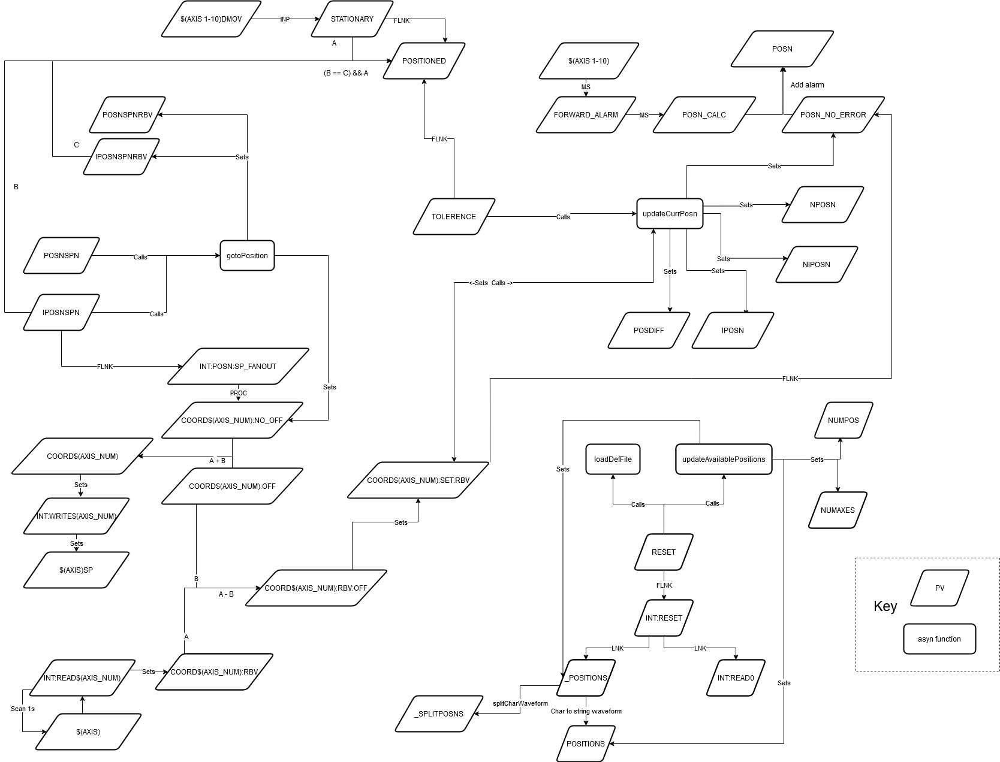

# Motion Set Points

Motion set points allow you to label set positions for any number of axis, though currently db files are only created for single, double or 10 axes. Other numbers of axis can also be easily created by following the example of these. The code for this is in support in the directory [motionSetPoints](https://github.com/ISISComputingGroup/EPICS-motionSetPoints). The configuration for a motion set point is in a number of parts:

1. First, you must set up axes on the motors that you want to configure with the set points
1. St file called `motionsetpoints.cmd` which sets up the db file which is stored in the configuration under the motor name:
    - galil is `Settings\config\<host name>\configurations\galil`
    - Mclennan is `Settings\config\<host name>\configurations\mcleanan`
    - SM300 is `Settings\config\<host name>\configurations\<sm300 ioc name e.g. SM300_01>`
1. The positions which are referenced from the st file. are stored in  `Settings\config\<host name>\configurations\motionSetPoints`

The  `motionsetpoints.cmd` contains the following lines:

1. **Point at motion setpoint config:** `epicsEnvSet "LOOKUPFILE<X>" "$(ICPCONFIGROOT)/motionSetPoints/<motion setpoint file>"`
1. **Configure setpoints:** `motionSetPointsConfigure("LOOKUPFILE<X>","LOOKUPFILE<X>", N)` (where N is the number of axes)
1. **Load Motion Setpoint Records:**
    * *For 1D setpoints* `dbLoadRecords("$(MOTIONSETPOINTS)/db/motionSetPointsSingleAxis.db","P=<motion set point prefix>,NAME0=<name0>,AXIS0=<axis0>,TOL=<tolerance>,LOOKUP=LOOKUPFILE<X>")`
    * *For 2D setpoints* `dbLoadRecords("$(MOTIONSETPOINTS)/db/motionSetPointsDoubleAxis.db","P=<motion set point prefix>,NAME0=<name0>,AXIS0=<axis0>,NAME1=<name1>,AXIS1=<axis1>,TOL=<tolerance>,LOOKUP=LOOKUPFILE<X>")`
    * *For 10D setpoints* `dbLoadRecords("$(MOTIONSETPOINTS)/db/motionSetPoints10Axis.db","P=<motion set point prefix>,NAME0=<name0>,AXIS0=<axis0>,NAME1=<name1>,AXIS1=<axis1>,NAME2=<name2>,AXIS2=<axis2>,NAME3=<name3>,AXIS3=<axis3>,NAME4=<name4>,AXIS4=<axis4>,NAME5=<name5>,AXIS5=<axis5>,NAME6=<name6>,AXIS6=<axis6>,NAME7=<name7>,AXIS7=<axis7>,NAME8=<name8>,AXIS8=<axis8>,NAME9=<name9>,AXIS9=<axis9>,TOL=<tolerance>,LOOKUP=LOOKUPFILE<X>")`
1. **Load _In Position_ records:** This is a `dbLoadRecordLoop` instruction (one for each `dbLoadRecords` above), which loads an extra `db` file for one setpoint per iteration, which contains a record for indicating whether the motor is at this particular setpoint. The line should look like `dbLoadRecordsLoop("$(MOTIONSETPOINTS)/db/inPos.db","P=<motion set point prefix>,NAME0=<name0>,AXIS0=<axis0>,TOL=<tolerance>,LOOKUP=LOOKUPFILE<X>", "NUMPOS", 0, 2)` (where the 2 at the end is how many different sample positions there are)
1. **A blank line at the end**

Where:
* `X` - enumeration of lookup files, e.g. 1, 2
* `motion setpoint file` - the lookup motion setpoint file
* `motion set point prefix` - the prefix you want to create for the motion setpoint, e.g. `$(MYPVPREFIX)LKUP:MON3:`, `$(MYPVPREFIX)LKUP:SAMPLE:`, `$(MYPVPREFIX)LKUP:ANALYSER:` (ending in a colon)
* `tolerance` - tolerance with which the position has to comply with the positions in the lookup file
* `axis0` - the axis to use for the first/only motor e.g. `$(MYPVPREFIX)MOT:SAMPLE:LIN`
* `name0` -  the name of axis 0, e.g. "linear" (defaults to `axis0`)
* `axis1` - the axis to use for the second motor e.g. `$(MYPVPREFIX)MOT:SAMPLE:ROT`
* `name1` -  the name of axis 1, e.g. "rotational" (defaults to `axis1`)
etc.

For examples see Larmor, Demo or SANDALS.

The lookup motion setpoint file has the following format:

    # Comment, lines starting with hashes are comments
    <label> <coord 1> <coord 2>
    <label> <coord 1> <coord 2>
    ...
    <label> <coord 1> <coord 2>

Field are separated by spaces. The fields are:

    - `label` is the text label for the setpoint
    - `coord 1` is the set point for the first/only motor
    - `coord 2` is the set point of the second motor (or not included if it is 1D set point)

Often these files are calculated from xml files using the sample changer support module.

### Example file

```
$(IFIOC_GALIL_04) epicsEnvSet "LOOKUPFILE1" "$(ICPCONFIGROOT)/motionSetPoints/monitor3.txt"
$(IFIOC_GALIL_04) motionSetPointsConfigure("LOOKUPFILE1","LOOKUPFILE1", 2)
$(IFIOC_GALIL_04) dbLoadRecords("$(MOTIONSETPOINTS)/db/motionSetPointsDoubleAxis.db","P=$(MYPVPREFIX)LKUP:MON3:,NAME0=linear,AXIS0=$(MYPVPREFIX)MOT:MONITOR3,TOL=0.1,LOOKUP=LOOKUPFILE1")
$(IFIOC_GALIL_04) dbLoadRecordsLoop("$(MOTIONSETPOINTS)/db/inPos.db","P=$(MYPVPREFIX)LKUP:MON3:,NAME0=linear,AXIS0=$(MYPVPREFIX)MOT:MONITOR3,TOL=0.1,LOOKUP=LOOKUPFILE1", "NUMPOS", 0, 2)
```

## OPI

There are two generic motion set point OPIs:
* Motion Set Point (Few): For setpoints with only 3 or 4 positions
* Motion Set Point: For setpoints with many positions

A number of other OPIs also use motion set points, such as SANS2D waveguide and apertures. 

## Upgrading from 7.2.0

Prior to version 7.2.0 motion set points only worked for 1 or 2 axes. As part of [4573](https://github.com/ISISComputingGroup/IBEX/issues/4573) a number of changes were made, which means that the format of `motionsetpoints.cmd` has changed in the following ways:

* There must be an axis on a motor before you can put a set point on it
* `motionSetPointsConfigure` requires the number of axes as the final argument
* The `motionSetPoints.db` has been replaced by `motionSetPointsSingleAxis` or `motionSetPointsDoubleAxis`
* The index for `AXISX` and `NAMEX` are now zero based, previously they were 1 based

See examples: https://github.com/ISISComputingGroup/EPICS-motionSetPoints/tree/master/settings

## Diagram

